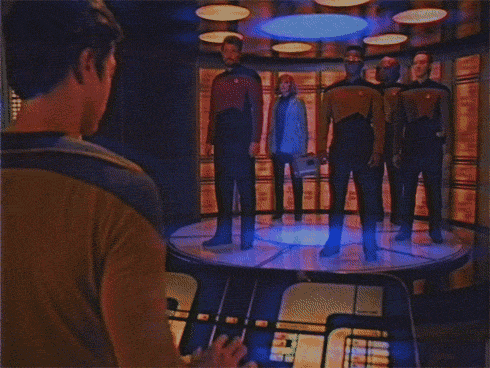

    

# 
Demos

The following is a collection of demos aimed at providing hands-on demonstrations of Confluent technologies. This digital demo repository will grow over time in an effort to provide a continually evolving set of hands-on content. 

> **Note**: The majority of this content has been developed independently and may differ in look and feel. 

See the following inventory of currently available demos.

## Inventory

| Demo | Description | Link |
|---|---|---|
| Application Modernization | This demo will provide a walkthrough experience of following the Strangler Fig pattern for migrating an application from a Monolithic Architecture to a Microservices one using Kafka and Confluent Cloud.  | [Click Me](https://github.com/confluentinc/stream-me-up-scotty/tree/main/demos/application-modernization) |
| Messaging Modernization | This demo will provide a walkthrough of modernizing an existing legacy messaging architecture to Kafka and Confluent Cloud.  | [Click Me](https://github.com/confluentinc/stream-me-up-scotty/tree/main/demos/messaging-modernization) |
| Streaming ETL | This demo will provide a walkthrough of creating a Streaming ETL architecture to process and transform streams of data in real time using Kafka and Confluent Cloud.  | [Click Me](https://github.com/confluentinc/stream-me-up-scotty/tree/main/demos/streaming-etl) |