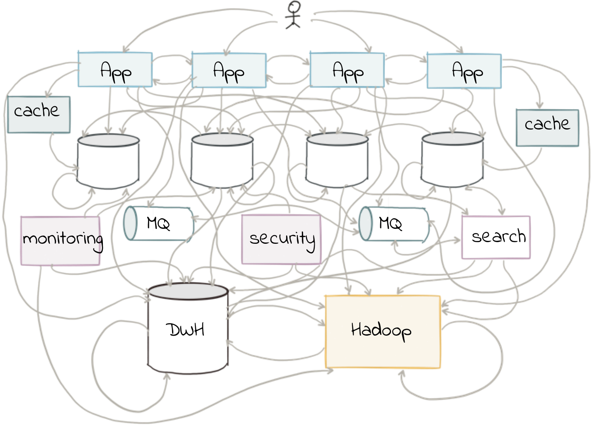
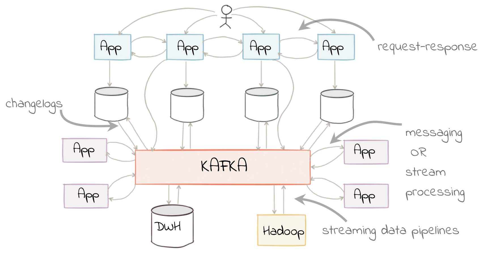
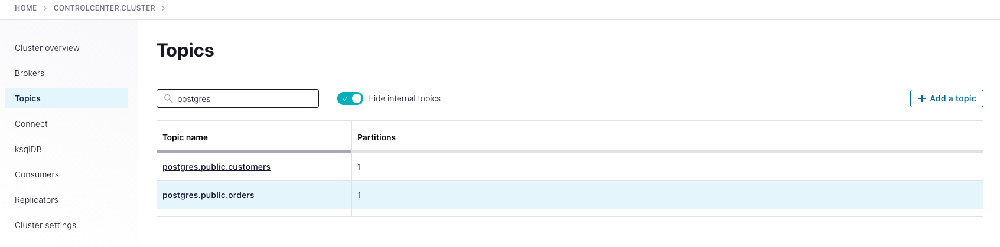
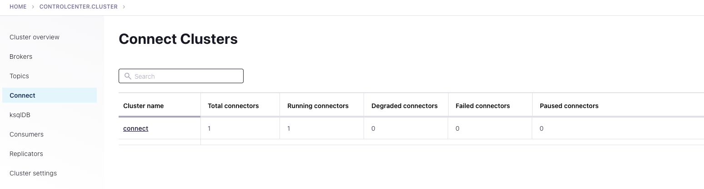
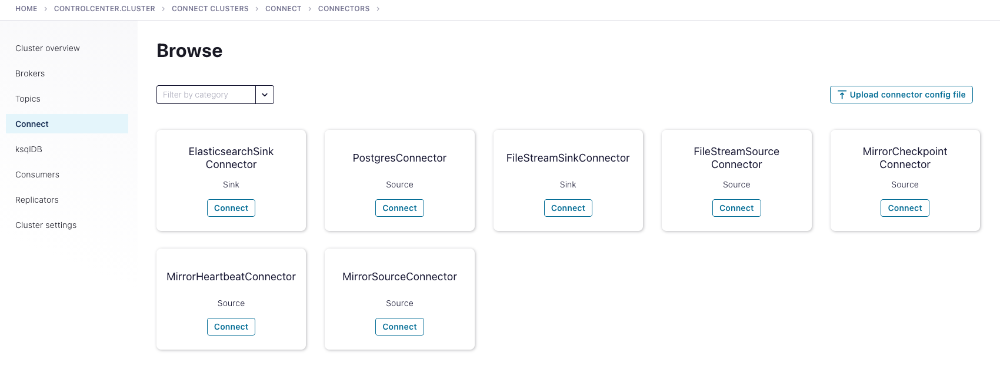
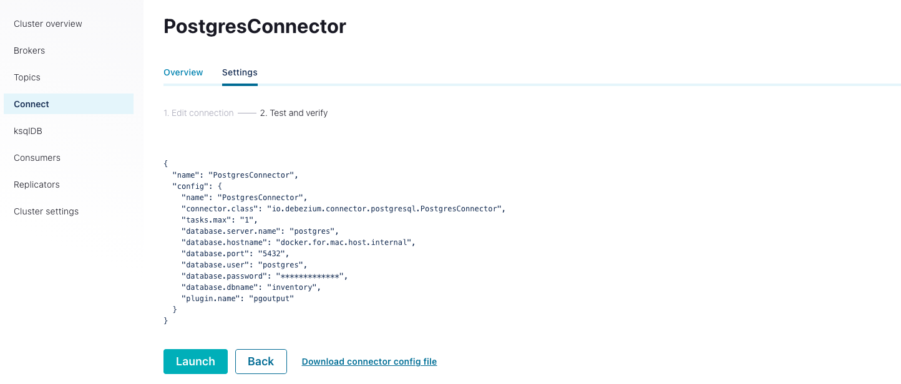
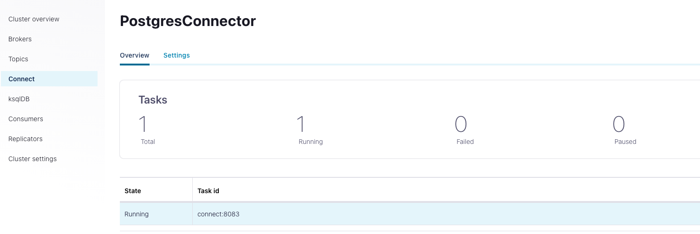
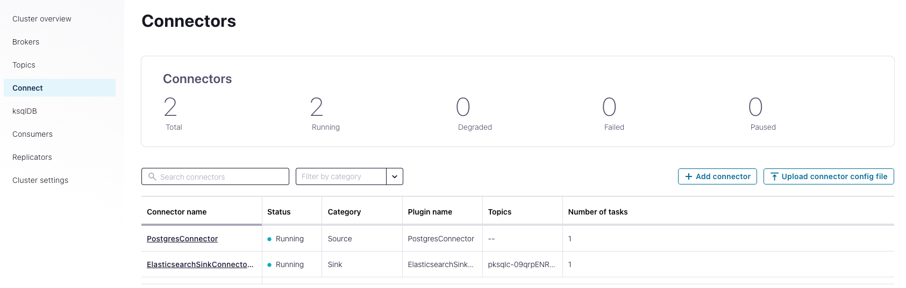

Solution Architecture
=====================

Overview
--------

Traditionally, ETL would be done on a point-to-point basis, taking data from a source system and loading it to a target one. If the data was needed elsewhere it would either be extracted twice or taken from the original target. Both of these are undesirable. The former increases the load on the source system, and the latter introduces an unnecessary dependency and coupling in the design. In short, this is how the “big-ball-of-mud” or “spaghetti” architectures start.

<div align="center">
    
</div>

By adopting Confluent streaming ETL platform, we decouple the sources and targets for data, and thus introduce greater flexibility to build upon and evolve an architecture.

<div align="center">
    
</div>

**Source: https://www.confluent.io/blog/changing-face-etl/**

Reference Example
-----------------

To demonstrate the streaming ETL pattern, we build the below demo. For the purpose of this demo, the source and sink components are simplified to be Postgres and ElasticSearch running in docker. But in a real world scenario, the source can be disparate entities running different data formats. Similarly the same stream of events can be consumed by multiple sink consumers in real time.

# Streaming-ETL-Demo - Enriching event stream data with CDC data from Postgres, stream into Elasticsearch
<div align="center" padding=25px>
    
</div>

# <div align="center">Streaming ETL with Confluent</div>
## <div align="center">Lab Guide</div>

## **Pre-reqs**
* `git`
* `jq`
* Docker with minimum 8GB memory (Docker settings -> Resources -> Memory)
* Confluent Cloud Account
    * Sign-up for a Confluent Cloud account [here](https://www.confluent.io/confluent-cloud/tryfree/).
    * Once you have signed up and logged in, click on the menu icon at the upper right hand corner, click on “Billing & payment”, then enter payment details under “Payment details & contacts”.

    > **Note:** You will create resources during this workshop that will incur costs. When you sign up for a Confluent Cloud account, you will get up to $200 per month deducted from your Confluent Cloud statement for the first three months. This will cover the cost of resources created during the workshop.

* Ports `443` and `9092` need to be open to the public internet for outbound traffic. To check, try accessing the following from your web browser:
    * portquiz.net:443
    * portquiz.net:9092

## **Steps**
1. [Log Into Confluent Cloud](#step-1)
2. [Create an Environment and Cluster](#step-2)
3. [Create a Schema Registry Instance](#step-3)
4. [Setup ksqlDB](#step-4)
5. [Create a Topic using the Cloud UI](#step-5)
6. [Create an API Key Pair](#step-6)
7. [Start connect cluster, Postgres instance and Elasticsearch cluster in docker](#step-7)
8. [Set up and connect self managed debezium connector to Confluent Cloud](#step-8)
## Extract
9. [Insert data into Postgres tables](#step-9)
10. [Check messages in Confluent Cloud](#step-10)
## Real time Transform
11. [Enrich and Transform the data using ksqlDB](#step-11)
## Load
12. [Set up Elasticsearch sink connector to Confluent cloud](#step-12)
13. [Check the data in the ElasticSearch](#step-13)

## Cleanup and Further Reading
14. [Clean Up Resources](#step-14)

***

## **Architecture Diagram**

<div align="center">
    
</div>

## **Objective**

In this workshop you will learn how Confluent Cloud can enable you to quickly and easily stand up a streaming ETL pipeline. During this workshop you’ll get hands-on experience with building out an end-to-end ETL pipeline; from extracting & loading data from out-of-the-box source & target systems with connectors to transforming the data in real-time with ksqlDB in Confluent Cloud. The use case will be centered around loading the data of customers purchases from Postgres into Confluent, transform and enrich the data for real time insights and then easily loading it in the destination application.

This workshop is perfect for those looking to build the foundation for your data processing pipeline and ETL use cases and to get started with Confluent Cloud. 

***

## <a name="step-1"></a>Step 1: Log Into Confluent Cloud

1. First, access Confluent Cloud sign-in by navigating [here](https://confluent.cloud).
1. When provided with the *username* and *password* prompts, fill in your credentials.
    > **Note:** If you're logging in for the first time you will see a wizard that will walk you through the some tutorials. Minimize this as you will walk through these steps in this guide.

***

## <a name="step-2"></a>Step 2: Create an Environment and Cluster

An environment contains Confluent clusters and its deployed components such as Connect, ksqlDB, and Schema Registry. You have the ability to create different environments based on your company's requirements. Confluent has seen companies use environments to separate Development/Testing, Pre-Production, and Production clusters.

1. Click **+ Add environment**.
    > **Note:** There is a *default* environment ready in your account upon account creation. You can use this *default* environment for the purpose of this workshop if you do not wish to create an additional environment.

    * Specify a meaningful `name` for your environment and then click **Create**.
        > **Note:** It will take a few minutes to assign the resources to make this new environment available for use.

1. Now that you have an environment, let's create a cluster. Select **Create Cluster**.
    > **Note**: Confluent Cloud clusters are available in 3 types: **Basic**, **Standard**, and **Dedicated**. Basic is intended for development use cases so you should use that for this lab. Basic clusters only support single zone availability. Standard and Dedicated clusters are intended for production use and support Multi-zone deployments. If you’re interested in learning more about the different types of clusters and their associated features and limits, refer to this [documentation](https://docs.confluent.io/current/cloud/clusters/cluster-types.html).

    * Choose the **Basic** cluster type.

    * Click **Begin Configuration**.

    * Choose **GCP** as your Cloud Provider and your preferred Region.
        
    * Specify a meaningful **Cluster Name** and then review the associated *Configuration & Cost*, *Usage Limits*, and *Uptime SLA* before clicking **Launch Cluster**.

***

## <a name="step-3"></a>Step 3: Create a Schema Registry Instance

A topic contains messages, and each message is a key-value pair. The message key or the message value (or both) can be serialized as JSON, Avro, or Protobuf. A schema defines the structure of the data format.

Confluent Cloud Schema Registry is used to manage schemas and it defines a scope in which schemas can evolve. It stores a versioned history of all schemas, provides multiple compatibility settings, and allows schemas to evolve according to these compatibility settings. It is also fully-managed.

1. Return to your environment by clicking on the Confluent icon at the top left corner and then clicking your environment tile.

1. Click on **Schema Registry**. Select your cloud provider and region, and then click on **Enable Schema Registry**.

***

## <a name="step-4"></a>Step 4: Setup ksqlDB

1. On the navigation menu, select **ksqlDB** and click **Create application myself**.

1. Select **Global Access** and then **Continue**.

1. Name your ksqlDB application and set the streaming units to the default value (When developing this content the default value was "4")

1. Click **Launch Application**!
> **Note:** A streaming unit, also known as a Confluent Streaming Unit (CSU), is the unit of pricing for Confluent Cloud ksqlDB. A CSU is an abstract unit that represents the linearity of performance.

***

## <a name="step-5"></a>Step 5: Create 2 Topic using the Cloud UI

1. On the navigation menu, select **Topics** and click **Create Topic**.
    > **Note:** Refresh the page if your cluster is still spinning up.

1. Enter **postgres.public.customers** as the Topic name and **1** as the Number of partitions
    > **Note:** Topics have many configurable parameters that dictate how Confluent handles messages. A complete list of those configurations for Confluent Cloud can be found [here](https://docs.confluent.io/cloud/current/using/broker-config.html).  The Debezium CDC connector for Postgres requires the topic to be created with the scheme of ${database.server.name}.${schema.name}.${table.name}. If using the default public schema, it can not be omitted, i.e. topic has to be something like Postgres.public.customers in this case.

1. Click **Create with defaults**.

    * **customers** is the name of one of the customer table in Postgres and Postgres is the database server name within the Postgres db that you will be sourcing data from.

1. Repeat the process and create another topic **postgres.public.orders** for the orders table.

***


## <a name="step-6"></a>Step 6: Create an API Key Pair

1. Select **API keys** on the navigation menu.

1. If this is your first API key within your cluster, click **Create key**. If you have set up API keys in your cluster in the past and already have an existing API key, click **+ Add key**.

1. Select **Global Access**, then click Next.

1. Save your API key and secret - you will need these during the workshop.

1. After creating and saving the API key, you will see this API key in the Confluent Cloud UI in the **API keys** tab. If you don’t see the API key populate right away, refresh the browser.

***

## <a name="step-7"></a>Step 7: Start Debezium connector, Postgres instance and Elasticsearch cluster in docker

1. To begin setting up the debezium, you should have already cloned the repository during the Prerequisites step. 
    > **Note:** This repository contains **all** the files to recreate this demo in your environment. 
    ```bash
    # Clone the ETL streaming demo repo
    git clone <>
    ```
    This directory contains two important supporting files, `setup.properties` and `docker-compose.yml`. 

    You will use `setup.properties` in order to export values from your Confluent Cloud account as environment variables. `docker-compose.yml` will use the environment variables from there to create four containers: `connect`, `control-center`, `elastic` and `postgres`. 

    You will use `control-center` to configure `connect` to do change data capture from `postgres` before sending this data Confluent Cloud. 

1. The next step is to replace the placeholder values surrounded in angle brackets within `setup.properties`. For reference, use the following table to fill out all the values completely.

    | property               | created in step                         |
    |------------------------|-----------------------------------------|
    | `BOOTSTRAP_SERVERS`      | [*create an environment and cluster*](#create-an-environment-and-kafka-cluster) |
    | `CLOUD_KEY`              | [*create an api key pair*](#create-an-api-key-pair)                  |
    | `CLOUD_SECRET`           | [*create an api key pair*](#create-an-api-key-pair)                  |
    | `SCHEMA_REGISTRY_KEY`    | [*enable schema registry*](#enable-schema-registry)                  |
    | `SCHEMA_REGISTRY_SECRET` | [*enable schema registry*](#enable-schema-registry)                  |
    | `SCHEMA_REGISTRY_URL`    | [*enable schema registry*](#enable-schema-registry)                  |

1. View the **docker-compose.yml**. 

    This will launch a PostgreSQL database, Elastic cluster and 2 Confluent Platform components - a Connect cluster and Confluent Control Center. Control Center is used to monitor your Confluent deployment. The file will not provision the brokers because you will be using the cluster you created in Confluent Cloud.

    The docker-compose.yml also has parameterized the values to connect to your Confluent Cloud instance, including the bootstrap servers and security configuration. You could fill in these Confluent Cloud credentials manually, but a more programmatic method is to create a local file with configuration parameters to connect to your clusters. To make it a lot easier and faster, you will use this method.

The docker-compose.yml file will start the Confluent Control Center, Connect Cluster, Postgres database and Elastic cluster as containers running in your docker environment. Start the environment with the below command.

```bash
source setup.properties
docker-compose up -d
```
Check whether all the containers are up using the below command

```bash
docker ps
```

Validate your credentials to Confluent Cloud Schema Registry.
```bash
curl -u $SCHEMA_REGISTRY_BASIC_AUTH_USER_INFO $SCHEMA_REGISTRY_URL/subjects
```
If successful, your output will return: `[ ]%`
    
## <a name="step-8"></a>Step 8: Set up and connect self managed debezium connector to Confluent Cloud

Let’s say you have a database, or object storage such as AWS S3, Azure Blob Storage, Elasticsearch cluster or Google Cloud Storage, or a data warehouse such as Snowflake. How do you connect these data systems to your architecture?

There are 2 options:

Develop your own connectors using the Kafka Connect framework (this requires a lot of development time and effort).
You can leverage the 180+ connectors Confluent offers out-of-the-box which allows you to configure your sources and sinks in a few, simple steps. To view the complete list of connectors that Confluent offers, please see Confluent Hub.
With Confluent’s connectors, your data systems can communicate with your services, completing your data pipeline.

If you want to run a connector not yet available as fully-managed in Confluent Cloud, you may run it yourself in a self-managed Connect cluster and connect it to Confluent Cloud. Please note that Confluent will still support any self managed components.

Now that you have completed setting up your Confluent Cloud account, cluster, topic, and Schema Registry, this next step will guide you how to configure a local Connect cluster backed by your cluster in Confluent Cloud that you created earlier.

You have seen and worked within the Confluent Cloud Dashboard in the previous steps. Because you have Confluent Platform services deployed, you can use Confluent Control Center (C3) to manage and monitor Confluent Platform, and it is also connected to Confluent Cloud from your set up. You will see confirmation that Control Center is indeed connected to Confluent Cloud by the end of this step.

1. Open a browser and go to **http://localhost:9021/** to access Confluent Control Center.

    <div align="center">
       
    </div>

    You will notice that the UI looks very similar to the Confluent Cloud dashboard. 

2. Click on the cluster, then click on **Topics**, and you should notice the **postgres.public.customers** and **postgres.public.orders** topic that you had created in Confluent Cloud in Step 3. This is your first confirmation that Control Center and local Connect cluster are successfully connected to Confluent Cloud.
    
    <div align="center">
       
    </div>

3. Click on **Connect**. You will see a cluster already here named **connect**. If not, please refresh the page. This is your local Connect cluster that you have running in Docker. 

    <div align="center">
       
    </div>

4. Click on **connect**, **Add Connector**, and then on the **PostgresConnector Source** tile. 

    <div align="center">
       
    </div>
    
5. As the final step in deploying the self managed PostgreSQL CDC Source connector, you will now create the connector. Enter the following configuration details:
    ```bash
    "name": "PostgresConnector"
    "connector.class": "io.debezium.connector.postgresql.PostgresConnector"
    "tasks.max": "1"
    "database.server.name": "postgres"
    "database.hostname": "docker.for.mac.host.internal"
    "database.port": "5432"
    "database.user": "postgres"
    "database.password": "*************"
    "database.dbname": "inventory"
    "plugin.name": "pgoutput"
    ```
    > **Note:** If you have networking rules that may not allow for connection to 0.0.0.0, then use *docker.for.mac.host.internal* as the hostname for Mac and use *docker.for.win.localhost* for Windows.

6. Scroll down to the very bottom of the page, click on **Continue**, review the configuration details, then click on **Launch.**
    <div align="center">
       
    </div>

7. Verify that the connector is running.

    <div align="center">
       
    </div>

8. Run the script in the repository "create-table.sql" to create two tables in the Postgres DB
```bash
cat ./create_table.sql| docker exec -i postgres psql -U postgres -d inventory
```
Debezium’s PostgreSQL connector captures row-level changes in the schemas of a PostgreSQL database. 

The first time it connects to a PostgreSQL server or cluster, the connector takes a consistent snapshot of all schemas. After that snapshot is complete, the connector continuously captures row-level changes that insert, update, and delete database content and that were committed to a PostgreSQL database. The connector generates data change event records and streams them to Kafka topics. For each table, the default behavior is that the connector streams all generated events to a separate Kafka topic for that table. Applications and services consume data change event records from that topic.

## <a name="step-9"></a>Step 9: Insert data into Postgres tables

1. Lets insert some data into the tables by running the script "input_data.sql". If you inspect the script it creates user and adds order entries to the corresponding tables.

```bash
cat ./input_data.sql| docker exec -i postgres psql -U postgres -d inventory
```
## <a name="step-10"></a>Step 10: Check messages in Confluent Cloud

Return to the Confluent Cloud UI, click on your cluster tile, then on **Topics**, then on the topic **postgres.public.customers**. You will now confirm that your PostgreSQL connector is working by checking to see if data is being produced to our Confluent Cloud cluster. You will see data being produced under the **Production** tile. 

1. Another way to confirm is to view the messages within the UI. Click on **Messages**. In the search bar at the top, set it to **Jump to Offset**. Enter **0** as the offset and click on the result **0 / Partition: 0**. 

    Remember, you created this topic with 1 partition. That partition is Partition 0.
    
2. Repeat the same step for the topic **postgres.public.orders** to make sure that the topic have received the messages.

## <a name="step-11"></a>Step 11: Enrich and Transform the data using ksqlDB

In a traditional batch ETL, you run nighly or hourly runs to transform and load the data from the RDBMS tables to the Data warehousing for running analytics. This includes running analytics from the orders for marketing, detecting fraud etc.. much later after the event has occured. With this option, your business cannot react to real time events when a customer discards the shopping cart or fraud happens. 

But with Confluent streaming ETL, you transform the data in real time using ksqlDB and find insights on the data in real time. This can help you with setting your data in motion by identifying business and marketing opportunies, detect and prevent fraud as they happen and many more. 
In this section we will use ksqlDB to transform the two tables by joining data in real time. 

For ksqlDB to be able to use the topics that Debezium created, you must declare streams over it. Because you configured Kafka Connect with Schema Registry, you don't need to declare the schema of the data for the streams, because it's automatically inferred from the schema that Debezium writes with.

By default, Debezium sends all events in an envelope that includes many pieces of information about the change captured. For this tutorial, we will transform the data to reflect the value after it changed and trim the rest of the metadata.

As first step, we will create streams from the topics we created:

```bash
CREATE STREAM customers WITH (
    kafka_topic = 'postgres.public.customers',
    value_format = 'avro'
);
```

**Note: Change "auto.offset.reset" to "Earliest"**

Repeat the same step for the orders topic:

```bash
CREATE STREAM orders WITH (
    kafka_topic = 'postgres.public.orders',
    value_format = 'avro'
);
```

Run the following statement to create a stream over the customers table:

```bash
CREATE stream customers_flattened AS
SELECT after->id,
       after->name,
       after->age,
       after->membership
FROM customers EMIT CHANGES;
```
Run the following statement to create a stream over the orders table:

```bash
CREATE stream orders_flattened AS
SELECT after->customer_id,
       after->order_id,
       after->price,
       after->product_code
FROM orders EMIT CHANGES;
```

Join the streams together:
The goal is to create a real time view of the activity of shipped orders. To do this, we want to include as much customer information on each order as possible. Remember that the orders table only had an customer_id for each customer, but not their name or age or gender or membership. We use this identifier to look up the rest of the information by using a stream/table join. To do this, you must re-key the stream into a table by the id field:

```bash
CREATE TABLE customers_by_key AS
    SELECT id,
           latest_by_offset(name) AS name,
           latest_by_offset(age) AS age,
           latest_by_offset(membership) AS membership
    FROM customers_flattened
    GROUP BY id
    EMIT CHANGES;
```
Now you can transform and enrich the orders with additional information to get real time insights. The following stream/table join creates a new stream that joins the customer information into every order event:

```bash
CREATE STREAM enriched_orders AS
    SELECT o.order_id,
           o.price,
	   o.product_code,
           c.id AS customer_id,
           c.name AS customer_name,
           c.age AS customer_age,
           c.membership AS customer_membership
    FROM orders_flattened AS o
    Inner JOIN customers_by_key c
    ON o.customer_id = c.id
    EMIT CHANGES;
 ```

**Now lets consider some real time scenarios and how Confluent can help with real time analsysis and insights:**

Say your ecommerce online store has a membership option. You want to identify customers who do large one time purchase from your site but is not a member. You want to target such customers to do a marketing campaign or targeted emails.

You can run the following sql query on the enriched orders to get the details of such customers:

```bash
select * from ENRICHED_ORDERS where price > 300 AND customer_membership != 'premium' emit changes;
```
You can do this in real time immediately when a customer places an order above $300 but not a member.

**Lets look at another scenario:**

Say you want to look at what products is in high demand so that you can forecast your inventory or sell related products. Use the below query to find the top sales product in real time.

```bash
select product_code, count(*) from ENRICHED_ORDERS group by product_code emit changes;
```

*As you can see you can do real time SQL queries using ksqlDB to find real time insights on the data instead of waiting for the batch ETL to run. There are endless possiblities and we have only shown couple of scenarios as part of the demo.*

## <a name="step-12"></a>Step 12: Set up Elasticsearch sink connector to Confluent cloud
1. Click on **Connect** in the Confluent Control Center and then click the defailt **connect**. You will have the Postgres connector created earlier.

    <div align="center">
       
    </div>

4. Click on **connect**, **Add Connector**, and then on the **Elasticsearch Sink Connector sink** tile. 

    <div align="center">
       
    </div>
    
5. As the final step in deploying the self managed **Elasticsearch Sink Connector**, you will now create the connector. Enter the following configuration details:
```bash
    "consumer.auto.offset.reset": "earliest"
    "name": "ElasticsearchSinkConnectorConnector_0"
    "connector.class": "io.confluent.connect.elasticsearch.ElasticsearchSinkConnector"
    "topics": "pksqlc-09qrpENRICHED_ORDERS"
    "connection.url": "http://elastic:9200"
```

6. Scroll down to the very bottom of the page, click on **Continue**, review the configuration details, then click on **Launch.**

7. Verify that the connector is running.

    <div align="center">
       
    </div>
    
## <a name="step-13"></a>Step 13: Check the data in the ElasticSearch

Elasticsearch will automatically get the enriched orders data. To confirm the same, use the below command in your terminal:

```bash
curl localhost:9200/<enriched_orders>/_search | jq
```
> **Note:**
1. Replace the <enriched orders topic name> with the correct topic name as shown under Topics in your Confluent Cloud UI
2. It starts with pksql....
3. ksql changes the case of the topic to caps like "ENRICHED_ORDERS" but Elastic only understand lower case. So change the capital letters to small when issuing the above command.

Now lets add two new orders to the orders table with order_id "52" and "53". 

Use the below command to add two more orders to the orders table.
```bash
cat ./addnew_orders.sql| docker exec -i postgres psql -U postgres -d inventory
```

The orders details with transformed data for analytics will be available in real time. Your output should look similar to below when using the above command:

```bash
 "hits": {
    "total": {
      "value": 3,
      "relation": "eq"
    },
    "max_score": 1,
    "hits": [
      {
        "_index": "pksqlc-09qrpenriched_orders",
        "_type": "_doc",
        "_id": "001",
        "_score": 1,
        "_source": {
          "ORDER_ID": "40",
          "PRICE": 500,
          "PRODUCT_CODE": "y02",
          "CUSTOMER_NAME": "Ironman",
          "CUSTOMER_AGE": 45,
          "CUSTOMER_MEMBERSHIP": "premium"
        }
      },
      {
        "_index": "pksqlc-09qrpenriched_orders",
        "_type": "_doc",
        "_id": "007",
        "_score": 1,
        "_source": {
          "ORDER_ID": "52",
          "PRICE": 70,
          "PRODUCT_CODE": "y05",
          "CUSTOMER_NAME": "Shangchi",
          "CUSTOMER_AGE": 40,
          "CUSTOMER_MEMBERSHIP": "standard"
        }
      },
      {
        "_index": "pksqlc-09qrpenriched_orders",
        "_type": "_doc",
        "_id": "005",
        "_score": 1,
        "_source": {
          "ORDER_ID": "53",
          "PRICE": 700,
          "PRODUCT_CODE": "z05",
          "CUSTOMER_NAME": "Blackwidow",
          "CUSTOMER_AGE": 35,
          "CUSTOMER_MEMBERSHIP": "standard"
        }
      }
    ]
  }
  ```

You can configure Kibana on Elasticsearch for data visualization.

## <a name="step-14"></a>Step 14: Clean Up Resources

Go to the Docker Dashboard, and stop the container using
```bash
docker-compose down
```

Go to your environment in Confluent Cloud -> Cluster Overview -> Cluster Settings to delete the cluster.

Resources
---------

Confluent blog:

<https://www.confluent.io/blog/changing-face-etl/>

<https://www.confluent.io/blog/cdc-and-streaming-analytics-using-debezium-kafka/>

<https://www.confluent.io/blog/streaming-etl-with-confluent-kafka-message-routing-and-fan-out/>

<https://www.confluent.io/blog/kafka-elasticsearch-connector-tutorial/>


