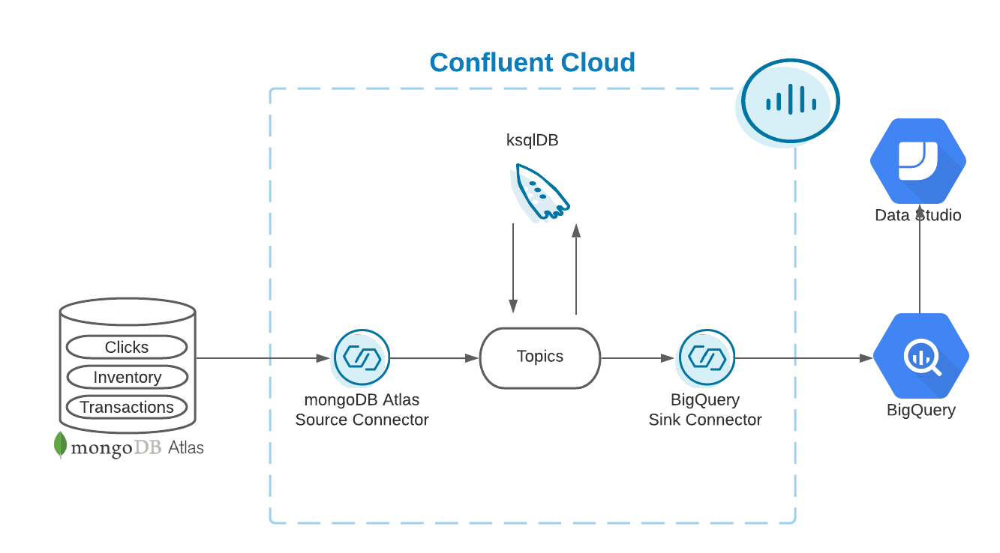

<div align="center" padding=25px>
    
</div>

# <div align="center">Getting Started with Stream Processing</div>
## <div align="center">Lab Guide</div>

## **Agenda**
1. [Log Into Confluent Cloud](#step-1)
1. [Create an Environment and Cluster](#step-2)
1. [Create a Schema Registry Instance](#step-3)
1. [Setup ksqlDB](#step-4)
1. [Create a Topic using the Cloud UI](#step-5)
1. [Create an API Key Pair](#step-6)
1. [Connect mongoDB Atlas source to Confluent Cloud](#step-7)
1. [Cloud Dashboard Walkthrough](#step-8)
1. [Create Streams and Tables using ksqlDB](#step-9)
1. [Stream Processing with ksqlDB](#step-10)
1. [Connect BigQuery sink to Confluent Cloud](#step-11)
1. [Clean Up Resources](#step-11)
1. [Confluent Resources and Further Testing](#confluent-resources-and-further-testing)

***

## **Architecture Diagram**

<div align="center">
    
</div>

This workshop will be utilizing mongoDB Atlas, BigQuery, and Data Studio instances that are being managed by Confluent. You will not be able to access these instances outside of the workshop time.  To test ksqlDB and connectors outside of the workshop you can take a look at the ksqlDB [quickstart](https://docs.confluent.io/cloud/current/get-started/ksql.html) and fully-managed connectors [page](https://docs.confluent.io/cloud/current/connectors/index.html#kafka-connect-cloud).
***

## **Prerequisites**

1. Confluent Cloud Account
    * Sign-up for a Confluent Cloud account [here](https://www.confluent.io/confluent-cloud/tryfree/).
    * Once you have signed up and logged in, click on the menu icon at the upper right hand corner, click on “Billing & payment”, then enter payment details under “Payment details & contacts”.

    > **Note:** You will create resources during this workshop that will incur costs. When you sign up for a Confluent Cloud account, you will get up to $200 per month deducted from your Confluent Cloud statement for the first three months. This will cover the cost of resources created during the workshop.

1. Ports `443` and `9092` need to be open to the public internet for outbound traffic. To check, try accessing the following from your web browser:
    * portquiz.net:443
    * portquiz.net:9092

***

## **Objective**

In this workshop you will learn how Confluent Cloud can enable you to quickly and easily stand up a streaming ETL pipeline. During this workshop you’ll get hands-on experience with building out an end-to-end ETL pipeline; from extracting & loading data from out-of-the-box source & target systems with connectors to transforming the data in real-time with ksqlDB all in Confluent Cloud. The use case will be centered around creating dynamic product promotions based on real-time purchases, inventory levels, and clickstream data applying a number of transformations like filter, aggregate or join on your data streams, and then easily loading it in the destination application, all without having to type a single line of code.

Attendees will leave with a clear understanding of their upcoming ETL implementation, how to get started with Confluent Cloud, and the resources available to assist with development.

This workshop is perfect for those looking to build the foundation for your data processing pipeline and ETL use cases and to get started with Confluent Cloud. This is also a great session to ask the engineers your questions and participate in a forum with other attendees who already use Confluent Cloud or plan to use Confluent Cloud.

***

## <a name="step-1"></a>Step 1: Log Into Confluent Cloud

1. First, access Confluent Cloud sign-in by navigating [here](https://confluent.cloud).
1. When provided with the *username* and *password* prompts, fill in your credentials.
    > **Note:** If you're logging in for the first time you will see a wizard that will walk you through the some tutorials. Minimize this as you will walk through these steps in this guide.

***

## <a name="step-2"></a>Step 2: Create an Environment and Cluster

An environment contains Confluent clusters and its deployed components such as Connect, ksqlDB, and Schema Registry. You have the ability to create different environments based on your company's requirements. Confluent has seen companies use environments to separate Development/Testing, Pre-Production, and Production clusters.

1. Click **+ Add environment**.
    > **Note:** There is a *default* environment ready in your account upon account creation. You can use this *default* environment for the purpose of this workshop if you do not wish to create an additional environment.

    * Specify a meaningful `name` for your environment and then click **Create**.
        > **Note:** It will take a few minutes to assign the resources to make this new environment available for use.

1. Now that you have an environment, let's create a cluster. Select **Create Cluster**.
    > **Note**: Confluent Cloud clusters are available in 3 types: **Basic**, **Standard**, and **Dedicated**. Basic is intended for development use cases so you should use that for this lab. Basic clusters only support single zone availability. Standard and Dedicated clusters are intended for production use and support Multi-zone deployments. If you’re interested in learning more about the different types of clusters and their associated features and limits, refer to this [documentation](https://docs.confluent.io/current/cloud/clusters/cluster-types.html).

    * Choose the **Basic** cluster type.

    * Click **Begin Configuration**.

    * Choose **GCP** as your Cloud Provider and your preferred Region.
        > **Note:** GCP is required as your Cloud Provider since you will be utilizing the fully-managed BigQuery sink connector for this workshop

    * Specify a meaningful **Cluster Name** and then review the associated *Configuration & Cost*, *Usage Limits*, and *Uptime SLA* before clicking **Launch Cluster**.

***

## <a name="step-3"></a>Step 3: Create a Schema Registry Instance

A topic contains messages, and each message is a key-value pair. The message key or the message value (or both) can be serialized as JSON, Avro, or Protobuf. A schema defines the structure of the data format.

Confluent Cloud Schema Registry is used to manage schemas and it defines a scope in which schemas can evolve. It stores a versioned history of all schemas, provides multiple compatibility settings, and allows schemas to evolve according to these compatibility settings. It is also fully-managed.

You will be exploring Confluent Cloud Schema Registry in more detail towards the end of the workshop. First, you will need to enable Schema Registry within your environment.

1. Return to your environment by clicking on the Confluent icon at the top left corner and then clicking your environment tile.

1. Click on **Schema Registry**. Select your cloud provider and region, and then click on **Enable Schema Registry**.

***

## <a name="step-4"></a>Step 4: Setup ksqlDB

1. On the navigation menu, select **ksqlDB** and click **Create application myself**.

1. Select **Global Access** and then **Continue**.

1. Name your ksqlDB application and set the streaming units to

1. Click **Launch Application**!
> **Note:** A streaming unit, also known as a Confluent Streaming Unit (CSU), is the unit of pricing for Confluent Cloud ksqlDB. A CSU is an abstract unit that represents the linearity of performance.

***

## <a name="step-5"></a>Step 5: Create a Topic using the Cloud UI

1. On the navigation menu, select **Topics** and click **Create Topic**.
    > **Note:** Refresh the page if your cluster is still spinning up.

1. Enter **abc.inventory** as the Topic name and **1** as the Number of partitions
    > **Note:** Topics have many configurable parameters that dictate how Confluent handles messages. A complete list of those configurations for Confluent Cloud can be found [here](https://docs.confluent.io/cloud/current/using/broker-config.html).  If you’re interested in viewing the default configurations, you can view them in the *Topic Summary* on the right side.

1. Click **Create with defaults**.

    * **inventory** is the name of one of the collections and abc is the database name within the mongoDB Atlas that you will be sourcing data from.

***


## <a name="step-6"></a>Step 6: Create an API Key Pair

1. Select **API keys** on the navigation menu.

1. If this is your first API key within your cluster, click **Create key**. If you have set up API keys in your cluster in the past and already have an existing API key, click **+ Add key**.

1. Select **Global Access**, then click Next.

1. Save your API key and secret - you will need these during the workshop.

1. After creating and saving the API key, you will see this API key in the Confluent Cloud UI in the **API keys** tab. If you don’t see the API key populate right away, refresh the browser.

***

## <a name="step-7"></a>Step 7: Connect mongoDB Atlas to Confluent Cloud

The next step is to source data from mongoDB using the [fully-managed mongoDB Atlas Source connector] (https://docs.confluent.io/cloud/current/connectors/cc-mongo-db-source.html). The connector will send real time data on clicks, inventory, and transactions to Confluent Cloud.

1. First, you will create the connector that will send data to clicks, inventory, and transactions topics. From the Confluent Cloud UI, click on the **Connectors** tab on the navigation menu. Search and click on the **mongoDB Atlas Source** icon.

1. Enter the following configuration details. The remaining fields can be left blank.

<div align="center">

| Setting            | Value                        |
|------------------------|-----------------------------------------|
| `Name`      | MongoDbAtlasSourceConnector |
| `Kafka API Key`              | From step 6                 |
| `Kafka API Secret`           | From step 6              |
| `Connection host`    | Will be provided during workshop            |
| `Connection user` | dbUser               |
| `Connection password`    | MONGODB_PW             |
| `Database name`    | abc           |
| `Copy existing data`    | True             |
| `Output message format`    | JSON           |
| `Tasks`    | 1             |

</div>

3. Click on **Next**.

1. Before launching the connector, you will be brought to the summary page.  Once you have reviewed the configs and everything looks good, select **Launch**.

1. This should return you to the main Connectors landing page. Wait for your newly created connector to change status from **Provisioning** to **Running**.

1. If you navigate back to the **Topics** tab you will notice two newly created topics **abc.transactions** and **abc.clicks**.  The connector automatically created these two additional topics based on the collections in the mongoDB Atlas database where data is being sourced from.

***

## <a name="step-8"></a>Step 8: Cloud Dashboard Walkthrough

This section will be conducted by the workshop instructor.  You can find additional information on the Cloud Dashboard [here](https://docs.confluent.io/cloud/current/overview.html) and [here](https://docs.confluent.io/cloud/current/client-apps/cloud-basics.html).

***

## <a name="step-9"></a>Step 9: Create Streams and Tables using ksqlDB

Now that you have data flowing through Confluent, you can now easily build stream processing applications using ksqlDB. You are able to continuously transform, enrich, join, and aggregate your data using simple SQL syntax. You can gain value from your data directly from Confluent in real-time. Also, ksqlDB is a fully managed service within Confluent Cloud with a 99.9% uptime SLA. You can now focus on developing services and building your data pipeline while letting Confluent manage your resources for you.

With ksqlDB, you have the ability to leverage streams and tables from your topics in Confluent. A stream in ksqlDB is a topic with a schema and it records the history of what has happened in the world as a sequence of events. Tables are similar to traditional RDBMS tables. If you’re interested in learning more about ksqlDB and the differences between streams and tables, I recommend reading these two blogs [here](https://www.confluent.io/blog/kafka-streams-tables-part-3-event-processing-fundamentals/) and [here](https://www.confluent.io/blog/how-real-time-stream-processing-works-with-ksqldb/).

1. Navigate back to the ksqlDB tab and click on your application name. This will bring us to the ksqlDB editor.

>**Note:** You can interact with ksqlDB through the Editor. You can create a stream by using the CREATE STREAM statement and a table using the CREATE TABLE statement.

To write streaming queries against topics, you will need to register the topics with ksqlDB as a stream and/or table.

2. First, create a **Stream** by registering the **abc.clicks** topic as a stream called **clicks**

    * Insert the following query into the ksqlDB editor and click ‘**Run query**’ to execute

```SQL
CREATE STREAM clicks(
    ip VARCHAR,
    userid INT,
    prod_id INT,
    bytes BIGINT,
    referrer VARCHAR,
    agent VARCHAR,
    click_ts BIGINT
    )
WITH (
    KAFKA_TOPIC='abc.clicks',
    VALUE_FORMAT='JSON',
    TIMESTAMP='click_ts'
);
```

3. Create another **Stream** by registering the **abc.transactions** topic as a stream called **transactions**

```sql
CREATE STREAM transactions (
  fullDocument STRUCT<
    cust_id INT,
    prod_id INT,
    txn_ts BIGINT>)
  WITH (
    KAFKA_TOPIC='abc.transactions',
    VALUE_FORMAT='JSON'
  );
```

4. Create another **Stream** by registering the **abc.inventory** topic as a stream called **inventory00**

```SQL
CREATE STREAM inventory00 (
  fullDocument STRUCT<
    product_id INT,
    name VARCHAR,
    "list" INT,
    discount INT,
    available INT,
    capacity INT,
    txn_hour INT>)
  WITH (
    KAFKA_TOPIC='abc.inventory',
    VALUE_FORMAT='JSON'
  );
```

5. Create an **inventory Table** based on the **inventory00** stream that you just created
    * Make sure to set ‘auto.offset.reset’ = ‘earliest’ first
    * This is a Persistent Query.  A Persistent Query runs indefinitely as it processes rows of events and writes to a new topic. You can create persistent queries by deriving new streams and new tables from existing streams or tables.

```SQL
CREATE TABLE INVENTORY AS
  SELECT
FULLDOCUMENT->PRODUCT_ID AS PRODUCT_ID,
LATEST_BY_OFFSET(FULLDOCUMENT->NAME) AS NAME,
LATEST_BY_OFFSET(FULLDOCUMENT->"list") AS LIST_PRICE,
LATEST_BY_OFFSET(FULLDOCUMENT->DISCOUNT) AS DISCOUNT,
LATEST_BY_OFFSET(FULLDOCUMENT->AVAILABLE) AS AVAILABLE,
LATEST_BY_OFFSET(FULLDOCUMENT->CAPACITY) AS CAPACITY,
LATEST_BY_OFFSET(FULLDOCUMENT->TXN_HOUR) AS TXN_HOUR
FROM INVENTORY00
GROUP BY FULLDOCUMENT->PRODUCT_ID;
```

6. Next, go to the **Tables** tab at the top and click on **INVENTORY**. This provides information on the table, topic (including replication, partitions, and key and value serialization), and schemas.

7. Click on **Query table** which will take you back to the **Editor**. You will see the following query auto-populated in the editor which may be already running by default. If not, click on **Run query**. An option is to set the ‘auto.offset.reset=earliest’ before clicking **Run query**.

Optionally, you can navigate to the editor and construct the select statement on your own, which should look like the following:

```SQL
SELECT * FROM INVENTORY EMIT CHANGES;
```

8. You should see the following data within your **INVENTORY** table.

9. Stop the query by clicking **Stop**


***

## <a name="step-10"></a>Step 10: Stream Processing with ksqlDB

1. Create a **PRODUCT_TXN_PER_HOUR** table based on the **INVENTORY** table and **TRANSACTIONS** stream.  Make sure to first set 'auto.offset.reset' = 'earliest' before running the query.

```SQL
CREATE TABLE PRODUCT_TXN_PER_HOUR WITH (FORMAT='AVRO') AS
SELECT T.FULLDOCUMENT->PROD_ID,
       COUNT(*) AS TXN_PER_HOUR,
       MAX(I.TXN_HOUR) AS EXPECTED_TXN_PER_HOUR,
       (CAST(MAX(I.AVAILABLE) AS DOUBLE)/ CAST(MAX(I.CAPACITY) AS DOUBLE))*100 AS STOCK_LEVEL, I.NAME AS PRODUCT_NAME
FROM  TRANSACTIONS T
      LEFT JOIN INVENTORY I
      ON T.FULLDOCUMENT->PROD_ID = I.PRODUCT_ID
WINDOW HOPPING (SIZE 1 HOUR, ADVANCE BY 5 MINUTES)
GROUP BY T.FULLDOCUMENT->PROD_ID,
         I.NAME;
```

2. Create a stream on the underlying topic backing the **PRODUCT_TXN_PER_HOUR** table that you just created
    * Determine the name of the backing topic by navigating to the **Topics** tab on the left hand side menu under **Cluster**.  You should see a topic that begins with **pksqlc-**… and ends with **PRODUCT_TXN_PER_HOUR**. Click on this topic and copy down this topic name as it will be required for the following query
    * Create the stream based on the backing topic for PRODUCT_TXN_PER_HOUR table

```SQL
CREATE STREAM PRODUCT_TXN_PER_HOUR_STREAM WITH (KAFKA_TOPIC='pksqlc-...PRODUCT_TXN_PER_HOUR', FORMAT='AVRO');
```

3. Now you want to perform a query to see which products you should create promotions for based on the following criteria
    * High inventory level (>80% of capacity)
    * Low transactions (< expected transactions/hour)

```SQL
CREATE STREAM ABC_PROMOTIONS AS
SELECT  ROWKEY,
        TIMESTAMPTOSTRING(ROWTIME,'yyyy-MM-dd HH:mm:ss','Europe/London') AS TS,
        AS_VALUE(ROWKEY -> PROD_ID) AS PROD_ID ,
        ROWKEY -> PRODUCT_NAME AS PRODUCT_NAME,
        STOCK_LEVEL ,
        TXN_PER_HOUR ,
        EXPECTED_TXN_PER_HOUR
   FROM PRODUCT_TXN_PER_HOUR_STREAM
WHERE TXN_PER_HOUR < EXPECTED_TXN_PER_HOUR
  AND  STOCK_LEVEL > 80
  ;
```

4. Query the results.  Make sure to set ‘auto.offset.reset=earliest’

```SQL
SELECT * FROM ABC_PROMOTIONS EMIT CHANGES;
```

***

## <a name="step-11"></a>Step 11: Connect BigQuery sink to Confluent Cloud

The next step is to sink data from Confluent Cloud into BigQuery using the [fully-managed BigQuery Sink connector](https://docs.confluent.io/cloud/current/connectors/cc-gcp-bigquery-sink.html). The connector will send real time data on promotions into BigQuery.

1. First, you will create the connector that will automatically create a BigQuery table and populate that table with the data from the promotions topic within Confluent Cloud. From the Confluent Cloud UI, click on the Connectors tab on the navigation menu and select **+Add connector**. Search and click on the BigQuery Sink icon.

2. Enter the following configuration details. The remaining fields can be left blank.

<div align="center">

| Setting            | Value                        |
|------------------------|-----------------------------------------|
| `Topics`      | pksqlc-...ABC_PROMOTIONS |
| `Name`              | BigQuerySinkConnector                 |
| `Input message format`           | Avro            |
| `Kafka API Key`    | From step 6           |
| `Kafka API Secret` | From step 6              |
| `GCP credentials file`    | [JSON file link](https://drive.google.com/drive/folders/1EOYZkyWvpnCydBCv2hv8DMH8FlZKuXKV)            |
| `Project ID`    | Will be provided during workshop          |
| `Dataset`    | Will be provided during workshop          |
| `Auto create tables`    | True          |
| `Tasks`    | 1             |

</div>

3. Click on **Next**.

4. Before launching the connector, you will be brought to the summary page.  Once you have reviewed the configs and everything looks good, select **Launch**.

5. This should return you to the main Connectors landing page. Wait for your newly created connector to change status from **Provisioning** to **Running**.

6. Shortly after, the workshop instructor will switch over to the BigQuery page within Google Console to show that a table matching the topic name you used when creating the BigQuery connector in Confluent Cloud has been created within the **workshop** dataset.  Clicking the table name should open a BigQuery editor for it:


***

## <a name="step-12"></a>Step 12: Clean Up Resources

Deleting the resources you created during this workshop will prevent you from incurring additional charges.

1. The first item to delete is the ksqlDB application. Select the Delete button under Actions and enter the Application Name to confirm the deletion.

2. Delete the BigQuery sink connector by navigating to **Connectors** in the navigation panel, clicking your connector name, then clicking the trash can icon in the upper right and entering the connector name to confirm the deletion.

3. Delete the mongoDB Atlas source connector by navigating to **Connectors** under Cluster in the navigation panel, clicking your connector name, then clicking the trash can icon in the upper right and entering the connector name to confirm the deletion.

4. Delete the Cluster by going to the **Settings** tab and then selecting **Delete cluster**

 5. Delete the Environment by expanding right hand menu and going to **Environments** tab and then clicking on **Delete** for the associated Environment you would like to delete

***

## <a name="confluent-resources-and-further-testing"></a>Confluent Resources and Further Testing

Here are some links to check out if you are interested in further testing:

* Confluent Cloud [Basics](https://docs.confluent.io/cloud/current/client-apps/cloud-basics.html)

* [Quickstart](https://docs.confluent.io/cloud/current/get-started/index.html) with Confluent Cloud

* Confluent Cloud ksqlDB [Quickstart](https://docs.confluent.io/cloud/current/get-started/ksql.html)

* Confluent Cloud [Demos/Examples](https://docs.confluent.io/platform/current/tutorials/examples/ccloud/docs/ccloud-demos-overview.html)

* ksqlDB [Tutorials](https://kafka-tutorials.confluent.io/)

* Full repository of Connectors within [Confluent Hub](https://www.confluent.io/hub/)
