<div align="center" padding=25px>
    
</div>

# <div align="center">Seamlessly Connect Sources and Sinks to Confluent Cloud with Kafka Connect</div>
## <div align="center">Lab Guide</div>
<br>

## **Agenda**

1. [Log in to Confluent Cloud](#step-1)
1. [Create an Environment and Cluster](#step-2)
1. [Create a Topic and Cloud Dashboard Walkthrough](#step-3)
1. [Create an API Key Pair](#step-4)
1. [Enable Schema Registry](#step-5)
1. [Set Up: Connect Self Managed Services to Confluent Cloud](#step-6)
1. [Deploy: Connect Self Managed Services to Confluent Cloud](#step-7)
1. [Install: Self Managed Debezium PostgreSQL CDC Source Connector](#step-8)
1. [Launch: PostgreSQL Source Connector in Confluent Control Center](#step-9)
1. [Fully-Managed AWS S3 Sink / Azure Blob Storage Sink / Google Cloud Storage Sink Connectors](#step-10)
1. [Confluent Cloud Schema Registry](#step-11)
1. [Clean Up Resources](#step-12)
1. [Confluent Resources and Further Testing](#step-13)

***

## **Architecture**

<div align="center">
    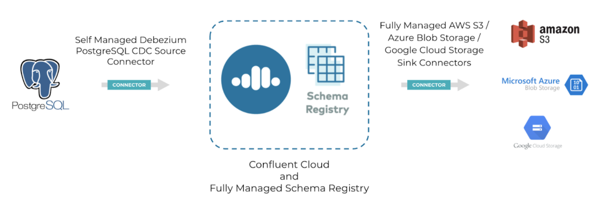
</div>

*** 

## **Prerequisites**
<br>

1. Confluent Cloud Account
    - Sign-up for a Confluent Cloud account [here](https://www.confluent.io/confluent-cloud/tryfree/)
    - Once you have signed up and logged in, click on the menu icon at the upper right hand corner, click on "Billing & payment", then enter payment details under “Payment details & contacts”. A screenshot of the billing UI is included below.

    > **Note:** You will create resources during this workshop that will incur costs. When you sign up for a Confluent Cloud account, you will get up to $200 per month deducted from your Confluent Cloud statement for the first three months. This will cover the cost of resources created during the workshop.

2. Ports 443 and 9092 need to be open to the public internet for outbound traffic. To check, try accessing the following from your web browser:
    - portquiz.net:443
    - portquiz.net:9092

1. This workshop requires access to a command line interface.
    * **Mac users:** The standard Terminal application or iTerm2 are recommended.
    * **Windows users:** The built-in Command Prompt or Git BASH are recommended.  

1. Git access, see [here](https://git-scm.com/book/en/v2/Getting-Started-Installing-Git) for installation instructions. After installation, verify that the installation was successful with the following command:
    ```bash
    # Check the git version
    git --version
    ```

1. This workshop requires `docker`. Download *Docker Desktop* [here](https://www.docker.com/products/docker-desktop). After installation, verify that the installation was successful with the following command:
    ```bash
    # Check the docker version
    docker --version
    ```

  > **Note:** You will be deploying Confluent Platform services and connecting them to Confluent Cloud. There are multiple ways to install Confluent Platform, which you can view in [On-Premises Deployments](https://docs.confluent.io/platform/current/installation/installing_cp/overview.html). In order to make the set up easier for those running different operating systems during the workshop, you will walk through setting up Confluent Platform using Docker. You can accomplish the steps in this lab guide using any of the other deployment methods.

6. AWS / Azure / GCP account - You will be creating a fully-managed sink connector to an object storage. 
    - Access Key/Credentials
        - AWS: [Access Keys](https://docs.aws.amazon.com/general/latest/gr/aws-sec-cred-types.html#access-keys-and-secret-access-keys)
        - Azure: [Manage account access keys](https://docs.microsoft.com/en-us/azure/storage/common/storage-account-keys-manage?tabs=azure-portal)
        - GCP:  [Creating and managing service accounts](https://cloud.google.com/iam/docs/creating-managing-service-accounts)

    - Bucket/Container Name - Create the object storage before the workshop and have the name of the bucket/container ready.

    - Region - Note which region you are deploying your object storage resource in. You will need to know during the workshop.

    - IAM Policy configured for bucket access
        - AWS: Follow the directions outlined in [IAM Policy for S3](https://docs.confluent.io/cloud/current/connectors/cc-s3-sink.html#cc-s3-bucket-policy)
        - GCP:  Your GCP service account role must have permission to create new objects in the GCS bucket. For example, the Storage Admin role can be selected for this purpose. If you are concerned about security and do not want to use the Storage Admin role, only use the storage.objects.get and storage.objects.create roles. Also, note that the Storage Object Admin role does not work for this purpose.

1. Clone Confluent's Commercial SE workshop repository to your machine to access useful files. 
    > **Note:** This repository contains **all** of the workshops and workshop series Confluent's Commercial SE team has created. Be sure to navigate to the correct sub-folder to use the right content.
    ```bash
    # clone the Commercial SE workshop repository
    git clone https://github.com/confluentinc/commercial-workshops.git
    ```
    Navigate to the correct sub-folder to access this labs content. This should act as your working directory for the remainder of the lab. 
    ```bash 
    # navigate to the correct sub-folder
    cd commercial-workshops/series-microservices/workshop-connectors/
    ```

***

## **Objective:**

Welcome to "Seamlessly Connect Sources and Sinks to Confluent Cloud with Kafka Connect"! In this workshop, you will learn how to connect your external systems to Confluent Cloud using Connectors. Confluent offers 180+ pre-built connectors for you to start using today with no coding or developing required. To view the complete list of connectors from Confluent, please see [Confluent Hub](https://www.confluent.io/hub/).

If you attended the first workshop in our Microservices Series, "Getting Started with Microservices in Confluent Cloud", you walked through how to apply your microservices use case to the world of event streaming with Confluent Cloud. 

Now, you'll cover what to do when you have other systems you want to pull data from or push data to. This can be anything from a database or data warehouse to object storage or a software application. You can easily connect these systems to Confluent Cloud using one of the pre-built connectors.

During the workshop, you will first set up your Confluent Cloud account, including creating your first cluster and topic, and setting up Schema Registry. 

Next, you will set up and deploy 2 different types of connectors: Self Managed and Fully-Managed.

* Self Managed Connectors are installed on a self managed Connect cluster that is then connected to your Confluent Cloud cluster. You will be walking through how to set up a local Connect cluster by downloading Confluent Platform, installing the connector offered by Confluent, and then connecting it to your cluster running in Confluent Cloud.

* Fully-Managed Connectors are available as fully-managed and fully hosted in Confluent Cloud. With a simple GUI-based configuration and elastic scaling with no infrastructure to manage, these fully-managed connectors make moving data in and out of Confluent simple. You will be walking through how to launch a fully-managed connector in the UI. Note that it can also be launched using the ccloud CLI. 

You will also learn more about Schema Registry and how you can use it in Confluent Cloud to ensure data compatibility and to manage your schemas. 

By the conclusion of the workshop, you will have learned how to leverage both self managed and fully-managed connectors to complete your data pipeline!

## <a name="step-1"></a>**Log in to Confluent Cloud**
1. Log in to [Confluent Cloud](https://confluent.cloud) and enter your email and password.

<div align="center" padding=25px>
    
</div>

2. If you are logging in for the first time, you will see a self-guided wizard that walks you through spinning up a cluster. Please minimize this as you will walk through those steps in this workshop. 

*** 

## <a name="step-2"></a>**Create an Environment and Cluster**

An environment contains clusters and its deployed components such as Connectors, ksqlDB, and Schema Registry. You have the ability to create different environments based on your company's requirements. Confluent has seen companies use environments to separate Development/Testing, Pre-Production, and Production clusters.

1. Click **+ Add Environment**. Specify an **Environment Name** and Click **Create**. 

    >**Note:** There is a *default* environment ready in your account upon account creation. You can use this *default* environment for the purpose of this workshop if you do not wish to create an additional environment.

<div align="center" padding=25px>
    
</div>

2. Now that you have an environment, click **Create Cluster**. 

    > **Note:** Confluent Cloud clusters are available in 3 types: Basic, Standard, and Dedicated. Basic is intended for development use cases so you will use that for the workshop. Basic clusters only support single zone availability. Standard and Dedicated clusters are intended for production use and support Multi-zone deployments. If you are interested in learning more about the different types of clusters and their associated features and limits, refer to this [documentation](https://docs.confluent.io/current/cloud/clusters/cluster-types.html).

3. Choose the **Basic** Cluster Type. 

<div align="center" padding=25px>
    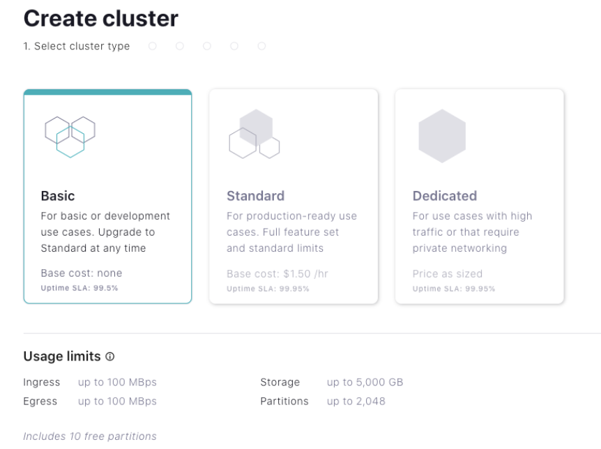
</div>

4. Click **Begin Configuration**.
5. Choose your preferred Cloud Provider (AWS, GCP, or Azure), Region, and Availability Zone.
     * **Choose the cloud provider you have your object storage set up with** 
     * **Choose the same region where your object storage resource is deployed**

6. Specify a **Cluster Name** - any name will work here. 

<div align="center" padding=25px>
    
</div>

7. View the associated Configuration & Cost, Usage Limits, and Uptime SLA information before launching.

8. Click **Launch Cluster.**

<div align="center" padding=25px>
    
</div>

## <a name="step-3"></a>**Create a Topic and Cloud Dashboard Walkthrough**

1. On the left hand side navigation menu, you will see **Cluster**.

    This section shows Cluster Metrics, such as Throughput and Storage. This page also shows the number of Topics, Partitions, Connectors, and ksqlDB Applications.  Below is an example of the metrics dashboard once you have data flowing through Confluent Cloud. 

<div align="center" padding=25px>
    
</div>

2. Click on **Settings**. This is an important tab that should be noted. This is where you can find your cluster ID, bootstrap server, cloud details, cluster type, and capacity limits. 
3. Copy and save the bootstrap server - you will use it later in the workshop.
4. On that same navigation menu, select **Topics** and click **Create Topic**. 
5. Enter **dbserver1.inventory.customers** as the Topic name and **1** as the Number of partitions, then click on **Create with defaults**.
    <div align="center" padding=25px>
       
    </div>

    **dbserver1.inventory.customers** is the name of the table within the Postgres database you will be setting up in a later section.

    > **Note:** Topics have many configurable parameters that dictate how messages are handled. A complete list of those configurations for Confluent Cloud can be found [here](https://docs.confluent.io/cloud/current/using/broker-config.html).  If you are interested in viewing the default configurations, you can view them in the Topic Summary on the right side. 

6. After creation, the **Topics UI** allows you to monitor production and consumption throughput metrics and the configuration parameters for your topics. When you begin sending messages to Confluent Cloud, you will be able to view those messages and message schemas. 

7. Below is a look at your topic, dbserver1.inventory.customers, but you need to send data to this topic before you see any metrics. 
    <div align="center" padding=25px>
       
    </div>

## <a name="step-4"></a>**Create an API Key Pair**

1. Select **API keys** on the navigation menu. 
2. If this is your first API key within your cluster, click **Create key**. If you have set up API keys in your cluster in the past and already have an existing API key, click **+ Add key**.
    <div align="center" padding=25px>
       
    </div>

3. Select **Global Access**, then click Next.
4. Save your API key and secret - you will need these during the workshop.
5. After creating and saving the API key, you will see this API key in the Confluent Cloud UI in the **API keys** tab. If you don’t see the API key populate right away, refresh the browser. 

## <a name="step-5"></a>**Enable Schema Registry**

A topic contains messages, and each message is a key-value pair. The message key or the message value (or both) can be serialized as JSON, Avro, or Protobuf. A schema defines the structure of the data format. 

Confluent Cloud Schema Registry is used to manage schemas and it defines a scope in which schemas can evolve. It stores a versioned history of all schemas, provides multiple compatibility settings, and allows schemas to evolve according to these compatibility settings. It is also fully-managed.

You will be exploring Confluent Cloud Schema Registry in more detail towards the end of the workshop. First, you will need to enable Schema Registry within your environment.

1. Return to your environment by clicking on the Confluent icon at the top left corner and then clicking your environment tile.
  <div align="center">
      
  </div>

2. Click on **Schema Registry**. Select your cloud provider and region, and then click on **Enable Schema Registry**.
  <div align="center">
      
  </div>

3. Next, you will create an API Key for Schema Registry. From here, click on the Edit icon under **API credentials**.
4. Click on **Add key** and save your API key and secret - you will also need these during the workshop. Click on **Done**.
5. **Important**: Make note of the **API endpoint**. You will use this endpoint in one of the steps later in the workshop.

## **<a name="step-6"></a>Set up and Connect Self Managed Services to Confluent Cloud**

Let’s say you have a database, or object storage such as AWS S3, Azure Blob Storage, or Google Cloud Storage, or a data warehouse such as Snowflake. How do you connect these data systems to your microservices architecture?

There are 2 options: <br>

1. Develop your own connectors using the Kafka Connect framework (this requires a lot of development time and effort).  
2. You can leverage the 180+ connectors Confluent offers out-of-the-box which allows you to configure your sources and sinks in a few, simple steps. To view the complete list of connectors that Confluent offers, please see [Confluent Hub](https://www.confluent.io/hub/).

With Confluent’s connectors, your data systems can communicate with your microservices, completing your data pipeline. 

If you want to run a connector not yet available as fully-managed in Confluent Cloud, you may run it yourself in a self-managed Connect cluster and connect it to Confluent Cloud. Please note that Confluent will still support any self managed components. 

Now that you have completed setting up your Confluent Cloud account, cluster, topic, and Schema Registry, this next step will guide you how to configure a local Connect cluster backed by your cluster in Confluent Cloud that you created earlier. 

1. Click on **Connectors**, and then click on **Self Managed**. 

    > **Note:** Self Managed connectors are installed on a local Connect cluster backed by a source cluster in Confluent Cloud. This Connect cluster will be hosted and managed by you, and Confluent will fully support it. 
    
    <div align="center" padding=25px>
       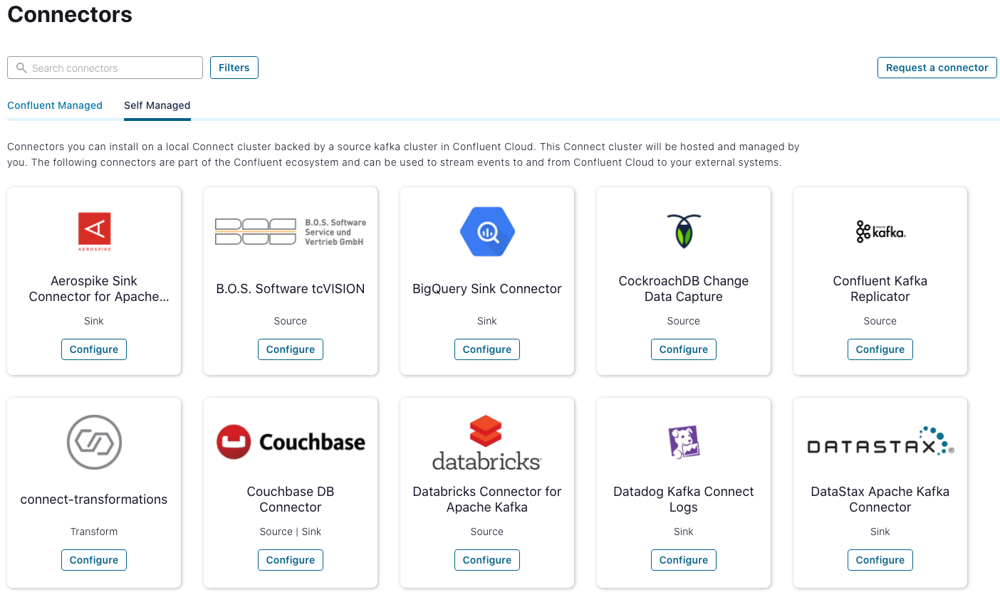
    </div>

1. To begin setting up **Connect**, you should have already cloned the repository during the Prerequisites step. If you have not, start by cloning Confluent's Commercial SE workshop repository.
    > **Note:** This repository contains **all** of the workshops and workshop series led by Confluent's Commercial SE team. Be sure to navigate to the correct sub-directory to access the right content. 
    ```bash
    # Clone Confluent's Commercial SE Workshop repo
    git clone https://github.com/confluentinc/commercial-workshops
    ```
    Then, navigate to the sub-directory for this lab.
    ```bash
    # Navigate to 'workshop-connectors'
    cd commercial-workshops/series-microservices/workshop-connectors
    ```

    This directory contains two important supporting files, `setup.properties` and `docker-compose.yml`. 

    You will use `setup.properties` in order to export values from your Confluent Cloud account as environment variables. `docker-compose.yml` will use the environment variables from there to create three containers: `connect`, `control-center`, and `postgres`. 

    You will use `control-center` to configure `connect` to do change data capture from `postgres` before sending this data Confluent Cloud. 

1. The next step is to replace the placeholder values surrounded in angle brackets within `setup.properties`. For reference, use the following table to fill out all the values completely.

    | property               | created in step                         |
    |------------------------|-----------------------------------------|
    | `BOOTSTRAP_SERVERS`      | [*create an environment and cluster*](#create-an-environment-and-kafka-cluster) |
    | `CLOUD_KEY`              | [*create an api key pair*](#create-an-api-key-pair)                  |
    | `CLOUD_SECRET`           | [*create an api key pair*](#create-an-api-key-pair)                  |
    | `SCHEMA_REGISTRY_KEY`    | [*enable schema registry*](#enable-schema-registry)                  |
    | `SCHEMA_REGISTRY_SECRET` | [*enable schema registry*](#enable-schema-registry)                  |
    | `SCHEMA_REGISTRY_URL`    | [*enable schema registry*](#enable-schema-registry)                  |

1. View the **docker-compose.yml**. 

    This will launch a PostgreSQL database and 2 Confluent Platform components - a Connect cluster and Confluent Control Center. Control Center is used to monitor your Confluent deployment. The file will not provision the brokers because you will be using the cluster you created in Confluent Cloud.

    The docker-compose.yml also has parameterized the values to connect to your Confluent Cloud instance, including the bootstrap servers and security configuration. You could fill in these Confluent Cloud credentials manually, but a more programmatic method is to create a local file with configuration parameters to connect to your clusters. To make it a lot easier and faster, you will use this method.

    You will be using Docker during this workshop. Alternatively, you can set up these Confluent Platform components and connect them to Confluent Cloud by installing Confluent Platform as a local install.

1. Run the following command to export the required properties to the console. 
    ```bash
    # export the variables to the console
    source setup.properties
    ```


1. Validate your credentials to Confluent Cloud Schema Registry.
    ```bash
    curl -u $SCHEMA_REGISTRY_BASIC_AUTH_USER_INFO $SCHEMA_REGISTRY_URL/subjects
    ```

    If successful, your output will return: `{ }%`

## <a name="step-7"></a>**Deploy: Connect Self Managed Services to Confluent Cloud**

You are now ready to start your Confluent Platform services - Connect and Control Center. Both will be connected to your cluster in Confluent Cloud, which is what you accomplished in the earlier steps.

1. Start Docker Desktop.

2. To bring up all of the services, run the following command:
    ```bash
    docker-compose up -d
    ```

3. Within Docker Desktop, go to Dashboard. Check if the services, including the PostgreSQL database, are all running successfully.

You have successfully installed the Debezium PostgreSQL CDC Source connector on your local Connect cluster. You also have a PostgreSQL database running in the container. These are all connected to Confluent Cloud. You are now ready to start producing data from your PostgreSQL database to Confluent Cloud.

## <a name="step-9"></a>**Launch: PostgreSQL Source Connector in Confluent Control Center**

You have seen and worked within the Confluent Cloud Dashboard in the previous steps. Because you have Confluent Platform services deployed, you can use Confluent Control Center (C3) to manage and monitor Confluent Platform, and it is also connected to Confluent Cloud from your set up. You will see confirmation that Control Center is indeed connected to Confluent Cloud by the end of this step.

1. Open a browser and go to **http://localhost:9021/** to access Confluent Control Center.

    <div align="center">
       
    </div>

    You will notice that the UI looks very similar to the Confluent Cloud dashboard. 

2. Click on the cluster, then click on **Topics**, and you should notice the **dbserver1.inventory.customers** topic that you had created in Confluent Cloud in Step 3. This is your first confirmation that Control Center and local Connect cluster are successfully connected to Confluent Cloud.
    
    <div align="center">
       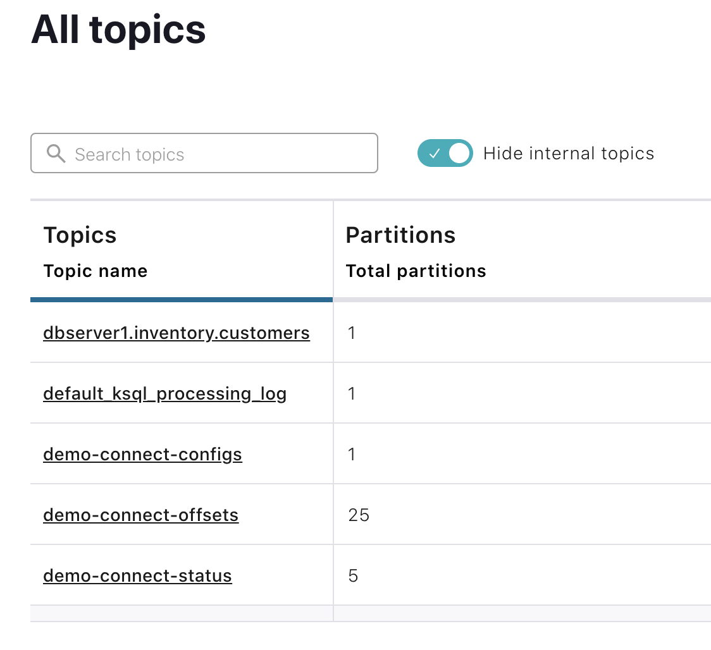
    </div>

3. Click on **Connect**. You will see a cluster already here named **connect-default**. If not, please refresh the page. This is your local Connect cluster that you have running in Docker. 

    <div align="center">
       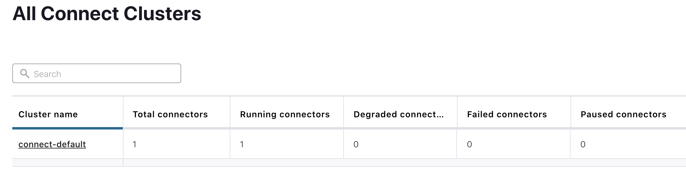
    </div>

4. Click on **connect-default**, **Add Connector**, and then on the **PostgresConnector Source** tile. 

    <div align="center">
       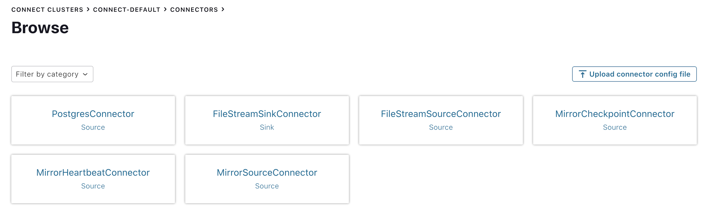
    </div>

5. As the final step in deploying the self managed PostgreSQL CDC Source connector, you will now create the connector. Enter the following configuration details:
    ```bash
    Name = PostgresSource
    Tasks max = 1
    Namespace = dbserver1
    Hostname = 0.0.0.0 
    Port = 5432
    User = postgres
    Password = confluent2021
    Database = postgres
    ```

    If you have networking rules that may not allow for connection to 0.0.0.0, then use *docker.for.mac.host.internal* as the hostname for Mac and use *docker.for.win.localhost* for Windows.

6. Scroll down to the very bottom of the page, click on **Continue**, review the configuration details, then click on **Launch.**
    <div align="center">
       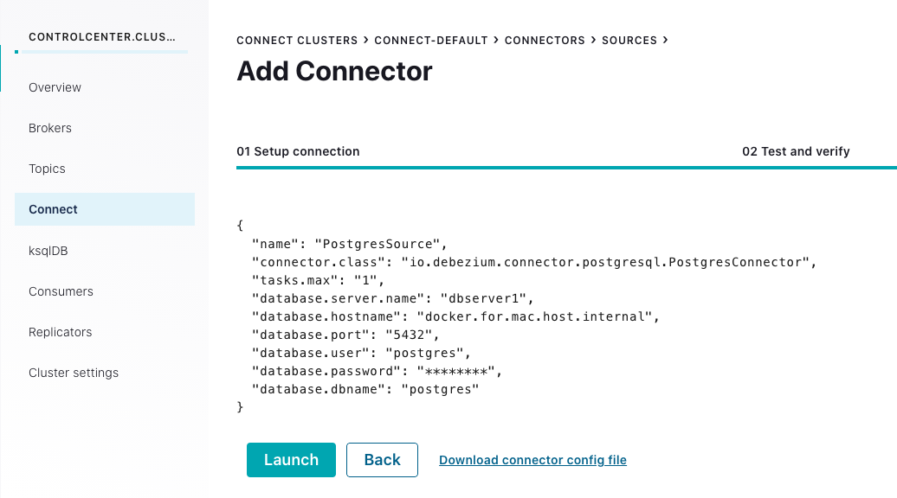
    </div>

7. Verify that the connector is running.

    <div align="center">
       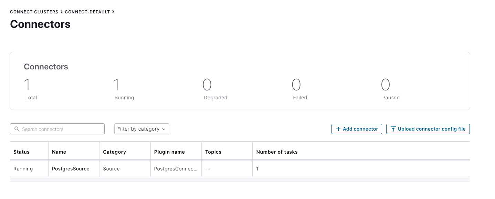
    </div>

8. Return to the Confluent Cloud UI, click on your cluster tile, then on **Topics**, then on the topic **dbserver1.inventory.customers**. You will now confirm that your PostgreSQL connector is working by checking to see if data is being produced to our Confluent Cloud cluster. You will see data being produced under the **Production** tile. 

9. Another way to confirm is to view the messages within the UI. Click on **Messages**. In the search bar at the top, set it to **Jump to Offset**. Enter **0** as the offset and click on the result **0 / Partition: 0**. 

    Remember, you created this topic with 1 partition. That partition is Partition 0.
	
10. You should now be able to see the messages within the UI. Click on the cards view (left option) to see the messages in a different format.

    <div align="center">
       
    </div>

	The messages should resemble:

    <div align="center">
       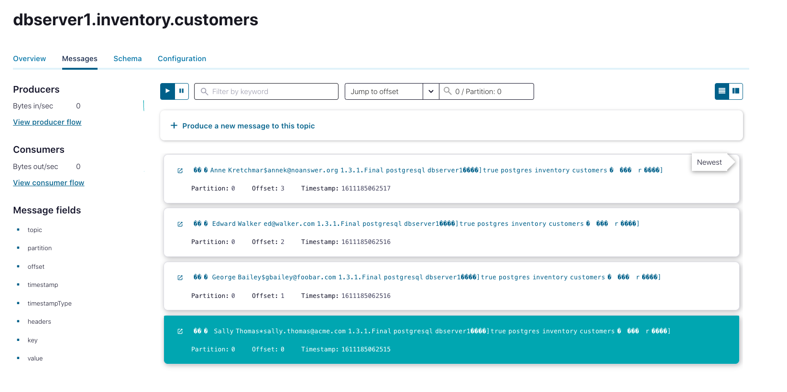
    </div>

    > **Note:** The unrecognized characters are a plaintext representation of Avro.

## <a name="step-10"></a>**Fully-Managed AWS S3 Sink / Azure Blob Storage Sink / Google Cloud Storage Sink Connectors**

In this step, you will set up a fully-managed connector to an object storage. You can find the official documentation on how to set up these connectors here:

- [Amazon S3 Sink Connector for Confluent Cloud](https://docs.confluent.io/cloud/current/connectors/cc-s3-sink.html#cc-s3-connect-sink)

- [Azure Blob Storage Sink Connector for Confluent Cloud](https://docs.confluent.io/cloud/current/connectors/cc-azure-blob-sink.html#cc-azure-blob-sink)

- [Google Cloud Storage Sink Connector for Confluent Cloud](https://docs.confluent.io/cloud/current/connectors/cc-gcs-sink.html#cc-gcs-connect-sink)

> **Note:** With fully-managed connectors, Confluent hosts and manages the Connect cluster and connector for you. Simply configure the connector of your choice to stream events between Confluent Cloud and your external systems. Confluent offers 30+ fully-managed connectors, with more on the way! You can view the full list [here](https://docs.confluent.io/cloud/current/connectors/index.html). 

1. Within Confluent Cloud, click on **Connectors**. You should see a list of connectors under **Fully Managed**. 

    <div align="center">
       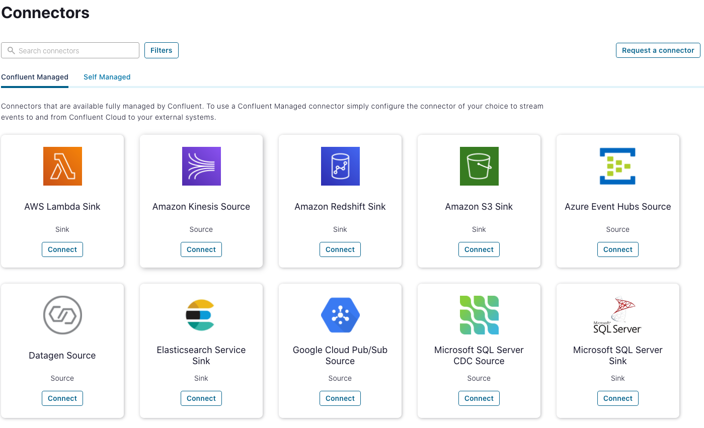
    </div>

2. Click on **Connect** for the Amazon S3 Sink, Google Cloud Storage Sink, or Azure Blob Storage Sink. 
    <div align="center">
       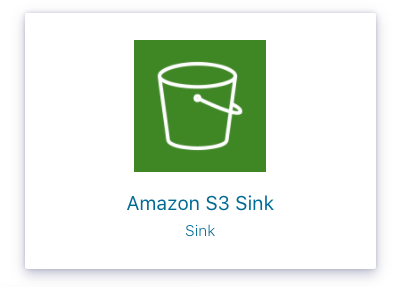
       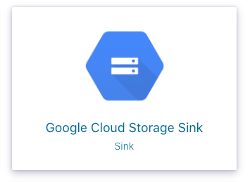
       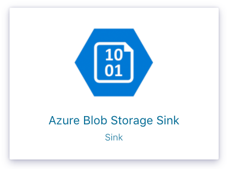
    </div>

3. Complete the configuration details. 

    | Configuration Setting               | Value                         |
    |------------------------|-----------------------------------------|
    | Which topics do you want to get data from? | `dbserver1.inventory.customers`                      |
    | Name                                       | Enter any connector name                           |
    | Message Format                             | Avro                                               |
    | API Key                              | Key created in [*create an api key pair*](#step-4) |
    | API Secret                           | Key created in [*create an api key pair*](#step-4) |
    | Bucket Name                                | Enter the name of your bucket/container            |
    | Output Message Format                      | AVRO                                               |
    | Time Interval                              | HOURLY                                             |
    | Flush Size                                 | 1000                                               |
    | Tasks                                      | 1                                                  |


    For credentials, choose one of the following depending on the cloud provider hosting your Confluent Cloud cluster:

    GCP:
    - You download service account [credentials as a JSON file](https://cloud.google.com/iam/docs/creating-managing-service-account-keys). These credentials are used when setting up the connector configuration. Upload your GCP credentials JSON file.

    AWS:
    - Your Amazon Access Key ID and Amazon Secret Access Key can be found in your AWS account under your security credentials

    Azure:
    - Your Azure Blob Storage Account Name will be the same as your [Azure block blob storage account](https://docs.microsoft.com/en-gb/azure/storage/blobs/storage-blob-create-account-block-blob), and your Azure Blob Storage Account Key will be your Azure [Azure storage account access key](https://docs.microsoft.com/en-us/azure/storage/common/storage-account-keys-manage?tabs=azure-portal)


    This should be your output before you **Launch** the connector, with the exception of the GCP/AWS/Azure credentials - please complete the details for your own credentials. Note this example is for S3:

    <div align="center">
       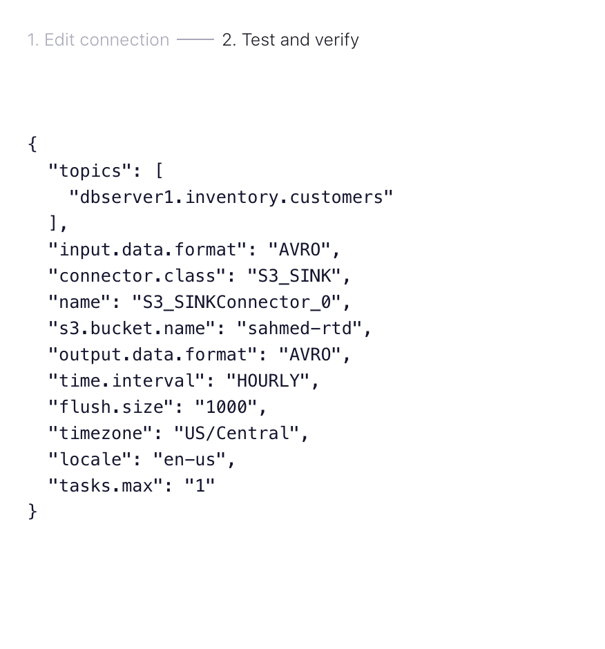
    </div>

4. View the connector, its status, and metrics on the **Connectors** page.

    <div align="center">  
       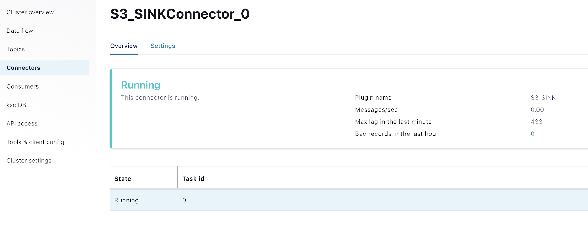
    </div>

5. Now let’s check on your bucket. Here is an example of what it will look like for S3. Notice the organizational method here is by year, month, day, and hour. 

    <div align="center">
       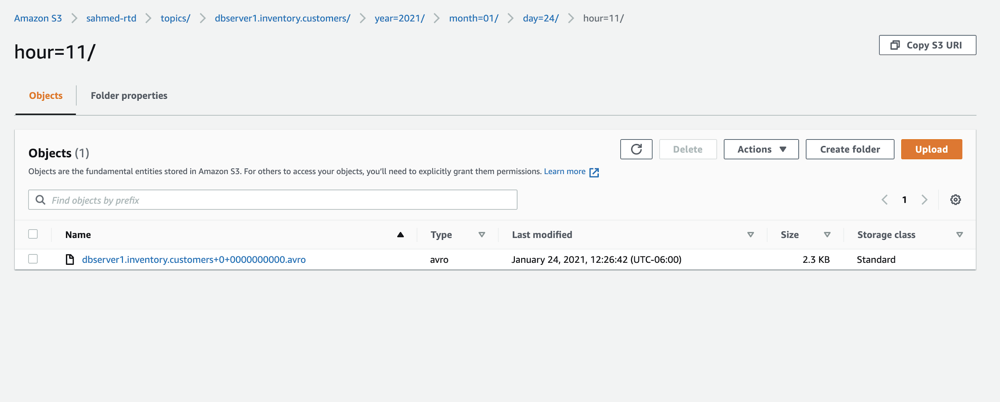
    </div>

    > **Note:** The following scenario describes one of the ways records may be flushed to storage, depending on the configuration settings you chose: You use the default setting of 1000 for Flush Size and the partitioner is set to hourly. 500 records arrive at one partition from 2:00pm to 3:00pm. At 3:00pm, an additional 5 records arrive at the partition. You will see 500 records in storage at 3:00pm. 

6. Finally, you will be going over error handling with Connectors. An invalid record may occur for a number of reasons. With Connect, errors that may occur are typically serialization and deserialization (serde) errors. For example, an error occurs when a record arrives at the sink connector in JSON format, but the sink connector configuration is expecting another format, like AVRO. 

    In Confluent Cloud, the connector does not stop when serde errors occur. Instead, the connector continues processing records and sends the errors to a [Dead Letter Queue (DLQ)](https://www.confluent.io/blog/kafka-connect-deep-dive-error-handling-dead-letter-queues/). You can use the record headers in a DLQ topic record to identify and troubleshoot an error when it occurs. Typically, these are configuration errors that can be easily corrected. 

7. When you launch a sink connector in Confluent Cloud, the DLQ topic is automatically created. The topic is named **dlq-<connector-ID>**. Click on **Topics** and find your dead letter queue topic. 
    <div align="center">
       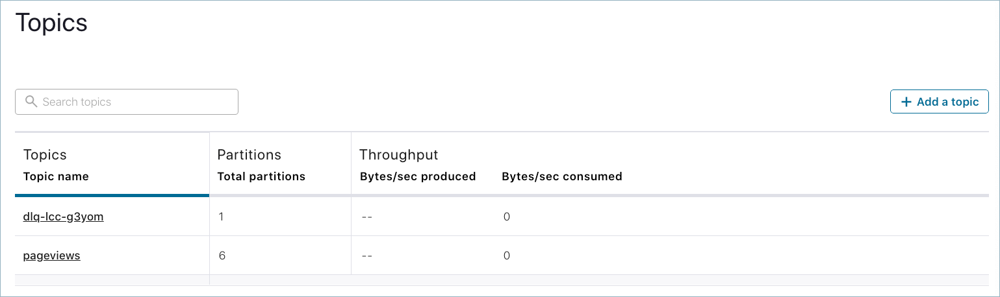
    </div>

    You are not expecting any errors in your data so your DLQ topic should be empty. 

8. You can walk through what it would look like if there were any errors by producing a message in JSON format when you are actually expecting Avro. Click on the **dbserver1.customers.inventory** topic, then click on **Messages**.

9.  Click on **+ Produce a new message to this topic**.

10. Either enter the data as shown in the following screenshot or enter any data you would like to, and then click on **Produce**.

    <div align="center">
       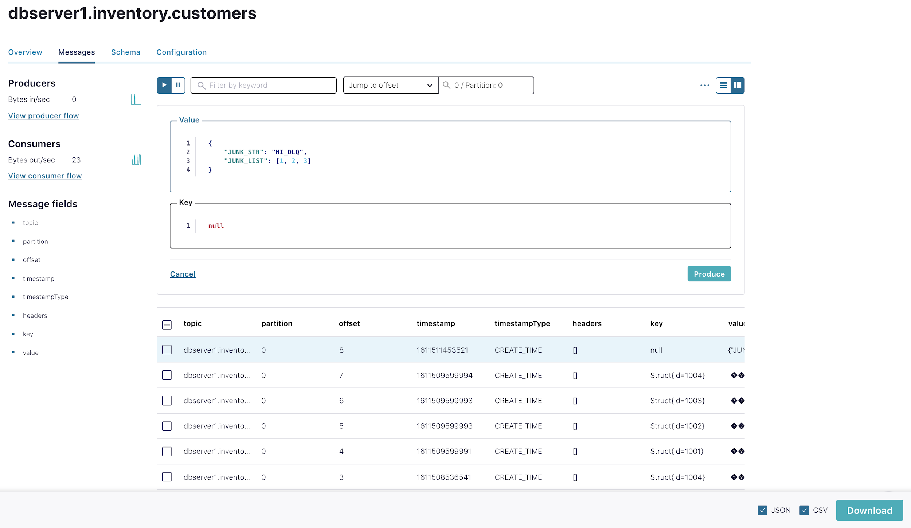
    </div>

11. Navigate back to your DLQ topic and you will see the message in the incorrect format. Open the record and select **Header**. 

    Each DLQ record header contains the name of the topic with the error, the error exception, and a stack trace (along with other information). If you have any errors, you can review the DLQ record header to identify any configuration changes you need to make to correct errors.

    > **Note:** this message will not land in your bucket. 

    <div align="center">
       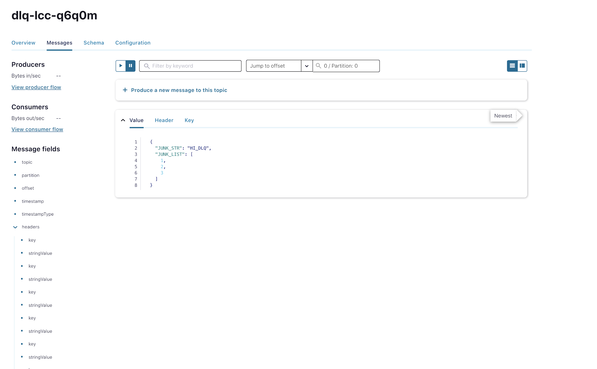
    </div>

## <a name="step 11"></a>**Confluent Cloud Schema Registry**

In this final section of the workshop, you will explore Confluent Cloud Schema Registry, which is used to manage and store a versioned history of all of your schemas. Confluent Cloud Schema Registry is fully-managed and supports JSON, Avro, and Protobuf.

1. Earlier, you enabled Schema Registry. Click on **Topics**, then **dbserver1.customers.inventory**, and then **Schema**.

2. Here you can see the schema value for your topic, **dbserver1.customers.inventory**. The following is an example of what your schema may look like. Note that it shows the Format (AVRO), Compatibility Mode (Default is set as Backward), Schema ID, and Version. 

    <div align="center">
       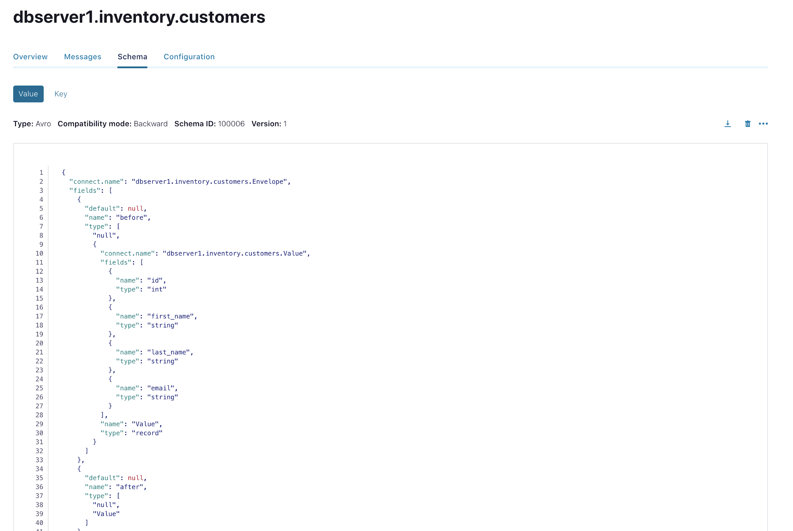
    </div>

3. If you click on the 3 dots, you can view and change the compatibility setting and version history. The compatibility setting is currently set as backward compatible, which is the default. Backward compatibility means that consumers using the new schema can read data produced with the last schema. There are several different options for the compatibility setting, which you can read more about here: [Schema Evolution and Compatibility](https://docs.confluent.io/platform/current/schema-registry/avro.html#)

    <div align="center">
       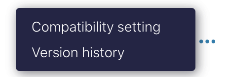
    </div>

4. Return to your environment.

5. Click on **Schema Registry** and edit the **Compatibility setting**. 

    <div align="center">
       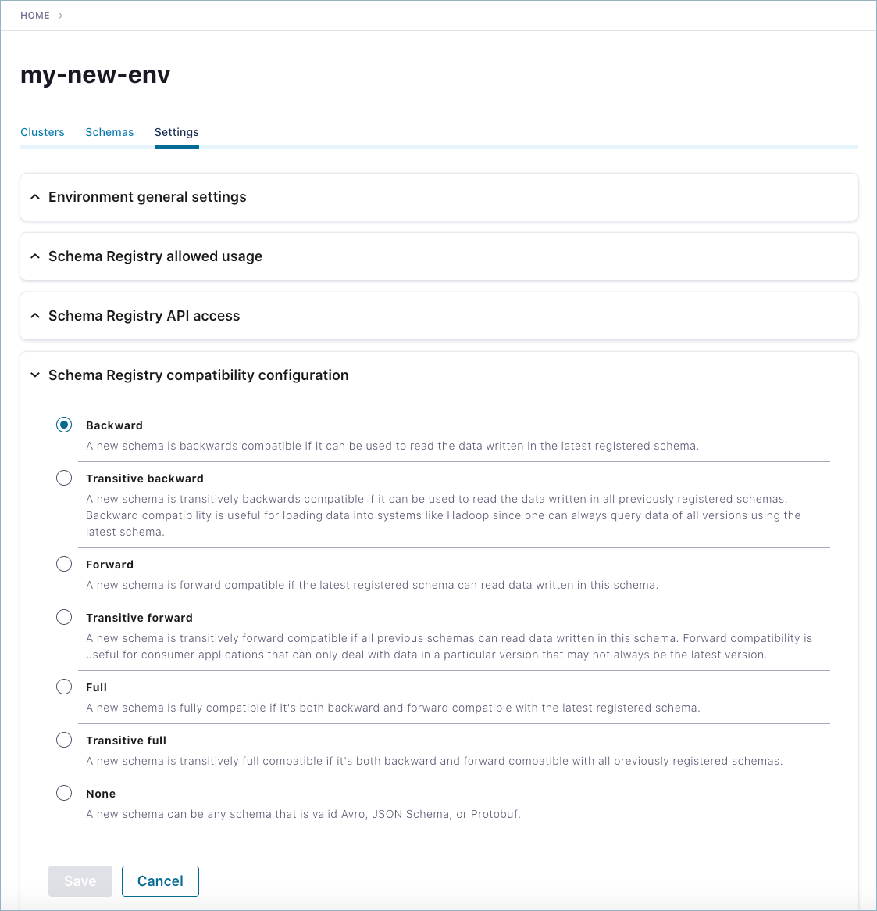
    </div>

6. Click on **View & Manage Schemas** to view a searchable list of all your schemas available in your Confluent Cloud environment.

## <a name="step-12"></a>**Clean Up Resources**

Deleting the resources you created during this workshop will prevent you from incurring additional charges.

1. The first item you should delete is the fully-managed Google Cloud Storage Sink / AWS S3 / Azure Blob Storage Connectors. In the Confluent Cloud UI, navigate to the Connectors tab and select the connector. In the top right corner, you will see a **trash** icon. Click the icon and enter the **connector name**. 
    <div align="center">
       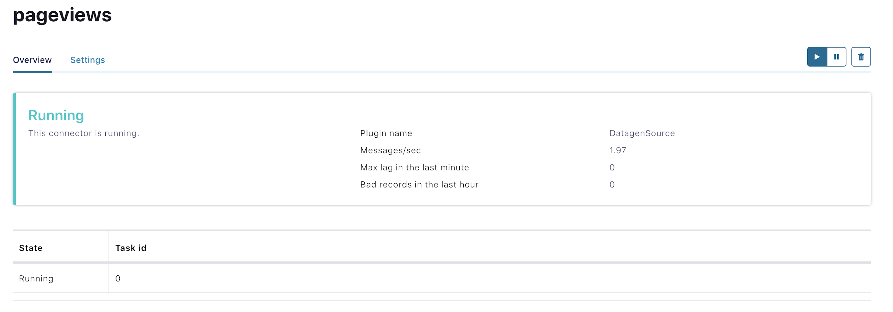
    </div>
    

2. Next, under **Settings**, you can select the **Delete Cluster** hyperlink at the bottom of your screen. Enter the cluster name and select Confirm.

    <div align="center">
       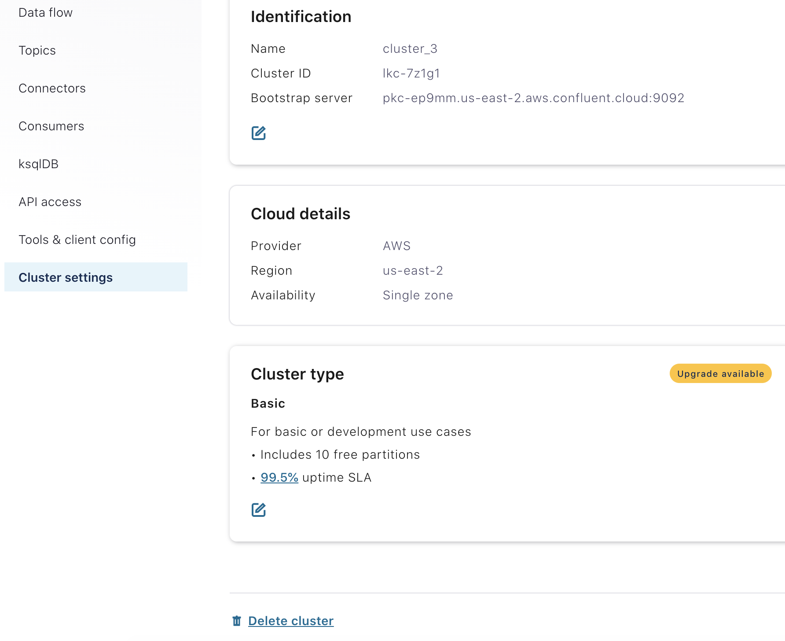
    </div>

3. Delete your object storage bucket/container.

4. Finally, go to the Docker Dashboard, and stop the container.

## <a name="step-13"></a>**Confluent Resources and Further Testing**

* [Confluent Cloud Documentation](https://docs.confluent.io/cloud/current/overview.html)

* [Confluent Connectors](https://www.confluent.io/hub/) - A recommended next step after the workshop is to deploy a connector of your choice.

* [Confluent Cloud Schema Registry](https://docs.confluent.io/cloud/current/client-apps/schemas-manage.html#)

* [Best Practices for Developing Apache Kafka Applications on Confluent Cloud](https://assets.confluent.io/m/14397e757459a58d/original/20200205-WP-Best_Practices_for_Developing_Apache_Kafka_Applications_on_Confluent_Cloud.pdf) 

* [Confluent Cloud Demos and Examples](https://docs.confluent.io/platform/current/tutorials/examples/ccloud/docs/ccloud-demos-overview.html)

* [Kafka Connect Deep Dive – Error Handling and Dead Letter Queues](https://www.confluent.io/blog/kafka-connect-deep-dive-error-handling-dead-letter-queues/)

