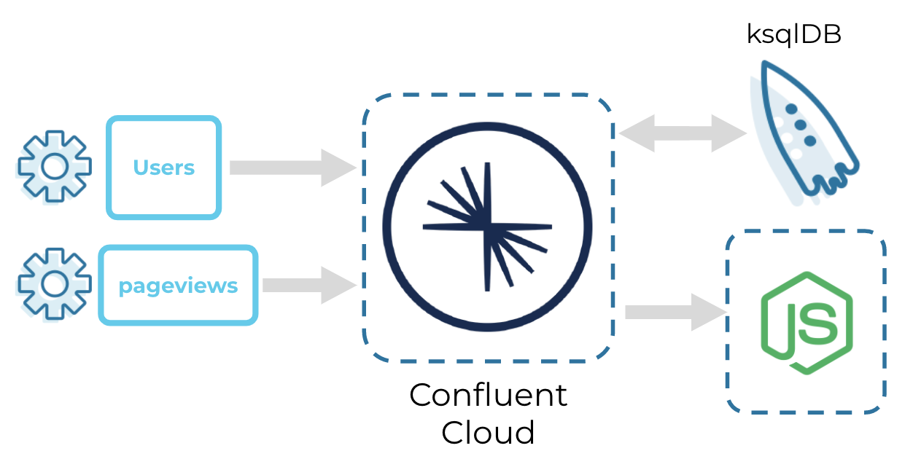

<div align="center" padding=25px>
    
</div>

# <div align="center">Getting Started with Microservices in Confluent Cloud</div>
## <div align="center">Lab Guide</div>

## **Agenda**
1. [Log Into Confluent Cloud](#log-into-confluent-cloud)
1. [Create an Environment and Cluster](#create-an-environment-and-cluster)
1. [Create a Topic using the Cloud UI](#create-a-topic-using-the-cloud-ui)
1. [Launch Docker and Test CCloud CLI Utility](#launch-docker-and-test-ccloud-cli-utility)
1. [Create a Topic Using the CCloud Utility](#create-a-topic-using-the-ccloud-utility)
1. [Create a ksqlDB Application](#create-a-ksqldb-application)
1. [Create Datagen Connectors for your Topics](#create-datagen-connectors-for-your-topics)
1. [Consume Topics Using NodeJs](#consume-topics-using-nodejs)
1. [Create Streams and Tables using ksqlDB](#create-streams-and-tables-using-ksqldb)
1. [Clean Up Resources](#clean-up-resources)
1. [Confluent Resources and Further Testing](#confluent-resources-and-further-testing)

***

## **Architecture Diagram**

<div align="center">
    
</div>

***

## **Prerequisites**

These prerequisites outline what is necessary to have in order to be successful with this guide. If you are not able to complete the prerequisite steps for whatever reason, Confluent's Commercial SE team presents this lab guide live on an ongoing basis. The event registration can be found on the [Confluent Events Calendar](https://events.confluent.io/) by searching for the workshop series name. Attendees can follow along, or just observe to absorb the concepts. Alternatively, those sessions are typically recorded and available for viewing. 

1. Confluent Cloud Account
    * Sign-up for a Confluent Cloud account [here](https://www.confluent.io/confluent-cloud/tryfree/).
    * Once you have signed up and logged in, click on the menu icon at the upper right hand corner, click on “Billing & payment”, then enter payment details under “Payment details & contacts”.

    > **Note:** You will create resources during this workshop that will incur costs. When you sign up for a Confluent Cloud account, you will get up to $200 per month deducted from your Confluent Cloud statement for the first three months. This will cover the cost of resources created during the workshop. 

1. Ports `443` and `9092` need to be open to the public internet for outbound traffic. To check, try accessing the following from your web browser:
    * portquiz.net:443
    * portquiz.net:9092

1. This workshop requires access to a command line interface.
    * **Mac users:** The built in terminal works completely fine. iTerm2 is also a viable and recommend alternative. 
    
    * **Windows users:** The built in Command Prompt is recommended. 

1. This workshop requires `docker`. Download *Docker Desktop* [here](https://www.docker.com/products/docker-desktop) and after installation, verify that you have the command line utility with the following command. 
    ```bash
    # Check the docker version
    docker --version
    ```

1. Git. If you don't already have it, down load it [here](https://git-scm.com/downloads) (you'll need it for the next prerequisite). Check for successful installation using the following command. 
    ```bash
    # Check the git version
    git --version
    ```

1. Clone Confluent's Commercial SE workshop repository to your machine to access useful files. 
    > **Note:** This repository contains **all** of the workshops and workshop series Confluent's Commercial SE team has created. Be sure to navigate to the correct sub-folder to use the right content.
    ```bash
    # Clone the Commercial SE workshop repository
    git clone https://github.com/confluentinc/commercial-workshops.git
    ```
    Navigate to the correct sub-folder to access this labs content. This should act as your working directory for the remainder of the lab. 
    ```bash 
    # Navigate to the correct sub-folder
    cd commercial-workshops/series-microservices/workshop-getting-started/
    ```


***

## **Objective**

In this workshop, you will learn how to apply a simple microservices use case to set your *data in motion* with Confluent Cloud. 

First, you will learn the basics of configuring a Confluent Cloud cluster, streaming data to a topic created through the Cloud UI and the CCloud CLI, and then consume the data. On that note, you will download and use the Cloud CLI as an alternative method to creating and managing Confluent Cloud clusters outside of the Confluent Cloud UI. 

Microservices can be both producers and consumers. You will be creating the **Datagen Source Connector** to stream mock data to topics called `users` and `pageviews`. For the purpose of this workshop, the datagen connector can be thought of as any one of your microservices. You can view the data flowing into Confluent in real-time. You will also explore using Nodejs to consume these messages. 

Once you have data from microservices' flowing into Confluent, you will then create a ksqlDB application to query against the topics you created. **ksqlDB** enables you to build real-time event streaming applications on top of Confluent Cloud. You no longer need to spend time on coding complex applications. You can unlock use cases for streaming ETL, monitoring and analytics, anomaly detection, and data discovery and enrichment (just to name a few), all by using simple SQL statements.

***

## <a name="log-into-confluent-cloud"></a>Log Into Confluent Cloud

1. First, access Confluent Cloud sign-in by navigating [here](https://confluent.cloud).
1. When provided with the *username* and *password* prompts, fill in your credentials.
    > **Note:** If you're logging in for the first time you will see a wizard that will walk you through the some tutorials. Minimize this as you will walk through these steps in this guide. 

*** 

## <a name="create-an-environment-and-cluster"></a>Create an Environment and Cluster

An environment contains Confluent clusters and its deployed components such as Connect, ksqlDB, and Schema Registry. You have the ability to create different environments based on your company's requirements. Confluent has seen companies use environments to separate Development/Testing, Pre-Production, and Production clusters. 

1. Click **+ Add environment**. 
    > **Note:** There is a *default* environment ready in your account upon account creation. You can use this *default* environment for the purpose of this workshop if you do not wish to create an additional environment.

    * Specify a meaningful `name` for your environment and then click **Create**. 
        > **Note:** It will take a few minutes to assign the resources to make this new environment available for use. 

1. Now that you have an environment, let's create a cluster. Select **Create Cluster**. 
    > **Note**: Confluent Cloud clusters are available in 3 types: **Basic**, **Standard**, and **Dedicated**. Basic is intended for development use cases so you should use that for this lab. Basic clusters only support single zone availability. Standard and Dedicated clusters are intended for production use and support Multi-zone deployments. If you’re interested in learning more about the different types of clusters and their associated features and limits, refer to this [documentation](https://docs.confluent.io/current/cloud/clusters/cluster-types.html).

    * Chose the **Basic** cluster type.

    * Click **Begin Configuration**.

    * Choose your preferred **Cloud Provider**, **Region**, and **Availability Zone**.
        > **Note:** Here you have the ability to choose which cloud provider you want (AWS, GCP, or Azure). It's recommended to use the **Region** and **Availability Zone** closest to you. 

    * Specify a meaningful **Cluster Name** and then review the associated *Configuration & Cost*, *Usage Limits*, and *Uptime SLA* before clicking **Launch Cluster**. 

1. After launching the cluster, find the **Cluster Settings** in the navigation menu and select it. On the **Cluster Settings** page, copy the **Bootstrap server**.
    * Open the `setup.properties` file that should be the present working directory in your command line. 
        > **Note:** If you closed the command line or prefer to open the file using a text editor, it is located at `commercial-workshops/series-microservices/workshop-getting-started/setup.properties` wherever you cloned the repository. 
    * Replace `<BOOTSTRAP_SERVERS>` with the value you just copied and **preserve the double-quotes** surrounding the value. You'll need this later on. 

***

## <a name="create-a-topic-using-the-cloud-ui"></a>Create a Topic using the Cloud UI

1. On the navigation menu, select **Topics** and click **Create Topic**.
    > **Note:** Refresh the page if your cluster is still spinning up. 

1. Enter `users` as the *Topic Name*.
    > **Note:** Topics have many configurable parameters that dictate how Confluent handles messages. A complete list of those configurations for Confluent Cloud can be found [here](https://docs.confluent.io/cloud/current/using/broker-config.html).  If you’re interested in viewing the default configurations, you can view them in the *Topic Summary* on the right side. 

    * Click **Create with defaults**. 

    After creation, the **Topics UI** allows you to monitor production and consumption throughput metrics and the configuration parameters for your topics. When you begin sending messages through, you will be able to view messages and message schemas. Creating a **Schema** will ensure messages are following a desired format and can be critical for production deployments. To learn more about **Schema Registry**, please go [here](https://docs.confluent.io/cloud/current/client-apps/schemas-manage.html#).

***

## <a name="launch-docker-and-test-ccloud-cli-utility"></a>Launch Docker and Test CCloud CLI Utility

In this step you will pull a docker image that comes pre-built with the `ccloud` CLI utility. You can use this utility to perform administrative tasks within your account. 

1. From the command line, pull the docker image.
    ```bash
    # Pull the pre-built image from Docker Hub
    docker pull zachhamilton/workshop-getting-started-nodejs
    ```
    > **Note:** This image also contains the build for the Nodejs consumer you will use later on in the lab. 

1. Run the image using the following command.
    ```bash
    # Start the image in interactive mode and remove the container on exit
    docker run -it --rm --name ccloud \
    zachhamilton/workshop-getting-started-nodejs
    ```

1. This will run the container in interactive mode and place you within the `/confluent` directory and with `ccloud` preinstalled. Check the `ccloud` version with the following command.
    ```bash
    # Verify ccloud version
    ccloud --version
    ```
    > **Note:** For good measure, execute `ccloud update` to verify you have the most recent version. 

1. Now that you have command line access to the `ccloud` utility, you can can log in with your cloud credentials. 
    ```bash
    # Log in using your username and password
    ccloud login
    ```

1. You have the ability to `list` the environments in your Confluent Cloud Account. Select the environment you created in [*Create an Environment and Cluster*](#create-an-environment-and-cluster). you will use the `environment_id` to connect to our cluster.  
    ```bash
    # List the environments in the account
    ccloud environment list
    ```
    ```bash
    # Configure 'ccloud' to use a specific environment
    ccloud environment use <environment_id>
    ```
    > **Note:** When replacing statements in a command, replace everything including the angle brackets. From the command above, you would change `<environment_id>` to `env-rjk73d`. For example: 
    > ```bash
    > ccloud environment use env-rjk73d
    > ```

1. You can also `list` and `use` the cluster you created in [*Create an Environment and Cluster*](#create-an-environment-and-cluster). Here, you need to specify the cluster you will use. Identify the `kafka_cluster_id` by running the first command. Use the second command to `use` that as your cluster. 

    ```bash
    # List the clusters in your current environment
    ccloud kafka cluster list
    ```
    ```bash
    # Configure 'ccloud' to use a specific cluster
    ccloud kafka cluster use <kafka_cluster_id>
    ```

1. In order to create and manage resources from the CCloud CLI, you are required to `create` and `use` an **API Key**. This command will create an **API Key** pair for you.
    > **Note:** It's very important to write the **API Key Secret** somewhere. It's value will be shown once and once only. If you don't save the value somewhere safe, you'll have no ability to see it again. 

    ```bash
    # Create an API key pair
    ccloud api-key create --resource <kafka_cluster_id>
    ```

    > **Note:** Make sure to copy the value of both the **API Key** and **API Secret** into `setup.properties` the same way you did with **Bootstrap server**. You will need this later on in the lab.

1. Configure the `ccloud` utility to use this key pair to authenticate in future commands.
    ```bash
    # Configure 'ccloud' to use your API key with your cluster
    ccloud api-key use <api_key> --resource <kafka_cluster_id>
    ```

    You will see this **API Key** in the Confluent Cloud UI in the **API Access** tab. If you don't see the **API Key** populate right away, refresh the browser. 

***

## <a name="create-a-topic-using-the-ccloud-utility"></a>Creating a Topic using the CCloud Utility

1. Now, back to the CLI. With the **API Key** created, you can now create and manage topics from the CLI.  Next, you will create another topic named `pageviews` using the CLI this time and it will be created with the default configuration. After you create it, you can check the list of topics in our cluster. You will see the `users` topic you created through the UI here as well.

    ```bash
    # Create the 'pageviews' topic
    ccloud kafka topic create pageviews
    ```
    ```bash
    # List the topics in the cluster
    ccloud kafka topic list
    ```

1. You can *produce* simple messages to the `pageviews` topic. This command will prompt you to manually enter messages. Feel free to produce a few messages to test this out. 

    ```bash
    # Use the console producer to produce messages to a topic
    ccloud kafka topic produce pageviews
    ```
    Use **CTRL+C** to exit the console producer. 

1. You can also *consume* those test messages you sent to the `pageviews` topic. The `-b` flag indicates you want to start reading from the beginning of the topic. 

    ```bash
    # Use the console consumer to consumer messages from a topic
    ccloud kafka topic consume -b pageviews
    ```
    Use **CTRL+C** to exit the console consumer. 

1. In the Confluent Cloud UI locate the **Topics** tab within your **cluster** and **environment**. Here, you can see the `pageviews` topic you just created. 

***

## <a name="create-a-ksqldb-application"></a>Create a ksqlDB Application

1. On the navigation menu, select **ksqlDB** and click **Create Application Myself**. 
1. Select **Global Access** and then **Continue**.
1. Name you ksqlDB application and set the streaming units to **4**. Click **Launch Application!**
    > **Note:** A streaming unit, also known as a Confluent Streaming Unit (CSU), is the unit of pricing for Confluent Cloud ksqlDB. A CSU is an abstract unit that represents the linearity of performance.

    The ksqlDB application will take some time to provision. While that is taking place, you can move on and let it provision in the background. 

***

## <a name="create-datagen-connectors-for-your-topics"></a>Create Datagen Connectors for your Topics

Microservices can be both *producers* and *consumers*. In this step, you will be creating the **Datagen Source Connector** to stream mock data to the `users` and `pageviews` topics. For the purpose of this workshop, the datagen connector can be thought of as any one of your microservices. Our goal here is to produce data to Confluent and view the messages in real-time as they are being produced.

1. From the Confluent Cloud UI, click on the **Connectors** tab on the navigation menu. 

1. Click on the **Datagen Source** icon. 

1. First, you will create the datagen connector that will send data to our `pageviews` topic. Use the following table to fill out the parameters of the new connector.
    <div align="center">

    | setting                            | value                            |
    |------------------------------------|----------------------------------|
    | name                               | DatagenSourceConnector_pageviews |
    | api key                            | [*from this step* ](#create-an-api-key-pair)|
    | api secret                         | [*from this step* ](#create-an-api-key-pair)|
    | topic                              | pageviews                        |
    | output message format              | JSON                             |
    | quickstart                         | PAGEVIEWS                        |
    | max interval between messages (ms) | 1000                             |
    | tasks                              | 1                                |
    </div>

    > **Note:** If the connectors fails, there are a few different ways to troubleshoot the error:
    > * Click on the *Connector Name*. You will see a play and pause button on this page. Click on the play button.
    > * Click on the *Connector Name*, go to *Settings*, and re-enter your API key and secret. Double check there are no extra spaces at the beginning or end of the key and secret that you may have accidentally copied and pasted.
    > * If neither of these steps work, try creating another Datagen Connector.

1. Second, you will create the connector that will send data to our `users` topic. Click on the Datagen Source icon again. Same as above, use the following table to fill out the parameters of the new connector. 

    <div align="center">

    | setting                            | value                            |
    |------------------------------------|----------------------------------|
    | name                               | DatagenSourceConnector_users     |
    | api key                            | [*from this step* ](#create-an-api-key-pair)|
    | api secret                         | [*from this step* ](#create-an-api-key-pair)|
    | topic                              | users                            |
    | output message format              | JSON                             |
    | quickstart                         | USERS                            |
    | max interval between messages (ms) | 1000                             |
    | tasks                              | 1                                |
    </div>

1. Switch to the CCloud CLI and run the following consumer commands to view the data being produced to our topics.  
    > **Note:** The `-b` flag tells the consumer to start consuming from the beginning of the topic. 
    
    ```bash
    # Consume messages from the 'pageviews' topic
    ccloud kafka topic consume -b pageviews
    ```
    ```bash
    # Consume messages from the 'users' topic
    ccloud kafka topic consume -b users
    ```
    
    Use **CTRL+C** to stop the console consumers. Then, take a moment to review the messages consumed. You should see new-line delimited JSON for the individual events in the console. 

    The data produced to the `pageviews` topic represents how long users are spending on each page of a given website. The `users` topic is collecting information on when *users* registered for a website and also contains information on those *users*. These types of data could represent a simple microservice. 

1. Exit the running container with a single exit command. You'll re-run the container in the next step with some additional properties.
    ```bash
    # 'exit' will kill the container and remove it
    exit
    ```

*** 

## <a name="consume-topics-using-nodejs"></a>Consume Topics using Nodejs

In this step, you will explore using Nodejs to consume these messages. Think of this Nodejs script as a simple example of what your microservice could look like. The goal here is to show the end-to-end flow of data as it moves through Confluent. You produced data in a previous step, viewed the messages in real-time as they were being produced, and now you're ready to set up your own consumer.

1. You'll need to pass some values as environment variables to the container so the consumer can access them. Start by exporting them to the console with the following command.
    ```bash
    # Export the 'bootstrap_servers', 'api_key', and 'api_secret' values
    source setup.properties
    ```

1. You can now reference the values as variables passed to the container. Run the following command. 
    ```bash
    # '-e' will set the values you've exported locally as environment variables in the container
    docker run -it --rm --name nodejs \
    -e BOOTSTRAP_SERVERS=$BOOTSTRAP_SERVERS \
    -e API_KEY=$API_KEY \
    -e API_SECRET=$API_SECRET \
    zachhamilton/workshop-getting-started-nodejs
    ```

1. Inside the running container, you should once again land within the `/confluent` directory. From here, navigate to the `nodejs-consumer` directory.
    ```bash
    # The consumer is pre-built in this directory
    cd nodejs-consumer
    ```

1. Run the Nodejs consumer using the following command. If you're curious what the consumer code looks like, take a look [here](https://github.com/zacharydhamilton/nodejs-consumer).
    ```bash
    # Run the consumer
    node index.js
    ```

    You'll see messages start being written to the console (likely very quickly). Our consumer is configured with `auto.offset.reset=earliest` and is defined with a distinct consumer `group.id`. The consumer will start reading messages from the `users` topic from the `earliest` offset until it catches up. Any time after that, it will read from the consumer groups last committed offset. 

1. You can either leave this running in the background, or use **CTRL+C** to stop the consumer and then `exit` to exit the container and remove it.
    ```bash
    # 'exit' will kill the container and remove it
    exit
    ```

***

## <a name="create-streams-and-tables-using-ksqldb"></a>Create Streams and Tables using ksqlDB

Now that you have data from 'microservices' flowing through Confluent, you can now easily build stream processing applications using ksqlDB. You are able to continuously transform, enrich, join, and aggregate your data using simple SQL syntax. You can gain value from your data directly from Confluent in real-time. Also, ksqlDB is a fully managed service within Confluent Cloud with a 99.9% uptime SLA. You can now focus on developing your microservices and building your data pipeline while letting Confluent manage your resources for you.

With ksqlDB, you have the ability to leverage streams and tables from your topics in Confluent. A **stream** in ksqlDB is a topic with a schema and it records the history of what has happened in the world as a sequence of events. **Tables** are similar to traditional RDBMS tables. If you’re interested in learning more about ksqlDB and the differences between **streams** and **tables**, I recommend reading these two blogs [here](https://www.confluent.io/blog/kafka-streams-tables-part-3-event-processing-fundamentals/) and [here](https://www.confluent.io/blog/how-real-time-stream-processing-works-with-ksqldb/).

1. From the Confluent Cloud UI, click on the **ksqlDB** tab on the navigation menu and select the application you create in [*Create a ksqlDB Application*](#create-a-ksqldb-application).

1. Begin by creating a new **stream** in the editor. Copy the follow statement into the editor and click **Run Query**. 

    ```sql
    CREATE STREAM pageviews (
        viewtime bigint, 
        userid varchar, 
        pageid varchar
    ) 
    WITH (kafka_topic='pageviews', value_format='JSON');
    ```

1. Now, if you want to check the messages coming through you can view the **Streams** tab and select the stream you created, `pageviews`. If you click on the name, it will take you to the stream information and give you the option to **Query stream** or **Drop stream**. Click on **Query stream** and run the select statement in the **Editor** tab. A sample output may already appear in the **Editor**. Alternatively, just copy the statement from below. 

    ```sql
    SELECT * FROM pageviews EMIT CHANGES;
    ```

    Wait a moment for results to be returned below the editor. The results should exemplify the persistent nature of querying a stream. There will be an unbounded, continuous stream of results returned.

    After you've taken a look at the results, stop the query. 

1. Now let's create a **table** for our `users` topic. Copy the following statement into the editor and execute. 
    > **Note:** Compared to a **stream**, a **table** represents the state of the world at a particular point in time. Typically *now*. 

    ```sql
    CREATE TABLE users (
        userid VARCHAR PRIMARY KEY, 
        registertime BIGINT, 
        gender VARCHAR, 
        regionid VARCHAR
    ) 
    WITH(KAFKA_TOPIC='users', VALUE_FORMAT='JSON');
    ```

    You used the `CREATE TABLE` statement to create a table from an underlying Kafka topic, `users`.

1. Next, let's view the data populating our new **table**, `users`. Enter the following into the **Editor** and execute the statement. 

    ```sql
    SELECT * FROM users EMIT CHANGES;
    ```

    You should be able to view this data in real-time below the editor, similarly to when you queried the stream before. 

    > **Note:** The results could take a minute to populate. Once you've observed the results, stop the query. 

1. Create a **persistent query** by joining the previously created `pageviews` stream with the `users` table. This query will run until terminated with `TERMINATE`. Copy the following statement into the **Editor** and click **Run query**. 

    ```sql
    CREATE STREAM pageviews_enriched AS
        SELECT users.userid AS userid, 
               pageid, 
               regionid, 
               gender
        FROM pageviews
        LEFT JOIN users
            ON pageviews.userid = users.userid
    EMIT CHANGES;
    ```

    You can view this in the **Running Queries** tab. This will show you details related to this stream. Click **Explain** to read more information. 

    > **Note:** As more things are being connected, visualizing the relationship between individual parts can be useful. Click on the **Data Flow** tab, and take a look at the flow of data you have so far. 
    > 
    > This visualization can be used to understand what was accomplished in this section and how the piece fit together. Click around and get an understanding of what was accomplished. 

***

## <a name="clean-up-resources"></a>Clean Up Resources

Since resources were created in this lab that will incur charges if left running, it's important to tear them down once you are done using them. 

1. Remove the **ksqlDB** application by selecting **ksqlDB** from the navigation menu and selecting **Delete** under the **Actions** column. 

1. Remove the Datagen Source connectors by selecting **Connectors** from the navigation menu, selecting the name of the connector, and selecting the "**trashcan**" icon at the top left of the window. Do this for both of the connectors. 

1. Remove the **cluster** itself by selecting **Cluster Settings** from the navigation menu, then selecting **Delete cluster** below the listed details. 

***

## <a name="confluent-resources-and-further-testing"></a>Confluent Resources and Further Testing

* Confluent Cloud [documentation](https://docs.confluent.io/cloud/current/overview.html) is a great resource for documentation.
* Interested in learning more about connectors? The [Confluent Hub](https://www.confluent.io/hub/) lists all 180+ fully managed and self managed connectors that Confluent supports. 
* Interested in learning more about ksqlDB? The [KSQL Recipes Guide](https://www.confluent.io/stream-processing-cookbook/) is useful to continue hands-on learning. 
* Interested in learning more about Schema Registry? Take a look at [Manage Schemas in Confluent Cloud](https://docs.confluent.io/cloud/current/client-apps/schemas-manage.html#).
* Interested in connecting your applications to Confluent Cloud? Check out [Best Practices for Developing Apache Kafka Applications on Confluent Cloud](https://assets.confluent.io/m/14397e757459a58d/original/20200205-WP-Best_Practices_for_Developing_Apache_Kafka_Applications_on_Confluent_Cloud.pdf) to get started.

***

## Conclusion

You have accomplished quite a few steps. 

First, you learned how to set up our clusters and topics within Confluent Cloud, and saw that this process is easy to complete within the cloud dashboard or ccloud CLI. 

Once you had everything set up, you used the **Datagen Source Connector** to produce data to Confluent Cloud and you viewed the messages flowing into Confluent in real-time. Next, you deployed a Nodejs application that acted as a consumer. This is a simple example of how your microservices can connect to Confluent and how they can act as either a producer or consumer. At this point, you have established an end-to-end flow of our data within Confluent Cloud! 

You then built stream processing applications using ksqlDB and saw how you were able to instantly gain value from our data that is directly in Confluent, all by using simple SQL statements. You only covered some simple ksqlDB examples during this workshop, so you are encouraged to test it out more! 

Finally, you briefly looked at the pre-built connectors and how you can easily connect your other data systems to Confluent Cloud. This last step completes our data pipeline by connecting the data from your microservices as well as the data from your external systems to Confluent.
