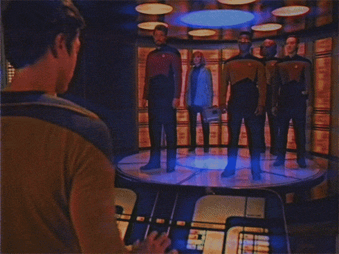

    

# 
Workshops

The collected "workshops" here are meant to provide you an end-to-end experience for doing something with Confluent Cloud. There are a variety of use cases available (and that will hopefully  continue to grow over time). If you experience problems with any of the content or would like to request new workshops for new uses, feel free to open an issue. 

> **Note**: The majority of this content has been developed independently and may differ in look and feel. 

See the following inventory of currently available Workshops.

## Inventory

| Workshop | Description |
|---|---|
| [Application Modernization](application-modernization) | This workshop will provide a walkthrough experience of following the Strangler Fig pattern for migrating an application from a Monolithic Architecture to a Microservices one using Kafka and Confluent Cloud.  |
| [Messaging Modernization](messaging-modernization) | This workshop will provide a walkthrough of modernizing an existing legacy messaging architecture to Kafka and Confluent Cloud.  |
| [Streaming ETL](streaming-etl) | This workshop will provide a walkthrough of creating a Streaming ETL architecture to process and transform streams of data in real time using Kafka and Confluent Cloud.  |
| [Microservices with C# and .NET](microservices-with-csharp-and-dotnet) | Create C# and .NET microservices that produce/consume messages using Confluent Cloud. |