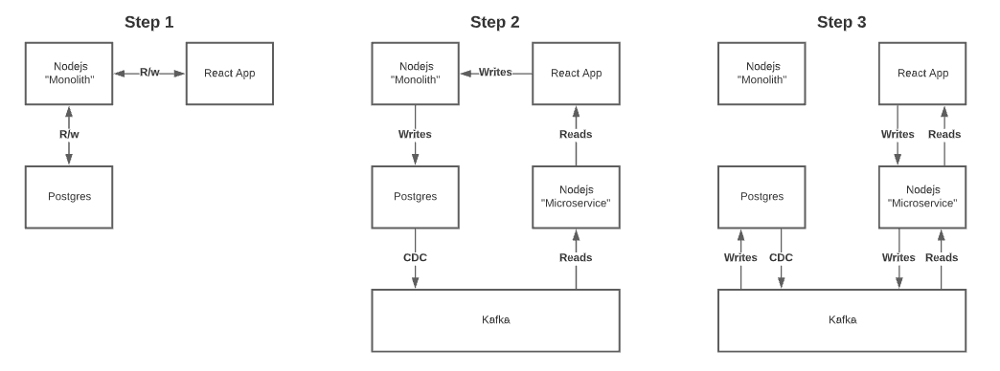

# Application Modernization

In this demo, you'll walk through the stages describe in the [Strangler Fig Pattern](https://developer.confluent.io/patterns/compositional-patterns/strangler-fig) for incrementally breaking a monolithic application down into microservices. The intention of this demo is to express the stages involved in this process by providing components that come prebuilt and ready to deploy. All that's left is for you to deploy them in the order described in this guide and view the results. 

## Before You Start

There are some things to take into consideration before you get too invested.     
- This has not been tested on PC. 
- This guide was created using `minikube`. So that will be a necessity to have. On Mac, assuming you have `homebrew` (if not, get it), you can install it using the command `brew install minikube`. 
- This development and testing for this demo was done on a `minikube` VM with approximately **4 CPUs**, **4GB of memory**, and **10GB of disk**. If that's more than your machine has, you can play around with less with the `minikube` commands. For example.
    ```sh
    minikube start --cpus=4 --disk-size="10gb" --memory="4gb"
    ```
- For some of the commands, you'll want a prettier output. So, `jq` is useful to have and will be use in these examples. If you don't have it installed, you can install it with `brew install jq`.
- This guide assumes you have Confluent Cloud setup and available to use. If you don't, sign up for a free trial [here](https://www.confluent.io/confluent-cloud/tryfree).

## Bootstrappin'

This demo comes equipped with `bootstrap.sh` which is intended to assist with a few things...
    
1. Creating all the necessary resources that will be used in Confluent Cloud.
1. Saving the IDs and credentials for things created in Confluent Cloud.
1. Making the credentials and IDs easily accessible to `kubectl` when you use them to create secrets. 

That being said, `bootstrap.sh` is not perfect 😇 . If you encounter issues, please create an issue so it can be addressed. In the future when Confluent Cloud releases an official Terraform Provider, we can throw this `bootstrap.sh` script out for a purpose built tool. 

### Inventory

The following is the "inventory" of things created and used in this demo so you can **A**, keep track of them and understand what is created, and **B**, act as a list of things that will needed to be created if yu have issues with `bootstrap.sh`. 

- **Confluent Cloud Environment**. This can be either newly created or shared. 
- **Confluent Cloud Schema Registry**. This can be the already enabled registry of an existing environment, or a new registry enabled in a brand new one. Doesn't matter.
    - `SCHEMA_REGISTRY_URL` will need to be collected as the URL of the registry instance.
    - `SCHEMA_REGISTRY_API_KEY` will need to be created and saved if not already available. 
    - `SCHEMA_REGISTRY_API_SECRET` will come paired with the above 👆 .
- **Confluent Cloud Cluster**. You will use this as your Kafka Cluster.
    - `BOOTSTRAP_SERVERS` will be necessary to connect Connectors and clients to Confluent Cloud. 
    - `CLIENT_KEY` will be the API key the Connectors and clients will use to authenticate to the cluster. You'll need to create API keys if you don't have them already.
    - `CLIENT_SECRET` will be the secret paired with the above 👆 .
- **ksqlDB Application**. You'll use this to process messages in real time and make them available to your API. 
    - `KSQLDB_APP_ENDPOINT` will be needed so the client can query the ksqlDB app.
    - `KSQLDB_API_KEY` will be necessary to authenticate queries from the client to the ksqlDB app. 
    - `KSQLDB_API_SECRET` will go with the key above 👆 .
- **Topics**. You'll need to create a new ahead of time so the Connectors will work. 
    - "**postgres.bank.transactions**".
    - "**postgres.bank.accounts**".
    - "**postgres.bank.customers**".
    - "**express.bank.transactions**".

## Kubernetes Secrets

Whether you used the `bootstrap.sh` script to create everything or you did it manually yourself, you'll need to use the aforementioned credentials and IDs in order to create Kubernetes secrets that the various deployments will use. Depending on which you did, the way you'll create the secrets will be different. 

### Created with `bootstrap.sh`

`bootstrap.sh` should have conveniently added all the necessary credentials and IDs into the following files you can see referenced in the command. So, assuming everything worked, you can just copy paste this command to create your secret `kafka-secrets`. 

First, if you don't have `minikube` running already, start it.

```sh
minikube start
```

Then:
    
```sh
kubectl create secret generic kafka-secrets --from-file=.ids/BOOTSTRAP_SERVERS --from-file=.creds/CLIENT_KEY --from-file=.creds/CLIENT_SECRET --from-file=.creds/SASL_JAAS_CONFIG --from-file=.creds/SCHEMA_REGISTRY_API_KEY --from-file=.creds/SCHEMA_REGISTRY_API_SECRET --from-file=.creds/SCHEMA_REGISTRY_BASIC_AUTH_USER_INFO --from-file=.ids/SCHEMA_REGISTRY_URL --from-file=.creds/KSQLDB_API_KEY --from-file=.creds/KSQLDB_API_SECRET --from-file=.ids/KSQLDB_APP_ENDPOINT
```

### Created manually

All of the following should be self explanatory with the exception of `SASL_JAAS_CONFIG` and `SCHEMA_REGISTRY_BASIC_AUTH_USER_INFO`. However, these are simple and are as follows.

- `SASL_JAAS_CONFIG` = `org.apache.kafka.common.security.plain.PlainLoginModule required username='<CLIENT_KEY>' password='<CLIENT_SECRET>';`
    - Simply replace `<CLIENT_KEY>` and `<CLIENT_SECRET>` with your values.
- `SCHEMA_REGISTRY_BASIC_AUTH_USER_INFO` = `<SCHEMA_REGISTRY_API_KEY>:<SCHEMA_REGISTRY_API_SECRET>`
    - Once again, just replacing `<SCHEMA_REGISTRY_API_KEY>` and `<SCHEMA_REGISTRY_API_SECRET>`.

To create the secret, replace the templates in the follow command and create the secret from there. Make sure to replace things within `<setting>`. 

Like above, if you don't have `minikube` running already, start it.

```sh
minikube start
```

Then:

```sh
kubectl create secret generic kafka-secrets \
    --from-literal=BOOTSTRAP_SERVERS="<BOOTSTRAP_SERVERS>" \
    --from-literal=CLIENT_KEY="<CLIENT_KEY>" \
    --from-literal=CLIENT_SECRET="<CLIENT_SECRET>" \
    --from-literal=SASL_JAAS_CONFIG="<SASL_JAAS_CONFIG>" \
    --from-literal=SCHEMA_REGISTRY_API_KEY="<SCHEMA_REGISTRY_API_KEY>" \
    --from-literal=SCHEMA_REGISTRY_API_SECRET="<SCHEMA_REGISTRY_API_SECRET>" \
    --from-literal=SCHEMA_REGISTRY_BASIC_AUTH_USER_INFO="<SCHEMA_REGISTRY_BASIC_AUTH_USER_INFO>" \
    --from-literal=SCHEMA_REGISTRY_URL="<SCHEMA_REGISTRY_URL>" \
    --from-literal=KSQLDB_API_KEY="<KSQLDB_API_KEY>" \
    --from-literal=KSQLDB_API_SECRET="<KSQLDB_API_SECRET>" \
    --from-literal=KSQLDB_APP_ENDPOINT="<KSQLDB_APP_ENDPOINT>"
```

## Getting Started

The following steps with bring you through the process of "Modernizing" the provided application using Confluent Cloud and Kafka. Use the following simple diagram to capture the basic flow (not everything is depicted).

<div align="center">
    
</div>

### Deploy the "monolith"

1. If you haven't already, start `minikube`. If it's already started, you can skip this step.
    ```sh 
    # minikube start can take arguments for how much of the host resources you want to dedicate to it as described earlier
    minikube start
    ```

1. First thing you should bring online is the Postgres database. 
    - Create the deployment.
        ```sh
        kubectl create -f k8s/postgres-deployment.yaml
        ```
    - Create the service. 
        ```sh
        kubectl create -f k8s/postgres-service.yaml
        ```

1. Next, deploy the "monolith".
    - Create the "monolith" deployment.
        ```sh 
        kubectl create -f k8s/monolith-deployment.yaml
        ```
    - Create the "monolith"  service.
        ```sh
        kubectl create -f k8s/monolith-service.yaml
        ```

1. Finally, deploy the web application.
    - Create the web application deployment.
        ```sh
        kubectl create -f k8s/webapp-deployment-mf1.yaml
        ```
    - Create the web application service. 
        ```sh
        kubectl create -f k8s/webapp-service.yaml

1. Now, since `minikube` has deployed Kubernetes on a VM on your machine, you'll need to create a tunnel to make the services accessible on your machine. This command will start running in the foreground, so you may want to leave it on a terminal tab so you can stop the tunnel later.
    ```sh
    minikube tunnel
    ```

Now that you have deployed all the components for your "monolith", you can go to http://localhost:80/ in order to access the web application. Try creating a new transaction or querying for the current balance (after you've created a new transaction ideally).

### Deploy Kafka Connect and a CDC Connector

1. Since it'll take the longest to start up, create the Kafka Connect first.
    - Create the Kafka Connect deployment.
        ```sh
        kubectl create -f k8s/connect-deployment.yaml
        ```
    - Create the Kafka Connect service.
        ```sh
        kubectl create -f k8s/connect-service.yaml

1. Once Kafka Connect is online (give it a minute or two), you can add a new connector to it to start capturing change events from Postgres. 
    - Check the status of Kafka Connect.
        ```sh
        curl -X GET -H "Content-Type: application/json" http://localhost:8083/
        ```
    - Create a new Debezium Postgres CDC Source Connector. 
        ```sh
        curl -X POST -H "Content-Type: application/json" --data @connect/postgres-cdc.json http://localhost:8083/connectors | jq
        ```
    - Check the connector's status.
        ```sh
        curl -X GET -H "Content-Type: application/json" http://localhost:8083/connectors/postgres-cdc-source/status | jq
        ```

Assuming everything above went smoothly, you can head over to the Confluent Cloud UI and look for messages in the topics (`postgres.bank.transactions` specifically).

### Create ksqlDB queries

The "microservice" in this demo will consume messages from Kafka by querying a ksqlDB table. In order to do that, you'll need to create them first. 

1. Navigate to the ksqlDB editor. 

1. Create a new stream by reading the messages from the topic `postgres.bank.transactions`.
    ```sql
    CREATE OR REPLACE STREAM postgres_bank_transactions_structured (
        after STRUCT<
            transaction_id VARCHAR,
            card_number VARCHAR,
            transaction_amount INT
        >
    ) WITH (KAFKA_TOPIC='postgres.bank.transactions', VALUE_FORMAT='JSON_SR');
    ```
    The reason for the use of `STRUCT` data types is because the topic contains JSON records.

1. Create a new table for the balances of each card by selecting from the stream you just created. 
    ```sql
    CREATE OR REPLACE TABLE balances WITH (kafka_topic='balances') AS
        SELECT after->card_number, SUM(after->transaction_amount) AS balance
        FROM postgres_bank_transactions_structured
        GROUP BY after->card_number 
    EMIT CHANGES;
    ```
    The convention '`->`' is used to target a specific key in a `STRUCT` field. 

Once both have been created, you can play around by selecting from them in the editor. 

### Deploy the "microservice"

1. Back on the command line, use `kubectl` to create and deploy the "microservice".
    - Create the "microservice" deployment. 
        ```sh
        kubectl create -f k8s/microservice-deployment.yaml
        ```
    - Create the "microservice" service. 
        ```sh
        kubectl create -f k8s/microservice-service.yaml
        ```

1. Begin the cut-over from the "monolith" to the "microservice".
    - Delete the web application deployment for "mf1". 
        ```sh
        kubectl delete -f k8s/webapp-deployment-mf1.yaml
        ```
    - Create the web application deployment for "mf2".
        ```sh
        kubectl create -f k8s/webapp-deployment-mf2.yaml
        ```
    There's probably a better way to do this, but I'm no Kubernetes administrator 😇 . 

Now that the new version of the web application has been deployed. Head back to the web browser and test out creating new transactions and getting balances. If everything went as expected, the user interaction in the front end shouldn't have changed. 

### Add ksqlDB format conversion

Since the data from our nodejs "microservice" won't have a schema (the `node-rdkafka` library doesn't currently have a support for this, but there are some out there), you'll want to convert the messages that will be produced to Kafka from the "microservice" to a new topic where the messages will have a given schema. This is pretty simple to do with ksqlDB. 

1. Create a new stream for the transactions received from the "microservice".
    ```sql
    CREATE OR REPLACE STREAM express_bank_transactions (
        `key` VARCHAR KEY,
        `transaction_id` VARCHAR, 
        `card_number` VARCHAR, 
        `transaction_amount` INTEGER
    ) WITH (kafka_topic='express.bank.transactions', value_format='JSON');
    ```

1. Create another stream by selecting the previous one and specify the output stream's value format.
    ```sql
    CREATE OR REPLACE STREAM jdbc_bank_transactions WITH (KAFKA_TOPIC='jdbc.bank.transactions', PARTITIONS=6, REPLICAS=3, VALUE_FORMAT='JSON_SR', KEY_FORMAT='KAFKA') AS 
        SELECT `key`, `transaction_id`,`card_number`, `transaction_amount`
        FROM express_bank_transactions
    EMIT CHANGES;
    ```

The second query will create an output topic named `jdbc.bank.transactions` which we can use to sink the data back to Postgres with another connector.

### Deploy JDBC Sink Connector 

Similarly to how you deployed the Debezium Postgres CDC Source Connector earlier, you'll now deploy a JDBC Sink Connector. This will write events from topics back to Postgres for consistency in our pipeline. 

1. Deploy the connector to the Kafka Connect cluster. 
    - Create new JDBC Sink Connector. 
        ```sh
        curl -X POST -H "Content-Type: application/json" --data @connect/jdbc-sink.json http://localhost:8083/connectors | jq
        ```
    - Check the status of the connector.
        ```sh
        curl -X GET -H "Content-Type: application/json" http://localhost:8083/connectors/jdbc-sink/status | jq
        ```

### Complete the "cut over" from the "monolith" to the "microservice"

In this final step you'll deploy the third version of the web application which will direct both **reads** and **writes** of data to the "microservice". 

1. Complete the cut over.
    - Delete the web application deployment for "mf2".
        ```sh
        kubectl delete -f k8s/webapp-deployment-mf2.yaml
        ```
    - Create the web application deployment for "mf3".
        ```sh
        kubectl create -f k8s/webapp-deployment-mf3.yaml
        ```

1. (Optional for extra effect) Delete the "monolith".
    - Delete the "monolith" deployment.
        ```sh
        kubectl delete -f k8s/monolith-deployment.yaml
        ```
    - Delete the "monolith" service.
        ```sh
        kubectl delete -f k8s/monolith-service.yaml
        ```

## Conclusion

If you followed the steps closely, and everything went as planned, you will have migrated a simple module of a "monolith" into its own "microservice" using the Stangler Fig pattern. Obviously in real life this process is much more tedious and there are more considerations to take into account, but the basic principles should be consistent. 

If anything broke or didn't work while going through this, please raise an issue and @zacharydhamilton should take care of it. Suggestion also welcome. 
