> With Confluent you can integrate disparate messaging systems with
> modern data stores both on-premises and in the cloud. This enables you
> to lower your TCO as you modernize your business. With Confluent, you
> can scale your capacity dramatically, and integrate your messaging
> systems with Confluent’s event streaming system with ease. This paper
> outlines the solution architecture for the integration of messaging
> systems with Confluent.

Solution Architecture
=====================

Overview
--------

Messaging systems are successfully deployed in a wide variety of ways
within today’s production enterprise architectures. However, due to
demands for greater scalability, improved resiliency and continuous
stream processing, it’s become imperative to integrate these systems
with modern event streaming. By doing so, enterprises can reduce TCO,
modernize infrastructure and benefit from blazing fast performance at
any scale.

In the presented example, we integrate messaging systems with Confluent.
We show the ingestion of data from ActiveMQ, IBM MQ, RabbitMQ, or Tibco
EMS via Kafka Connect and Confluent Schema registry. We illustrate
stream processing, using ksqlDB to merge, enrich and join data sets from
different messaging systems. Lastly, we show using Kafka Connect how to
relay the resulting event streams to a modern data store such as an
ElasticSearch Index, an RDBMS, a NoSQL Database, or Confluent Cloud.

Reference Example
-----------------

To demonstrate the integration, we work with Confluent Cloud in concert with a reference set of docker images tied together with docker-compose. The images included are:

-   **Confluent Platform**, including Kafka Connect, ksqlDB, and Confluent Control Center.

-   **Messaging Systems** of your choice. The example includes ActiveMQ,
    IBM MQ, Tibco EMS, and RabbitMQ. You can choose a subset or add your
    own.

-   **Modern Datastores** of your choice. The example includes MySQL as
    an example of an RDBMS, MongoDB as an example of a NoSQL Database,
    and Elasticsearch as a search index. You can choose a subset or add
    your own, such as HDFS, AWS S3, or others.

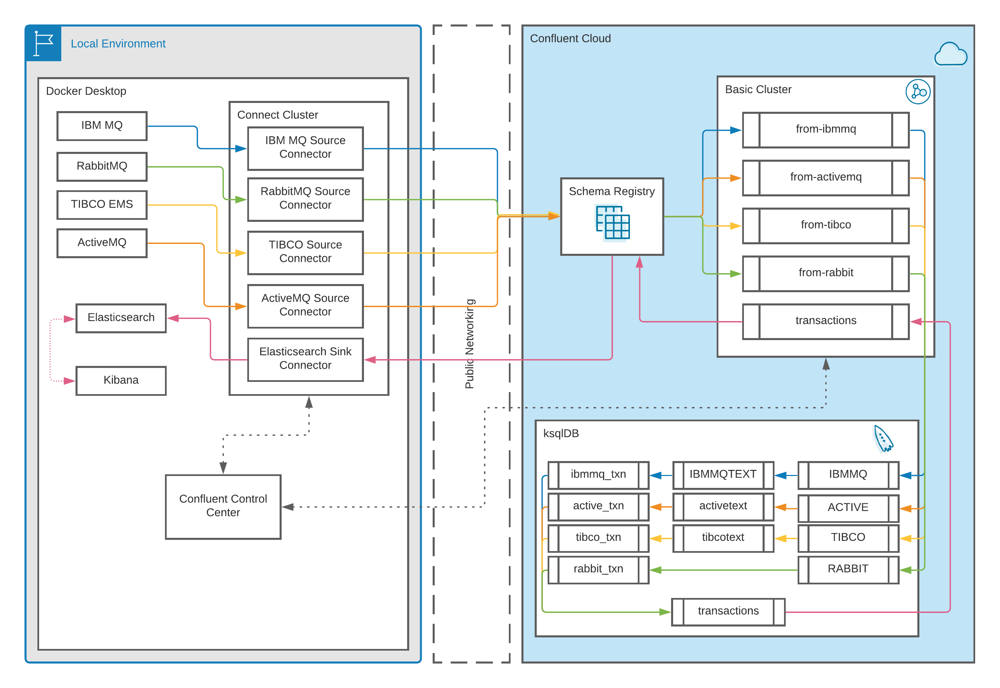

*Streaming event data from a variety of messaging systems to modern data
stores via Confluent Platform*

Demonstration
=============

Overview
--------

The docker images included with this demonstration are built on
resources publicly available on Docker Hub. For the Confluent
components, we work with the cp-all-in-one on-premises docker image as a
baseline. To include the particular connectors and dependent jars for
the demonstration, we’ve made some modifications to the kafka-connect
image.

Since the process of publishing data to each messaging system varies a
little bit from system to system, as does the default content and
structure of each messaging system, we provide sample shell scripts
which produce data to each system via that system’s REST API. Also
included are some simple ksqlDB queries to massage data from each queue
into a combined stream backed by a single Kafka topic. This is meant to
be a demonstrative example to get you started on your own proof of
concept. The recommendation is that you get this demonstration working
to your satisfaction, substitute the sample messaging systems we work
with in the demo with your existing systems, modify the queries
accordingly, and then scale out your Confluent installation to meet your
latency and throughput requirements.

Getting Started
---------------

The `docker-compose.yml` file ties the images together and coordinates
their initialization. By default the following systems are enabled:

<table>
<colgroup>
<col style="width: 33%" />
<col style="width: 33%" />
<col style="width: 33%" />
</colgroup>
<thead>
<tr class="header">
<th><strong>Sources</strong></th>
<th><strong>Confluent</strong></th>
<th><strong>Sinks</strong></th>
</tr>
</thead>
<tbody>
<tr class="odd">
<td><ul>
<li>
Tibco EMS
</li>
<li>
Active MQ
</li>
<li>
IBM MQ
</li>
<li>
Rabbit MQ
</li>
</ul></td>
<td><ul>
<li>
Kafka Broker
</li>
<li>
Zookeeper
</li>
<li>
Schema Registry
</li>
<li>
Kafka Connect
</li>
<li>
ksqlDB
</li>
<li>
Confluent Control Center (optional)
</li>
</ul></td>
<td><ul>
<li>
Elasticsearch (optional)
</li>
<li>
MongoDB (optional)
</li>
<li>
MySQL (optional)
</li>
</ul></td>
</tr>
</tbody>
</table>

Obtain and properly place the dependent jars. Run docker-compose up -d to start the images. Run docker-compose ps to monitor startup. If docker-compose ps does not show the expected images after startup, run docker-compose down and restart.

Dependent Jars and Docker Images
--------------------------------

The demonstration relies on external docker images for IBM MQ, Rabbit,
ActiveMQ and Tibco. Although they’re all referenced in docker-compose.yml,
the Tibco image needs to be built before running the installation, while the IBM MQ and Tibco connectors both require additional jars in order to
function.

### Tibco

Download the TIBCO EMS Community Edition at: [TIBCO Enterprise Message
Service™ - Community Edition – Free Download -
Linux](https://www.tibco.com/resources/product-download/tibco-enterprise-message-service-community-edition-free-download-0),
and place the file `TIB_ems-ce_8.6.0_linux_x86_64.zip` into the
directory `scripts/tibco/docker-tibco` (depending on the time of reading, the version may have changed, and you will need to update the build script)

Run `scripts/tibco/build-tibco.sh` to build the docker image.

In addition to the docker image, this should have produced a file
`tibjms.jar` which was extracted from the downloaded zip. Place that in
the `jars` directory so it’s added to the kafka-connect image later.

### IBM MQ

Download the IBM MQ JMS and Java 'All Client’ following the
documentation at:
<https://docs.confluent.io/kafka-connect-ibmmq-sink/current/overview.html#ibmmq-client-jar>.
Place the jars com.ibm.mq.allclient.jar and jms.jar in the jars
directory so they’re added to the kafka-connect image later.

Your jars directory should look contain:

     README
     jms.jar
     com.ibm.mq.allclient.jar
     tibjms.jar

Confluent
---------

### Control Center

If you’re running the Confluent Control Center image, you can access it
from localhost:9021. The steps to add and configure connectors and
ksqlDB queries can be done from Confluent Control Center.

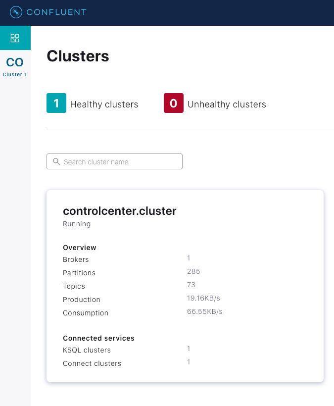

### Kafka Connect

Each subdirectory under `/scripts` contains a
`create-. . .-connector.sh` script which creates and configures the
appropriate source or sink connector. Messaging systems will vary (see
below) with respect to whether pre-creation of the queue is required
before the creation of the connector. The kafka-connect image takes the
longest to start. Use Docker dashboard or docker-compose ps to monitor
progress.

You can check the status of any running connector with Confluent Control
Center or with the provided debug script.

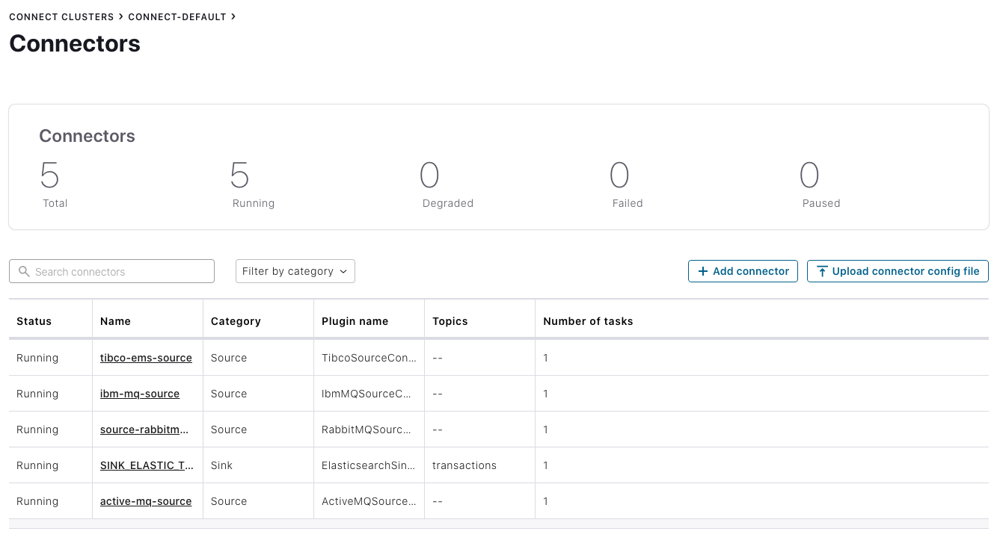

### ksqlDB

Run `scripts/ksqldb.sh` to mount and execute the ksqldb CLI for the
included ksqlDB image. You can use print commands to inspect the topics
created by the connector. You can also use the Confluent Control Center
for this purpose.

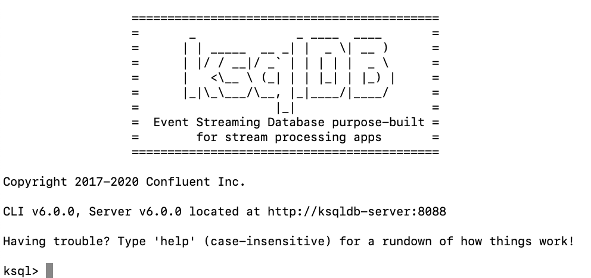

IBM MQ
------

`Docker-compose.yml` calls the extract-dependent-jars command to unpack
and install dependent jars into both the Kafka Connect and IBM MQ image.

If the image is running, you can use the script
`scripts/ibmmq/producetransaction2ibmmq.sh` or to produce a sample row
of JSON data to a test queue.

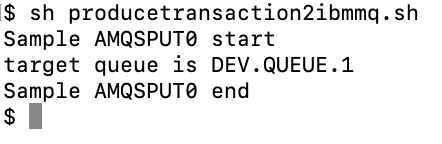

The script `scripts/ibmmq/produceuserids2ibmmq.sh` can also be used to
produce a batch of rows to the test queue.

The script `scripts/ibmmq/create-ibm-connector.sh` will create and start
a source connector connector which will produce messages published on
the test queue to a topic in Apache Kafka.

    curl -X PUT \
    -H "Content-Type: application/json" \
    --data '\{
    "connector.class": "io.confluent.connect.ibm.mq.IbmMQSourceConnector",
    "kafka.topic": "from-ibmmq",
    "mq.hostname": "ibmmq",
    "mq.port": "1414",
    "mq.transport.type": "client",
    "mq.queue.manager": "QM1",
    "mq.channel": "DEV.APP.SVRCONN",
    "mq.username": "app",
    "mq.password": "passw0rd",
    "jms.destination.name": "DEV.QUEUE.1",
    "jms.destination.type": "queue",
    "key.converter": "io.confluent.connect.avro.AvroConverter",
    "value.converter": "io.confluent.connect.avro.AvroConverter",
    "key.converter.schema.registry.url":"http://schema-registry:8081",
    "value.converter.schema.registry.url":"http://schema-registry:8081",
    "confluent.license": "",
    "confluent.topic.bootstrap.servers": "broker:29092",
    "confluent.topic.replication.factor": "1"
    }' \
    http://localhost:8083/connectors/ibm-mq-source/config

You can also use the connector configuration interface in Confluent
Control Center. See
<https://docs.confluent.io/platform/current/control-center/connect.html>
for more information.

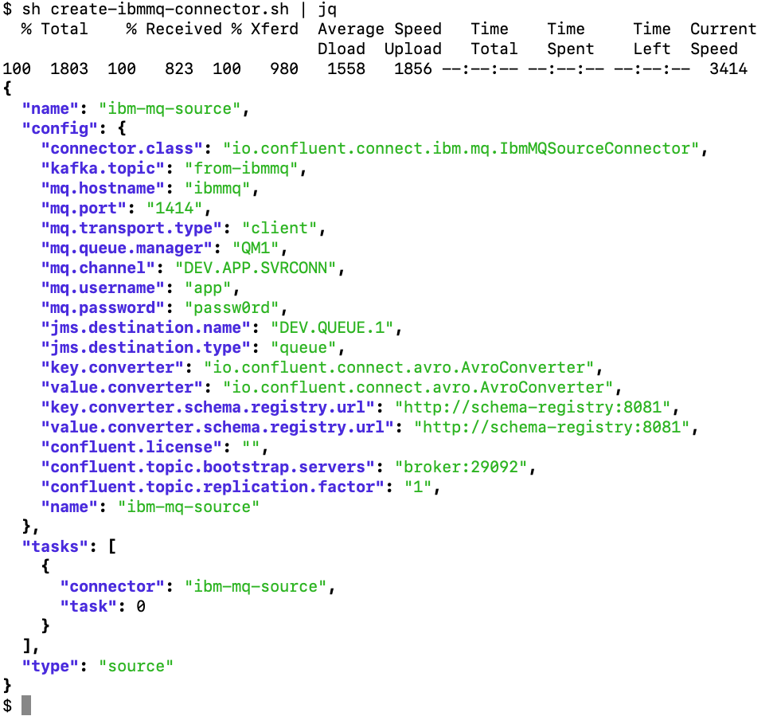

To verify the functionality of the connector, you can view the topic
contents in Confluent Control Center while producing messages to it:

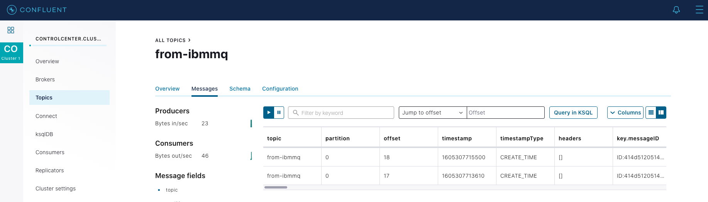

You can also use this command in ksqlDB:

    print ‘from-ibmmq’ from beginning;

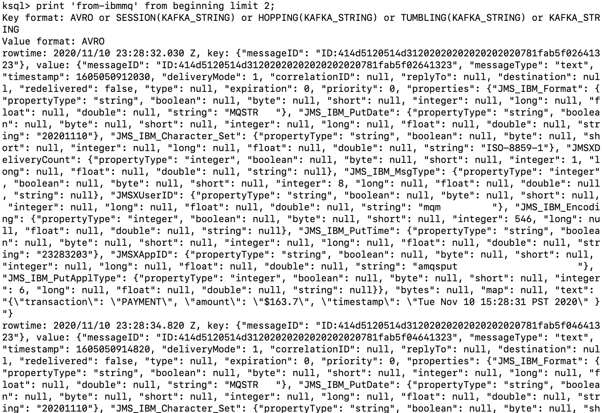

Active MQ
---------

If the image is running, you can use the script
`scripts/activemq/producetransaction2active.sh` to produce a sample row
of JSON data to a test queue.

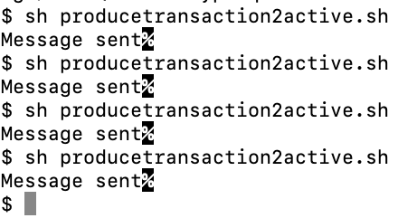

The script `scripts/activemq/create-active-connector.sh` will create and
start a source connector connector which will produce messages published
on the test queue to a topic in Apache Kafka.

    curl -i -X PUT \
    -H "Content-Type: application/json" \
    --data '\{
    "connector.class": "io.confluent.connect.activemq.ActiveMQSourceConnector",
    "kafka.topic": "from-activemq",
    "activemq.url": "tcp://activemq:61616",
    "jms.destination.name": "DEV.QUEUE.1",
    "jms.destination.type": "queue",
    "key.converter": "io.confluent.connect.avro.AvroConverter",
    "value.converter": "io.confluent.connect.avro.AvroConverter",
    "key.converter.schema.registry.url":"http://schema-registry:8081",
    "value.converter.schema.registry.url":"http://schema-registry:8081",
    "confluent.license": "",
    "confluent.topic.bootstrap.servers": "broker:29092",
    "confluent.topic.replication.factor": "1"
    }' \
    http://localhost:8083/connectors/active-mq-source/config

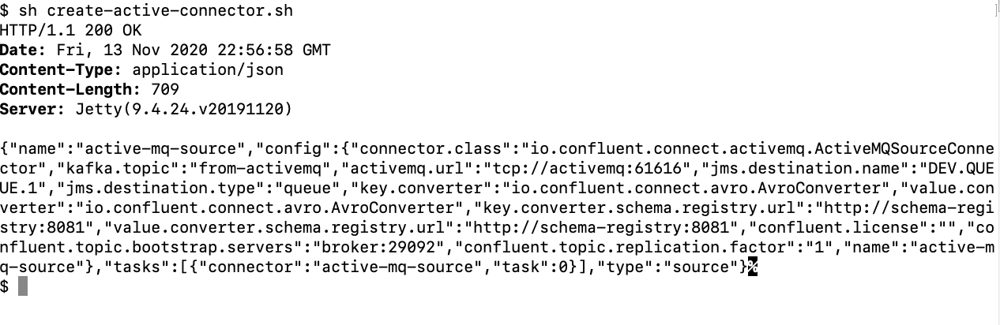

To verify the functionality of the connector, you can view the topic
contents in Confluent Control Center while producing messages to it:

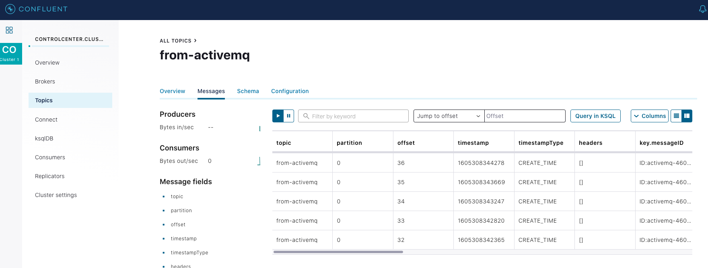

You can also use this command in the ksqlDB shell:

    print topic ‘from-activemq’ from beginning;

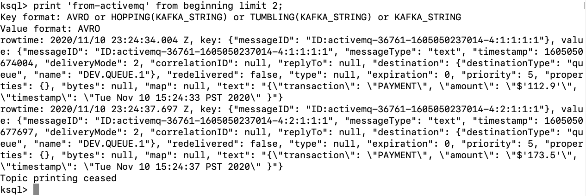

Tibco EMS
---------

Prior to running `docker-compose up` for the first time, it may be
necessary to build the Docker image for Tibco EMS using the script
`scripts/tibco/build-tibco.sh`. `docker-compose.yml` also specifies the
installation of the dependent tibco client jar into the Kafka Connect
image.

If the image is running, you can use the script
`scripts/tibco/producetransaction2tibco.sh` to produce a sample row of
JSON data to a test queue.

The example used for Tibco is based on a simple publicly available
producer client which Tibco commonly refers to. The script compiles the
example in the image if needed and then invokes the client. More
information about the client in use can be found at:
<https://github.com/tradel/tibco-ems-monitoring-extension/blob/master/src/com/singularity/jms/tibjmsMsgProducer.java>

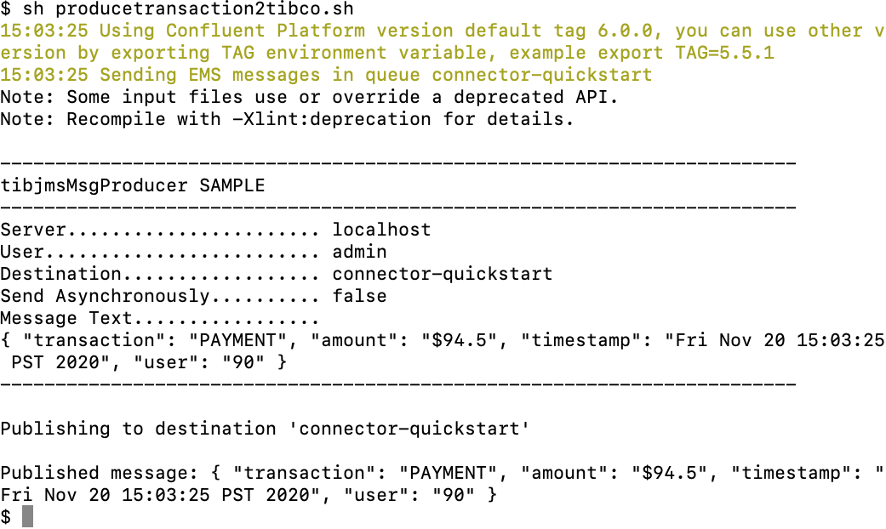

The script `scripts/tibco/create-tibco-connector.sh` will create and
start a source connector which will produce messages published on the
test queue to a topic in Apache Kafka.

    curl -X PUT \
    -H "Content-Type: application/json" \
    --data '\{
    "connector.class": "io.confluent.connect.tibco.TibcoSourceConnector",
    "tasks.max": "1",
    "kafka.topic": "from-tibco",
    "tibco.url": "tcp://tibco-ems:7222",
    "tibco.username": "admin",
    "tibco.password": "",
    "jms.destination.type": "queue",
    "jms.destination.name": "connector-quickstart",
    "key.converter": "io.confluent.connect.avro.AvroConverter",
    "value.converter": "io.confluent.connect.avro.AvroConverter",
    "key.converter.schema.registry.url":"http://schema-registry:8081",
    "value.converter.schema.registry.url":"http://schema-registry:8081",
    "confluent.topic.bootstrap.servers": "broker:29092",
    "confluent.topic.replication.factor": "1"
    }' \
    http://localhost:8083/connectors/tibco-ems-source/config

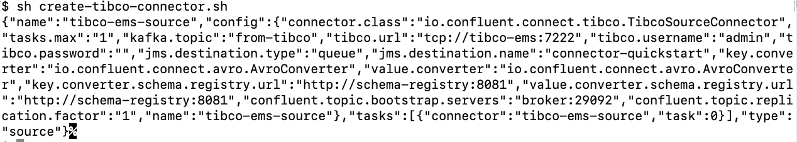

To verify the functionality of the connector, view the topic contents in
Control Center while producing messages to Tibco EMS:

You can also use this command in the ksqlDB shell:

    print topic ‘from-tibco’ from beginning;

Rabbit MQ
---------

RabbitMQ requires the queue to be created before producing data to it.

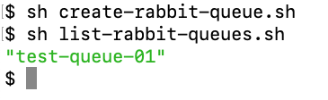

If the image is running, you can use the script
`scripts/rabbit/producetransaction2rabbit.sh` to produce a sample row of
JSON data to a test queue.

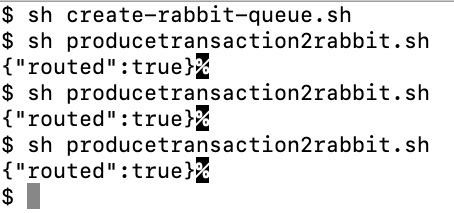

The script `scripts/rabbit/create-rabbit-connector.sh` will create and
start a source connector connector which will produce messages published
on the test queue to a topic in Apache Kafka.

    curl -i -X PUT -H "Content-Type:application/json" \
    http://localhost:8083/connectors/source-rabbitmq-00/config \
    -d '\{
    "connector.class" : "io.confluent.connect.rabbitmq.RabbitMQSourceConnector",
    "kafka.topic" : "from-rabbit",
    "rabbitmq.queue" : "test-queue-01",
    "rabbitmq.username": "guest",
    "rabbitmq.password": "guest",
    "rabbitmq.host": "rabbitmq",
    "rabbitmq.port": "5672",
    "rabbitmq.virtual.host": "/",
    "confluent.license":"",
    "confluent.topic.bootstrap.servers":"broker:29092",
    "confluent.topic.replication.factor":1,
    "value.converter": "org.apache.kafka.connect.converters.ByteArrayConverter",
    "key.converter": "org.apache.kafka.connect.storage.StringConverter"
    } '

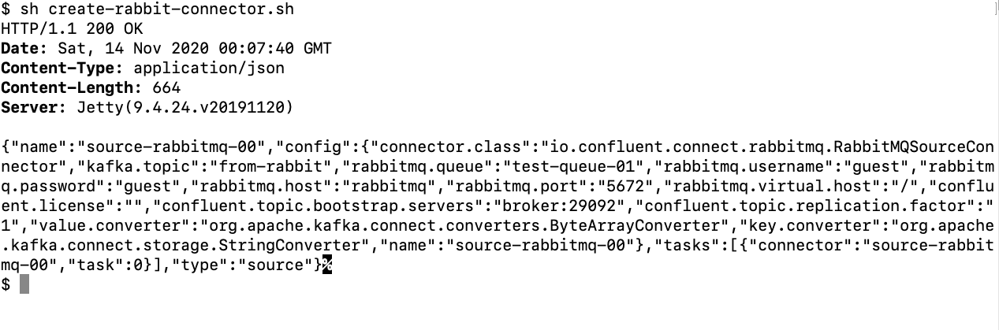

To verify the functionality of the connector, use this command in
ksqlDB:

print topic ‘from-rabbit’ from beginning emit changes;

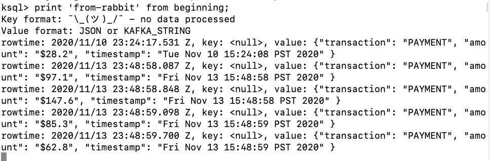

Demonstration: Ingest and Merge
-------------------------------

[Video on ingest and merge](https://videos.confluent.io/watch/hojr9MdU5KJELi7qLHRcAZ?) 

### Run the Demo

1.  Determine which message queues you’d like to run

2.  Download and configure dependent jars (see above) for Tibco and IBM
    if you have selected those.

3.  Edit docker-compose.yml and comment out the unselected messaging
    systems.

4.  Run docker-compose -d to start the demo

5.  Wait until docker-compose ps shows that the kafka-connect image is
    running and healthy

#### Publish Test Data and Create the Connectors

Pick some or all of the data sources. Then, following the directions
above:

1.  Create a Rabbit MQ queue

2.  Publish a few Rabbit messages

3.  Publish a few Tibco messages

4.  Publish a few IBM MQ messages

5.  Publish a few ActiveMQ messages

6.  Run the scripts to create connectors for each system

7.  Confirm the messages are present in the Kafka topics using ksqldb’s
    “print” command

#### Create a Stream

In ksqlDB (either the CLI shell or the Confluent Control Center), we’ll
create streams out of these messages, pull out key fields, and merge
them. The `ksqldb` directory contains the sample ksql for the following
operations.

Messages that are serialized in Avro are automatically registered with
Confluent Schema Registry. This saves you the cumbersome process of
having to manually map complex metadata from the stream into a
meaningful data structure. The following statements will create a stream
using the registered Avro schema:

    CREATE STREAM IBMMQ WITH (KAFKA_TOPIC='from-ibmmq', VALUE_FORMAT='AVRO');

    CREATE STREAM ACTIVE WITH (KAFKA_TOPIC='from-activemq', VALUE_FORMAT='AVRO');

    CREATE STREAM TIBCO WITH (KAFKA_TOPIC='from-tibco', VALUE_FORMAT='AVRO');

The RabbitMQ example uses JSON instead of Avro, so it has a simpler
message format. Fields can be directly referenced:

    CREATE STREAM RABBIT (TRANSACTION VARCHAR,
    AMOUNT VARCHAR,
    TIMESTAMP VARCHAR,
    USERID VARCHAR)
    WITH (KAFKA_TOPIC='from-rabbit',
    VALUE_FORMAT='JSON');

### Extract Fields

In ksqlDB, you can extract fields to pull out the important data in the
text field:

From the IBM MQ stream:

    create stream IBMMQTEXT as
     select EXTRACTJSONFIELD(ibmmq.text, '$.transaction') as TRANSACTION,
            EXTRACTJSONFIELD(ibmmq.text, '$.amount') as AMOUNT,
            EXTRACTJSONFIELD(ibmmq.text, '$.timestamp') as TIMESTAMP,
            EXTRACTJSONFIELD(ibmmq.text, '$.user') as USERID
     from ibmmq emit changes;

From the ActiveMQ stream:

    create stream activetext as
     select MESSAGEID as MESSAGEID,
            EXTRACTJSONFIELD(active.text, '$.transaction') as TRANSACTION,
            EXTRACTJSONFIELD(active.text, '$.amount') as AMOUNT,
            EXTRACTJSONFIELD(active.text, '$.timestamp') as TIMESTAMP,
            EXTRACTJSONFIELD(active.text, '$.user') as USERID
     from active emit changes;

From the Tibco EMS stream:

    create stream tibcotext as
     select EXTRACTJSONFIELD(tibco.text, '$.transaction') as TRANSACTION,
            EXTRACTJSONFIELD(tibco.text, '$.amount') as AMOUNT,
            EXTRACTJSONFIELD(tibco.text, '$.timestamp') as TIMESTAMP,
            EXTRACTJSONFIELD(tibco.text, '$.user') as USERID
     from tibco emit changes;

### Apply Types

Our goal is a single combined stream. The next step in that journey is
making the data types and field names the same across all the
constituent streams. You can also do some basic parsing and data
massaging in this step:

Create a transactions stream from Tibco:

    create stream tibcotransactions with (VALUE_FORMAT='AVRO') AS
     SELECT TRANSACTION as tx_type,
            SUBSTRING(amount,1,1) AS CURRENCY,
            CAST(SUBSTRING(AMOUNT,2,LEN(AMOUNT)-1) AS DECIMAL(9,2)) AS TX_AMOUNT,
            TIMESTAMP AS TX_TIMESTAMP,
            CAST(USERID AS INT) AS USERID
     FROM tibcotext where TIMESTAMP IS NOT NULL
     EMIT CHANGES;

Create a transactions stream from IBM MQ:

    create stream ibmmqtransactions with (VALUE_FORMAT='AVRO') AS
     SELECT TRANSACTION as tx_type,
            SUBSTRING(AMOUNT,1,1) AS CURRENCY,
            CAST(SUBSTRING(AMOUNT,3,LEN(AMOUNT)-3) AS DECIMAL(9,2)) AS TX_AMOUNT,
            TIMESTAMP AS TX_TIMESTAMP,
            CAST(USERID AS INT) AS USERID
     FROM ibmmqtext where TIMESTAMP IS NOT NULL
     EMIT CHANGES;

Create a transactions stream from ActiveMQ:

    create stream activetransactions with (VALUE_FORMAT='AVRO') AS
     SELECT TRANSACTION as tx_type,
            SUBSTRING(AMOUNT,1,1) AS CURRENCY,
            CAST(SUBSTRING(AMOUNT,3,LEN(AMOUNT)-3) AS DECIMAL(9,2)) AS TX_AMOUNT,
            TIMESTAMP AS TX_TIMESTAMP,
            CAST ((USERID) AS INT) AS USERID
     FROM activetext where TIMESTAMP IS NOT NULL
     EMIT CHANGES;

Create a transactions stream from Rabbit MQ:

    CREATE STREAM RABBITTRANSACTIONS WITH (VALUE_FORMAT='AVRO') AS
      SELECT TRANSACTION AS TX_TYPE,
             SUBSTRING(AMOUNT,1,1) AS CURRENCY,
             CAST(SUBSTRING(AMOUNT,2,LEN(AMOUNT)-1) AS DECIMAL(9,2)) AS TX_AMOUNT,
             TIMESTAMP AS TX_TIMESTAMP,
             CAST(USERID as int) AS USERID
        FROM rabbit
       WHERE TIMESTAMP IS NOT NULL
        EMIT CHANGES;

You can view the active ksqlDB queries in Confluent Control Center:

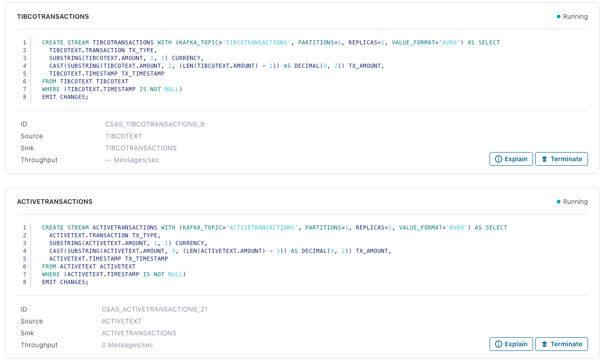

### Merge Streams

Create the merged streams from one constituent stream, then insert the
other ones:

    CREATE STREAM TRANSACTIONS WITH (kafka_topic='transactions') AS
     SELECT * FROM TIBCOTRANSACTIONS;

    INSERT INTO TRANSACTIONS SELECT * FROM RABBITTRANSACTIONS;

    INSERT INTO TRANSACTIONS SELECT * FROM IBMMQTRANSACTIONS;

    INSERT INTO TRANSACTIONS SELECT * FROM ACTIVETRANSACTIONS;

    INSERT INTO TRANSACTIONS SELECT * FROM TIBCOTRANSACTIONS;

### Confirm Merged Stream

To confirm the merged stream, run

    SELECT * FROM TRANSACTIONS EMIT CHANGES;

in a ksqlDB interface, and then produce data to any operational queue.
You can also view the overall flow in Confluent Control Center:

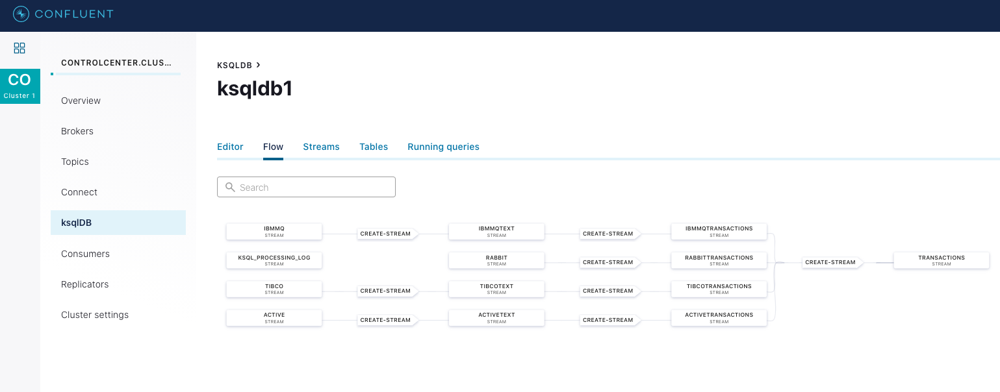

Demonstration: Joining Streams
------------------------------

[Video on Joining Streams](https://videos.confluent.io/watch/hojr9MdU5KJELi7qLHRcAZ?)

In addition to scripts which produce a single transaction stream,
scripts are provided to generate a stream of transactions and a batch of
related user data in order to demonstrate a join.

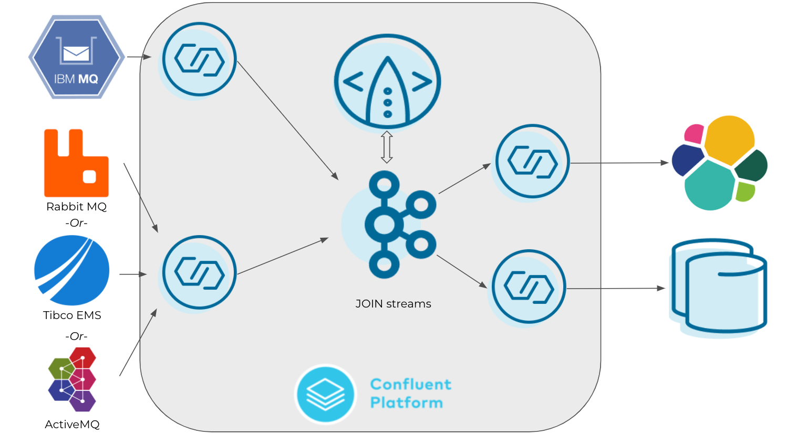

While it’s possible to massage the prior example into a join, it’s
easier to start from a fresh set of containers. To do this, run
`docker-compose down` to stop and remove the containers, then
`docker-compose up -d` to start fresh.

Select two messaging systems to receive different streams of data. One
system will receive user data, the other will receive transaction data.
Each subdirectory contains a script to do both.

Start and run connectors to load data from queues into topics. Here
connectors for IBM MQ and ActiveMQ are selected, but any pair of
messaging systems can be used.

    scripts/ibmmq/create-ibmmq-connector.sh
    scripts/activemq/create-active-connector.sh

Once the connectors are created for two messaging systems, designate one
for transactions and the other for users.

(If you decide to use the same data source for both user and transaction
data, you need to tweak the `create-. . .-connector.sh` scripts and
subsequent ksql to accommodate different kafka topics for each stream.)

To produce a batch of 100 users to IBMMQ, for example, run the script

    scripts/ibmmq/produceuserids2ibmmq.sh

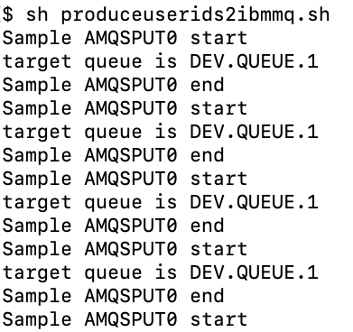

And to generate an endless stream of transaction data to Active MQ, run
the script:

    scripts/activemq/streamtransactions2active.sh

Create the stream for the user data:

    CREATE STREAM TIBCO WITH (KAFKA_TOPIC='from-ibmmq', VALUE_FORMAT='AVRO');

Create a derived stream from the user fields:

    CREATE STREAM IBMMQTEXT AS
    SELECT EXTRACTJSONFIELD(ibmmq.text, '$.user') AS USER,
           EXTRACTJSONFIELD(ibmmq.text, '$.first') AS FIRST,
           EXTRACTJSONFIELD(ibmmq.text, '$.last') AS LAST,
           EXTRACTJSONFIELD(ibmmq.text, '$.country') AS COUNTRY
    FROM IBMMQ EMIT CHANGES;

    CREATE STREAM IBMMQUSERS AS
    SELECT (CAST(USER) AS INT) USERID, FIRST, LAST, COUNTRY FROM IBMMQTEXT;

Create the stream for transaction data. In this example we use ActiveMQ
for the transaction data. In ksqlDB:

    CREATE STREAM ACTIVE WITH (KAFKA_TOPIC='from-activemq', VALUE_FORMAT='AVRO);

Infer transaction data:

    CREATE STREAM ACTIVETEXT AS
        SELECT MESSAGEID AS MESSAGEID,
               EXTRACTJSONFIELD(active.text, '$.transaction') AS TRANSACTION,
               EXTRACTJSONFIELD(active.text, '$.amount') AS AMOUNT,
               EXTRACTJSONFIELD(active.text, '$.timestamp') AS TIMESTAMP,
               EXTRACTJSONFIELD(active.text, '$.user') AS USERID
    FROM ACTIVE EMIT CHANGES;

    CREATE STREAM ACTIVETRANSACTIONS WITH (VALUE_FORMAT='AVRO') AS
        SELECT TRANSACTION AS TX_TYPE,
        SUBSTRING(AMOUNT,1,1) AS CURRENCY,
        CAST(SUBSTRING(AMOUNT,3,LEN(AMOUNT)-3) AS DECIMAL(9,2)) AS TX_AMOUNT,
        TIMESTAMP AS TX_TIMESTAMP,
        CAST ((USERID) AS INT) AS USERID
    FROM ACTIVETEXT WHERE TIMESTAMP IS NOT NULL
    EMIT CHANGES;

Create / insert data into source-indepdendent streams:

    CREATE STREAM TRANSACTIONS WITH (kafka_topic='transactions') AS
      SELECT * FROM ACTIVETRANSACTIONS;

    CREATE STREAM USERS WITH (kafka_topic=’users’) AS SELECT * FROM TIBCOUSERS;

Join user data with transaction stream, generating a stream of
transaction data that’s enriched with the corresponding user information
from another messaging system:

    SELECT
    USERS.FIRST,
    USERS.LAST,
    USERS.COUNTRY,
    TX_TYPE,
    TX_AMOUNT,
    TX_TIMESTAMP
    FROM USERS
    JOIN TRANSACTIONS
    WITHIN 1 HOURS
    ON USERS.USERID = TRANSACTIONS.USERID
    EMIT CHANGES;

This join can be visualized in Confluent Control Center:

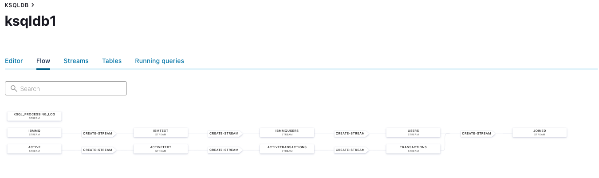

### Define Sink Connectors

You can define any sink connector to consume data from any Kafka topic.
In this example, let’s write to Elasticsearch. While we created the
source connectors with shell scripts, you can also define any connector
directly from ksqlDB. This statement pushes the contents of the
transactions topic to Elasticsearch:

    CREATE SINK CONNECTOR SINK_ELASTIC WITH (
    'connector.class' = 'io.confluent.connect.elasticsearch.ElasticsearchSinkConnector',
    'connection.url' = 'http://elasticsearch:9200',
    'key.converter' = 'org.apache.kafka.connect.storage.StringConverter',
    'type.name' = 'doc',
    'topics' = 'transactions',
    'key.ignore' = 'true',
    'schema.ignore' = 'false'
    );

Feel free to experiment with other sink connectors, including MySQL,
MongoDB, S3, and so on.

Resources
---------

Confluent technical marketing on github, including this demo:
<https://github.com/confluentinc/pmm>

Streaming messages from RabbitMQ using Kafka Connect:
<https://rmoff.net/2020/01/08/streaming-messages-from-rabbitmq-into-kafka-with-kafka-connect/>

Confluent blog:
<https://www.confluent.io/blog/kafka-fastest-messaging-system/>
<https://www.confluent.io/kafka-vs-pulsar/>

Confluent docker image reference:
<https://docs.confluent.io/platform/current/installation/docker/image-reference.html>

Confluent Demo Scene: <https://github.com/confluentinc/demo-scene>

Reference for Confluent and Elastic:
<https://www.confluent.io/blog/using-kafka-ksqldb-kibana-to-stream-data-and-get-real-time-analytics/>

<https://www.confluent.io/blog/the-simplest-useful-kafka-connect-data-pipeline-in-the-world-or-thereabouts-part-2/>

Kafka Docker playground:
<https://github.com/vdesabou/kafka-docker-playground>

Confluent Documentation: <https://docs.confluent.io/home/overview.html>

Tibco client:
<https://github.com/tradel/tibco-ems-monitoring-extension/blob/master/src/com/singularity/jms/tibjmsMsgProducer.java>
