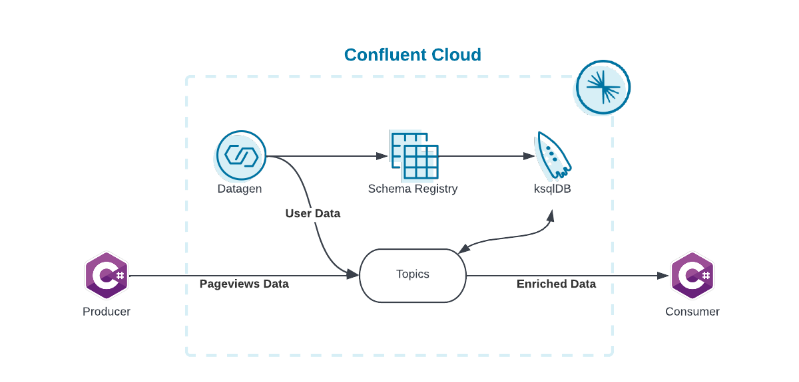
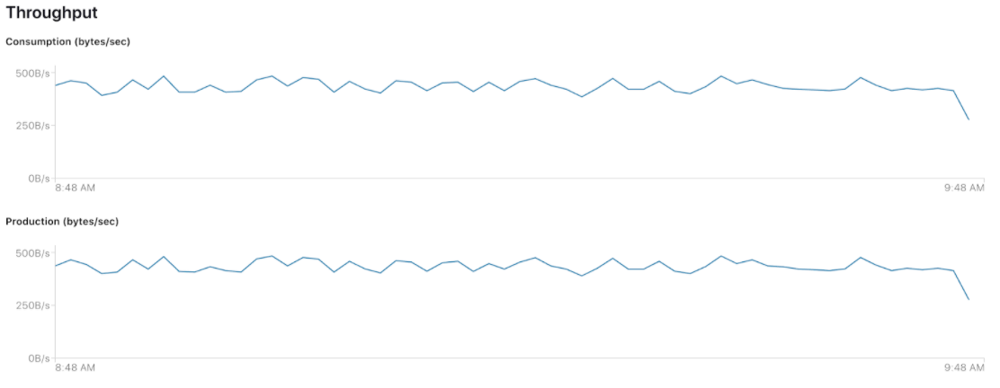

<div align="center" padding=25px>
    
</div>

# <div align="center">Microservices with C# and .NET</div>
## <div align="center">Lab Guide</div>
<br>

## **Agenda**

1. [Log in to Confluent Cloud](#step-1)
1. [Create an Environment and Cluster](#step-2)
1. [Enable Schema Registry](#step-3)
1. [Create a ksqlDB Application](#step-4)
1. [Create a Topic and Cloud Dashboard Walkthrough](#step-5)
1. [Create an API Key Pair](#step-6)
1. [Connect C# Producer and Consumer to Confluent Cloud](#step-7)
1. [Launch Fully-Managed Datagen Source Connector in Confluent Cloud](#step-8)
1. [Real-Time Data Transformations and Stream Processing with ksqlDB](#step-9)
1. [Clean Up Resources](#step-10)
1. [Confluent Resources and Further Testing](#step-11)

***

## **Architecture**

<div align="center">
    
</div>

*** 

## **Prerequisites**
<br>

1. .NET 5 or above - [Download .NET 5.0 (Linux, macOS, and Windows)](https://dotnet.microsoft.com/download/dotnet/5.0)

1. Visual Studio Code (Optional) - [Download Visual Studio Code (Mac, Linux, Windows)](https://code.visualstudio.com/Download)

1. Confluent Cloud Account
    - Sign-up for a Confluent Cloud account [here](https://www.confluent.io/confluent-cloud/tryfree/)
    - Once you have signed up and logged in, click on the menu icon at the upper right hand corner, click on "Billing & payment", then enter payment details under “Payment details & contacts”. A screenshot of the billing UI is included below.

    > **Note:** You will create resources during this workshop that will incur costs. When you sign up for a Confluent Cloud account, you will get free credits to use in Confluent Cloud. This will cover the cost of resources created during the workshop. More details on the specifics can be found [here](https://www.confluent.io/confluent-cloud/tryfree/).

1. Ports 443 and 9092 need to be open to the public internet for outbound traffic. To check, try accessing the following from your web browser:
    - portquiz.net:443
    - portquiz.net:9092

1. This workshop requires access to a command line interface.
    * **Mac users:** The standard Terminal application or iTerm2 are recommended.
    * **Windows users:** The built-in Command Prompt or Git BASH are recommended.  

1. Git access, see [here](https://git-scm.com/book/en/v2/Getting-Started-Installing-Git) for installation instructions. After installation, verify that the installation was successful with the following command:
    ```bash
    # Check the git version
    git --version
    ```
1. Clone this GitHub repository to your machine to access useful files.
    ```bash
    # clone this GitHub repository
    git clone https://github.com/confluentinc/stream-me-up-scotty.git
    ```
    Navigate to the correct sub-folder to access this labs content. This should act as your working directory for the remainder of the lab. 
    ```bash 
    # navigate to the correct sub-folder
    cd stream-me-up-scotty/workshops/microservices-with-csharp-and-dotnet/csharp-clients
    ```

***

## **Objective:**

Welcome to “Microservices with C# and .NET”! In this workshop, you will learn how to use .NET and C# to create a client application that produces and consume events in Confluent Cloud. You will also learn how to build stream processing applications using ksqlDB as well as learn about the use cases ksqlDB unlocks: streaming ETL, data discovery and enrichment, anomaly detection, and more.

Once you have connected data from various sources to Confluent Cloud, you'll start thinking about how to join data from different topics, transform, and enrich the data in real-time. You can do that by using ksqlDB to create stream processing applications, all by using simple SQL statements. ksqlDB is available as a fully managed service within Confluent Cloud.

By the conclusion of the workshop, you will have learned how to create producer and consumer applications using .NET and C# and leverage ksqlDB to perform continuous transformations, create materialized views, and serve lookups against these materialized views all with the data you already have in Confluent Cloud.

## <a name="step-1"></a>**Step 1: Log in to Confluent Cloud**
1. Log in to [Confluent Cloud](https://confluent.cloud) and enter your email and password.

   <div align="center" padding=25px>
       
   </div>

1. If you are logging in for the first time, you will see a self-guided wizard that walks you through spinning up a cluster. Please minimize this as you will walk through those steps in this workshop. 

*** 

## <a name="step-2"></a>**Step 2: Create an Environment and Cluster**

An environment contains clusters and its deployed components such as Connectors, ksqlDB, and Schema Registry. You have the ability to create different environments based on your company's requirements. Confluent has seen companies use environments to separate Development/Testing, Pre-Production, and Production clusters.

1. Click **+ Add Environment**. Specify an **Environment Name** and Click **Create**. 

    >**Note:** There is a *default* environment ready in your account upon account creation. You can use this *default* environment for the purpose of this workshop if you do not wish to create an additional environment.

   <div align="center" padding=25px>
       
   </div>

1. Now that you have an environment, click **Create Cluster**. 

    > **Note:** Confluent Cloud clusters are available in 3 types: Basic, Standard, and Dedicated. Basic is intended for development use cases so you will use that for the workshop. Basic clusters only support single zone availability. Standard and Dedicated clusters are intended for production use and support Multi-zone deployments. If you are interested in learning more about the different types of clusters and their associated features and limits, refer to this [documentation](https://docs.confluent.io/current/cloud/clusters/cluster-types.html).

1. Choose the **Basic** Cluster Type. 

   <div align="center" padding=25px>
       
   </div>

1. Click **Begin Configuration**.
1. Choose your preferred Cloud Provider (AWS, GCP, or Azure), Region, and Availability Zone.
1. Specify a **Cluster Name** - any name will work here. 

   <div align="center" padding=25px>
       
   </div>

1. View the associated Configuration & Cost, Usage Limits, and Uptime SLA information before launching.

1. Click **Launch Cluster.**

   <div align="center" padding=25px>
       
   </div>

## <a name="step-3"></a>**Step 3: Enable Schema Registry**

A topic contains messages, and each message is a key-value pair. The message key or the message value (or both) can be serialized as JSON, Avro, or Protobuf. A schema defines the structure of the data format. 

Confluent Cloud Schema Registry is used to manage schemas and it defines a scope in which schemas can evolve. It stores a versioned history of all schemas, provides multiple compatibility settings, and allows schemas to evolve according to these compatibility settings. It is also fully-managed.

1. Return to your environment by clicking on the Confluent icon at the top left corner and then clicking your environment tile.
   <div align="center">
       
   </div>

1. Click on **Schema Registry**. Select your cloud provider and region, and then click on **Enable Schema Registry**.
   <div align="center">
       
   </div>

## <a name="step-4"></a>**Step 4: Create a ksqlDB Application**

1. On the navigation menu, select **ksqlDB** and click **Create Application Myself**. 
1. Select **Global Access** and then **Continue**.
1. Name you ksqlDB application and set the streaming units to **1**. Click **Launch Application!**
1. It will take a few minutes to provision the ksqlDB application. We will come back later to check it out.

> **Note:** A Confluent Streaming Unit is the unit of pricing for Confluent Cloud ksqlDB. A CSU is an abstract unit that represents the size of your kSQL cluster and scales linearly. 

   <div align="center" padding=25px>
       
   </div>

## <a name="step-5"></a>**Step 5: Create a Topic and Cloud Dashboard Walkthrough**

1. On the left hand side navigation menu, you will see **Cluster overview**.

   This section shows Cluster Metrics, such as Throughput and Storage. This page also shows the number of Topics, Partitions, Connectors, and ksqlDB Applications.  Below is an example of the metrics dashboard once you have data flowing through Confluent Cloud. 

   <div align="center" padding=25px>
       
   </div>

1. Click on **Cluster settings**. This is an important tab that should be noted. This is where you can find your cluster ID, bootstrap server (also known as broker endpoint), cloud details, cluster type, and capacity limits. 
1. Copy and save the bootstrap server - you will use it later in the workshop.
1. On that same navigation menu, select **Topics** and click **Create Topic**. 
1. Enter **pageviews** as the Topic name and **1** as the Number of partitions, then click on **Create with defaults**.
   <div align="center" padding=25px>
      
   </div>

   > **Note:** Topics have many configurable parameters that dictate how messages are handled. A complete list of those configurations for Confluent Cloud can be found [here](https://docs.confluent.io/cloud/current/using/broker-config.html).  If you are interested in viewing the default configurations, you can view them in the Topic Summary on the right side. 

1. After creation, the **Topics UI** allows you to monitor production and consumption throughput metrics and the configuration parameters for your topics. When you begin sending messages to Confluent Cloud, you will be able to view those messages and message schemas. 

1. Below is a look at your topic, pageviews, but you need to send data to this topic before you see any metrics. 
   <div align="center" padding=25px>
      
   </div>

## <a name="step-6"></a>**Step 6: Create an API Key Pair**

1. Select **API keys** on the navigation menu. 
1. If this is your first API key within your cluster, click **Create key**. If you have set up API keys in your cluster in the past and already have an existing API key, click **+ Add key**.
   <div align="center" padding=25px>
      
   </div>

1. Select **Global Access**, then click Next.
1. Save your API key and secret - you will need these during the workshop.
1. After creating and saving the API key, you will see this API key in the Confluent Cloud UI in the **API keys** tab. If you don’t see the API key populate right away, refresh the browser. 

## <a name="step-7"></a>**Step 7: Connect C# Producer and Consumer to Confluent Cloud**

### Setup

1. To begin setting up **client**, you should have already cloned the repository during the prerequisites step. If you have not, start by cloning [this Github repo](https://github.com/confluentinc/stream-me-up-scotty.git).
    > **Note:** you can skip this step if you have already cloned the repository during the prerequisites step.
    ```bash
    git clone https://github.com/confluentinc/stream-me-up-scotty.git
    ```
1. Change directory to the csharp-client directory within this labs sub-folder.
    ```bash
    cd stream-me-up-scotty/workshops/microservices-with-csharp-and-dotnet/csharp-clients
    ```
1. The next step is to replace the placeholder values surrounded in angle brackets within `csharp.config` with configuration parameters to connect to your Kafka cluster. For reference, use the following table to fill out all the values completely.

    | property               | created in step                         |
    |------------------------|-----------------------------------------|
    | `BROKER_ENDPOINT`      | [*create an environment and cluster*](#step-2) |
    | `CLUSTER_API_KEY`      | [*create an api key pair*](#step-5) |
    | `CLUSTER_API_SECRET`   | [*create an api key pair*](#step-5) |
    
### Produce Records

1. Build the client example application
    ```bash
    dotnet build
    ```
1. Run the example application, passing in arguments for:
   - whether to produce or consume (produce)
   - the topic name (pageviews)
   - the local file with configuration parameters to connect to your Kafka cluster
   - Windows only: a local file with default trusted root CA certificates
    ```bash
    # Run the producer (Windows)
    dotnet run produce pageviews csharp.config /path/to/curl/cacert.pem
    
    # Run the producer (other)
    dotnet run produce pageviews csharp.config
    ```
1. Verify that the producer sent all the messages. You should see:
    ```bash
    Producing record: 10 {"viewtime":10,"userid":"User_3","pageid":"Page_44"}
    Producing record: 20 {"viewtime":20,"userid":"User_4","pageid":"Page_60"}
    Producing record: 30 {"viewtime":30,"userid":"User_2","pageid":"Page_63"}
    Producing record: 40 {"viewtime":40,"userid":"User_2","pageid":"Page_73"}
    Producing record: 50 {"viewtime":50,"userid":"User_6","pageid":"Page_53"}
    Producing record: 60 {"viewtime":60,"userid":"User_7","pageid":"Page_57"}
    Producing record: 70 {"viewtime":70,"userid":"User_4","pageid":"Page_15"}
    Producing record: 80 {"viewtime":80,"userid":"User_4","pageid":"Page_32"}
    Producing record: 90 {"viewtime":90,"userid":"User_8","pageid":"Page_28"}
    Producing record: 100 {"viewtime":100,"userid":"User_2","pageid":"Page_45"}
    Produced message to: pageviews [[0]] @0
    Produced message to: pageviews [[0]] @1
    Produced message to: pageviews [[0]] @2
    Produced message to: pageviews [[0]] @3
    Produced message to: pageviews [[0]] @4
    Produced message to: pageviews [[0]] @5
    Produced message to: pageviews [[0]] @6
    Produced message to: pageviews [[0]] @7
    Produced message to: pageviews [[0]] @8
    Produced message to: pageviews [[0]] @9
    10 messages were produced to topic pageviews
    ```
1. View the [producer code](https://github.com/hendrasutanto/csharp-clients/blob/main/Program.cs)

### Consume Records

1. Run the example application, passing in arguments for:
   - whether to produce or consume (produce)
   - the topic name: same topic name as used above
   - the local file with configuration parameters to connect to your Kafka cluster
   - Windows only: a local file with default trusted root CA certificates
    ```bash
    # Run the consumer (Windows)
    dotnet run consume pageviews csharp.config /path/to/curl/cacert.pem
    
    # Run the consumer (other)
    dotnet run consume pageviews csharp.config
    ```
1. Verify that the consumer received all the messages. You should see:
    ```bash
    Consumed record with key 10 and value {"viewtime":10,"userid":"User_3","pageid":"Page_44"}
    Consumed record with key 20 and value {"viewtime":20,"userid":"User_4","pageid":"Page_60"}
    Consumed record with key 30 and value {"viewtime":30,"userid":"User_2","pageid":"Page_63"}
    Consumed record with key 40 and value {"viewtime":40,"userid":"User_2","pageid":"Page_73"}
    Consumed record with key 50 and value {"viewtime":50,"userid":"User_6","pageid":"Page_53"}
    Consumed record with key 60 and value {"viewtime":60,"userid":"User_7","pageid":"Page_57"}
    Consumed record with key 70 and value {"viewtime":70,"userid":"User_4","pageid":"Page_15"}
    Consumed record with key 80 and value {"viewtime":80,"userid":"User_4","pageid":"Page_32"}
    Consumed record with key 90 and value {"viewtime":90,"userid":"User_8","pageid":"Page_28"}
    Consumed record with key 100 and value {"viewtime":100,"userid":"User_2","pageid":"Page_45"}
    ```
1. When you are done, press `<ctrl>-c`.

1. View the [consumer code](https://github.com/hendrasutanto/csharp-clients/blob/main/Program.cs)

### Troubleshooting: Configure SSL trust store

Depending on your operating system, there may be complexity around the `SslCaLocation` config, which specifies the path to your SSL CA root certificates. If your system doesn’t have the SSL CA root certificates properly set up, you may receive a `SSL handshake failed` error message similar to the following:
```bash
%3|1605776788.619|FAIL|rdkafka#producer-1| [thrd:sasl_ssl://...confluent.cloud:9092/bootstr]: sasl_ssl://...confluent.cloud:9092/bootstrap: SSL handshake failed: error:14090086:SSL routines:ssl3_get_server_certificate:certificate verify failed: broker certificate could not be verified, verify that ssl.ca.location is correctly configured or root CA certificates are installed (brew install openssl) (after 258ms in state CONNECT)
```
For further troubleshooting information, see [Configure SSL trust store](https://docs.confluent.io/platform/current/tutorials/examples/clients/docs/csharp.html?utm_source=github&utm_medium=demo&utm_campaign=ch.examples_type.community_content.clients-ccloud#configure-ssl-trust-store).

## <a name="step-8"></a>**Step 8: Launch Fully-Managed Datagen Source Connector in Confluent Cloud**

In real world, the user data is usually stored in a database and a Debezium/CDC (Change Data Capture) source connector can be used to stream the data to Kafka. In this workshop, you will set up a fully-managed connector that is used to generate mock user data.
> **Note:** With fully-managed connectors, Confluent hosts and manages the Connect cluster and connector for you. Simply configure the connector of your choice to stream events between Confluent Cloud and your external systems. Confluent offers 30+ fully-managed connectors, with more on the way! You can view the full list [here](https://docs.confluent.io/cloud/current/connectors/index.html)

1. Within Confluent Cloud, click on **Connectors**. You should see a list of connectors under **Fully Managed**. 

   <div align="center">
      
   </div>

1. Click on **Connect** for the Datagen Source. 
   <div align="center">
      \
   </div>

1. Complete the configuration details. 

   | Configuration Setting               | Value                         |
   |------------------------|-----------------------------------------|
   | Select or create new topics | Add new topic `users` with `1` partition                      |
   | Kafka credentials                          | Use an existing API key                            |
   | Kafka API Key                              | Key created in [*create an api key pair*](#step-4) |
   | Kafka API Secret                           | Key created in [*create an api key pair*](#step-4) |
   | Select a template                          | Select `Users`                                     |
   | Select output record value format          | AVRO                                               |
   | Tasks                                      | 1                                                  |
   | Connector name                             | Enter any connector name                           |

   This should be your output before you **Launch** the connector.

   <div align="center">
      
   </div>

1. View the connector, its status, and metrics on the **Connectors** page.

   <div align="center">  
      
   </div>
    
1. Once the connector is successfully launched. Navigate to `Topics` and select `users` topic.

1. You should see some messages being produced on this topic under the `Messages` tab.
   > **Note:** The messages contain some unreadable characters due to the Avro format.

1. Click on the `Schema` tab. Here you can see the schema value for your topic. The following is an example of what your schema may look like. Note that it shows the Format (AVRO), Compatibility Mode (Default is set as Backward), Schema ID, and Version.

   <div align="center">
      
   </div>
    
   For more information about schema evolution and compatibility, click [here](https://docs.confluent.io/platform/current/schema-registry/avro.html)

## <a name="step-9"></a>**Step 9: Real-Time Data Transformations and Stream Processing with ksqlDB**

### Create a Stream and a Table

Now that you are producing a continuous stream of data to `users` and `pageviews` topic, you will use ksqlDB to understand the data better by performing continuous transformations and creating new derived topics with the enriched data.

You will start by creating a stream and table, which will be the foundation for your transformations in the upcoming steps.

A *stream* provides immutable data. It is append only for new events; existing events cannot be changed. Streams are persistent, durable, and fault tolerant. Events in a stream can be keyed.

A *table* provides mutable data. New events—rows—can be inserted, and existing rows can be updated and deleted. Like streams, tables are persistent, durable, and fault tolerant. A table behaves much like an RDBMS materialized view because it is being changed automatically as soon as any of its input streams or tables change, rather than letting you directly run insert, update, or delete operations against it.

To learn more about *streams* and *tables*, the following resources are recommended:
- [Streams and Tables in Apache Kafka: A Primer](https://www.confluent.io/blog/kafka-streams-tables-part-1-event-streaming/)
- [ksqlDB: Data Definition](https://docs.ksqldb.io/en/latest/reference/sql/data-definition/)

1. Navigate back to the **ksqlDB** tab and click on your application name. This will bring us to the ksqlDB editor. 

> **Note:** You can interact with ksqlDB through the **Editor**. You can create a stream by using the `CREATE STREAM` statement and a table using the `CREATE TABLE` statement. <br><br>To write streaming queries against **users_topic** and **stocks_topic**, you will need to register the topics with ksqlDB as a stream and/or table. 

1. First, create a **Stream** by registering the **pageviews** topic as a stream called **pageviews**. 

   ```sql
   CREATE STREAM pageviews (
       viewtime bigint,
       userid varchar,
       pageid varchar
   ) WITH (
       kafka_topic='pageviews',
       value_format='JSON'
   );
   ```

1. Next, go to the **Streams** tab at the top and click on **PAGEVIEWS**. This provides information on the stream, output topic (including replication, partitions, and key and value serialization), and schemas.

   <div align="center">
       
   </div>

1. Click on **Query Stream** which will take you back to the **Editor**. You will see the following query auto-populated in the editor which may be already running by default. If not, click on **Run query**. To see data already in the topic, you can set the `auto.offset.reset=earliest` property before clicking **Run query**. <br> <br> Optionally, you can navigate to the editor and construct the select statement on your own, which should look like the following.

   ```sql
   SELECT * FROM PAGEVIEWS EMIT CHANGES;
   ```

1. You should see the following data within your **PAGEVIEWS** stream.

   <div align="center">
       
   </div>

1. Click **Stop**. 
1. Next, create a **Table** by registering the **users** topic as a table named **users**. Copy the following code into the **Editor** and click **Run**.
   ```sql
   CREATE TABLE users (
       id VARCHAR PRIMARY KEY
   ) WITH (
       KAFKA_TOPIC = 'users', 
       VALUE_FORMAT = 'AVRO'
   );
   ```
   > **Note:** ksqlDB can integrate with Confluent Schema Registry and automatically retrieves (reads) and registers (writes) schemas as needed, which spares you from defining columns and data types manually in `CREATE` statements and from manual interaction with Schema Registry.

1. Once you have created the **USERS** table, repeat what you did above with **PAGEVIEWS** stream and query the **USERS** table. This time, select the **Tables** tab and then select the **USERS** table. You can also set the `auto.offset.reset=earliest`. Like above, if you prefer to construct the statement on your own, make sure it looks like the following.

   ```sql
   SELECT * FROM USERS EMIT CHANGES;
   ```

   * You should see the following data in the messages output.

   <div align="center">
       
   </div>

   > **Note:** Note: If the output does not show up immediately, you may have done everything correctly and it just needs a moment. Setting `auto.offset.reset=earliest` also helps output data faster since the messages are already in the topics.

1. Stop the query by clicking **Stop**. 

***

## Create a Persistent Query

A *Persistent Query* runs indefinitely as it processes rows of events and writes to a new topic. You can create persistent queries by deriving new streams and new tables from existing streams or tables.

1. Create a **Persistent Query** named **pageviews_enriched** by left joining the stream (**PAGEVIEWS**) and table (**USERS**), and filter the results with female users. Navigate to the **Editor** and paste the following command.

   ```sql
   CREATE STREAM pageviews_enriched with (kafka_topic='pageviews_enriched', partitions=1, value_format='JSON') AS
       SELECT users.id AS userid, pageid, regionid, gender
       FROM pageviews
       LEFT JOIN users
         ON pageviews.userid = users.id
       WHERE (USERS.GENDER = 'FEMALE')
   EMIT CHANGES;
   ```

1. Using the **Editor**, query the new stream. You can either type in a select statement or you can navigate to the stream and select the query button, similar to how you did it in a previous step. You can also choose to set `auto.offset.reset=earliest`. Your statement should be the following. 

   ```sql
   SELECT * FROM PAGEVIEWS_ENRICHED EMIT CHANGES;
   ```
   * The output from the select statement should be similar to the following: <br> 

   <div align="center">
       
   </div> 

   > **Note:** Now that you have a stream of records from the left join of the **USERS** table and **PAGEVIEWS** stream, you can view the relationship between user and pageviews in real-time.

1. Next, view the topic created when you created the persistent query with the left join. Navigate to the **Topics** tab on the left hand menu and then select the topic **pageviews_enriched**. 

   <div align="center">
       
   </div>

1. Navigate to **Data integration** -> **Clients** -> **Consumer lag** on the left hand menu and find the group that corresponds with your **PAGEVIEWS_ENRICHED** stream. See the screenshot below as an example. This view shows how well your persistent query is keeping up with the incoming data. You can monitor the consumer lag, current and end offsets, and which topics it is consuming from.

   <div align="center">
       
   </div>

1. Run the consumer application and consume the messages from **pageviews_enriched** topic.
    ```bash
    # Run the consumer (Windows)
    dotnet run consume pageviews_enriched csharp.config /path/to/curl/cacert.pem
    
    # Run the consumer (other)
    dotnet run consume pageviews_enriched csharp.config
    ```
1. Verify that the consumer received all the enriched messages. You should see:
    ```bash
    Consumed record with key User_7 and value {"PAGEID":"Page_58","REGIONID":"Region_5","GENDER":"FEMALE"}
    Consumed record with key User_7 and value {"PAGEID":"Page_52","REGIONID":"Region_5","GENDER":"FEMALE"}
    Consumed record with key User_3 and value {"PAGEID":"Page_28","REGIONID":"Region_7","GENDER":"FEMALE"}
    Consumed record with key User_1 and value {"PAGEID":"Page_28","REGIONID":"Region_1","GENDER":"FEMALE"}
    Consumed record with key User_1 and value {"PAGEID":"Page_48","REGIONID":"Region_1","GENDER":"FEMALE"}
    Consumed record with key User_8 and value {"PAGEID":"Page_59","REGIONID":"Region_7","GENDER":"FEMALE"}
    Consumed record with key User_7 and value {"PAGEID":"Page_63","REGIONID":"Region_5","GENDER":"FEMALE"}
    ```
    
## <a name="step-10"></a>**Clean Up Resources**

Deleting the resources you created during this workshop will prevent you from incurring additional charges. 

1. The first item to delete is the ksqlDB application. Select the **Delete** button under **Actions** and enter the **Application Name** to confirm the deletion. 

   <div align="center">
       
   </div>

1. Next, delete the Datagen Source connectors for **users**. Navigate to the **Connectors** tab and select the **users** connector. In the top right corner, you will see a **trash** icon. Click the icon and enter the **Connector Name**. Delete the **users** connector.

   <div align="center">
       
   </div>

1. Finally, under **Cluster Settings**, select the **Delete Cluster** button at the bottom. Enter the **Cluster Name** and select **Confirm**. 

   <div align="center">
       
   </div>


## <a name="step-11"></a>**Confluent Resources and Further Testing**

Here are some links to check out if you are interested in further testing:
- [ksqlDB Tutorials](https://kafka-tutorials.confluent.io/)
- [ksqlDB: The Event Streaming Database, Purpose-Build for Stream Processing](https://ksqldb.io/)
- [Streams and Tables in Apache Kafka: A Primer](https://www.confluent.io/blog/kafka-streams-tables-part-1-event-streaming/)
- [Confluent Cloud Documentation](https://docs.confluent.io/cloud/current/overview.html)
- [Best Practices for Developing Apache Kafka Applications on Confluent Cloud](https://assets.confluent.io/m/14397e757459a58d/original/20200205-WP-Best_Practices_for_Developing_Apache_Kafka_Applications_on_Confluent_Cloud.pdf)
- [Confluent Cloud Demos and Examples](https://docs.confluent.io/platform/current/tutorials/examples/ccloud/docs/ccloud-demos-overview.html)
- [Kafka Connect Deep Dive – Error Handling and Dead Letter Queues](https://www.confluent.io/blog/kafka-connect-deep-dive-error-handling-dead-letter-queues/)
